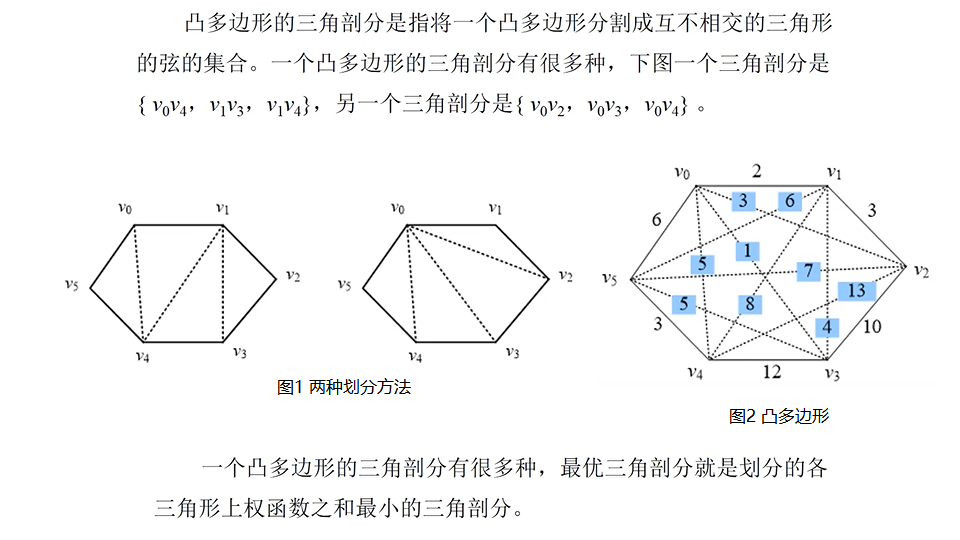
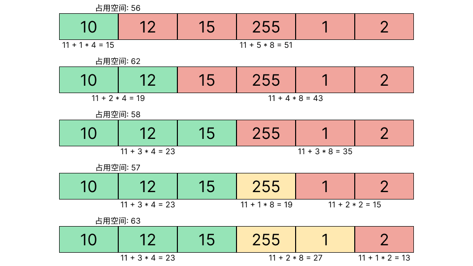

## 动态规划

#### 1. [矩阵连乘](./matrixChain.cpp)

> 给定n个矩阵{A1,A2,…,An}, 其中Ai与Ai+1 是可乘的i=1,2,…n-1,
> 考察这n个矩阵的连乘积 ： A1A2…An, 确定计算矩阵连乘积的计算次序，使数乘次数最少
>
> 例: 设有四个矩阵A,B,C,D, 它们的维数分别是：
> > A=50×10，B=10×40，C=40×30，D=30×5
>
> 总共有五种完全加括号的方式：
> > | (A((BC)D)) | ((A(BC))D) |
> > | ---------- | ---------- |
> > | (A(B(CD))) | ((AB)(CD)) |
> > | (((AB)C)D) |            |

> 

#### 2. 基本要素

---

##### 2.1 最优子结构性质

- 当问题的最优解包含子问题的最优解时, 该问题具有最优子结构性质
- 以自底向上的方式递归的从子问题的最优解逐步构建出整个问题的最优解

##### 2.2 子问题重叠性质

- 递归算法自顶向下解子问题时, 每次产生的子问题并不总是新问题, 利用子问题的重叠性质, 对每个子问题只解一次并保存结果以便后续使用

##### 2.3 备忘录方法

- 备忘录方法是动态规划的变形, 备忘录方法用表格保存已解决的子问题的答案以便后续使用
- 与动态规划不同的是, 备忘录方法的递归方式是自顶向下的, 动态规划是自底向上的
- 当一个问题的所有子问题都至少需要解一次时, 使用动态规划
- 当问题空间中的部分子问题可不必求解时, 使用备忘录方法

#### 3. [最长公共子序列](./longestCommonSubsequence.cpp)

> 子序列是源序列中删去若干元素后得到的序列
>
>如: 源系列 X = { x1, x2, x3, x4, … xn}, 存在递增下标序列 {i1, i2, i3, … ik}
>
>例: X = {A, B, C, B, D, A, B} 的子序列 Z = {B, C, D, B}, 有递增下标为 {2, 3, 5, 7}
>
>若 Z 同时是 X 和 Y 子序列, 则称 Z 是 X 和 Y 的公共子序列
>
>若 Z 是 X 和 Y 的公共子序列中最长的一个, 则称 Z 是 X 和 Y 的最长公共子序列(LCS)
>
>> 求给定 字符序列的最长公共子序列

#### 4. [最大字段和](./MaximumFieldAnd.cpp)

> 给定由n个整数（包含负整数）组成的序列a1,a2,…,an，求该序列子段和的最大值。
>
>当所有整数均为负值时定义其最大子段和为0。
>
>例: 当 (a1,a2, a3, a4, a5,a6) = (-2,11,-4,13,-5,-2) 时，最大子段和为：11-4+13=20
>
>动态规划算法: 遍历数组找到一个正数后连加记录sum, 若和小于0 则遍历下一正数

#### 5. [凸多边形最优三角划分](minWeightTriangulation.cpp)

> 凸多边形即任意两定点有连线(弦)不会落在凸多边形的外部(图1)

> 
>
>> 多边形划分为互补相交的三角形的**弦**的集合 T 中, 各弦互不相交且 T 已达到最大(任意不在 T 中的弦必与 T 中的某一弦相交), *在有 n 个定点的凸多边形的三角划分中, 恰有 n - 3 条弦和 n - 2 个三角形*
>>
>> 显然, 三角形权值之和 = 弦之和 + 凸多边形边权之和
>
>> 给定凸多边形 P = {v0, v1, ... vn-1} , 以及边和弦的权值, 求该凸多边形的最优三角划分(最小权值)

#### [6. 多边形游戏](./PolygonMaxima.cpp)

> 有一个由n个顶点构 成的多边形。
>
> 每个顶点被赋予一个整数值，每条边被赋予一个 运算符 “+” 或 “*” 。所有边依次用整数从1到n编号。
>
> > 游戏开始：
> >
> > 第一步: 选择一条边删除（为了防止最终两条边重叠, 此时的多边形变成一条由数值和符号组成的链）；
> >
> > 第二步: 选择的那一条边，以及该边连接的两个顶点V1和V2；
>>
> > 第三步：用一个新的顶点替代上述边和顶点，新顶点的值为V1，V2经过中间的运算符运算后得到的结果；
>>
> > 第四步：重复送代第二步和第三步，直至所有的边都被删除，只剩下一个结点，得到最终运算结果。
>
> 求最终的节点值最大

#### [7. 图像压缩](./ImageCompress.cpp)

>图像的由很多个像素点构成，像素点越多分辨率越高，像素的灰度值范围为0~255，也就是需要8bit来存储一个像素的灰度值信息
>如, 一个像素灰度值序列P={1,2,2,2,1,2,60,55,78}, 传输过程中把图像像素点转成序列，而不是直接传输矩阵, 每个像素灰度值都用8bit来存储是非常消耗空间
>
>正常情况下，一幅图像的某一范围内像素点的灰度值是很接近的，表现为一幅图片某一区域颜色相近,可以把一段内的像素用相同的bit数来存储，只需要额外存树每段的长度和bit数即可，这样可以节省很多空间。
>
>> b[i] : 第i段中每个像素的位数，1<=b[i]<=8 , 需要3 bit
>> l[i] : 第i段中像素的个数, 定义1<=l[i]<=255 , 需要8 bit
>> 此外每一段需要额外的 3+8=11 bit来存储段内像素的信息
>
>
