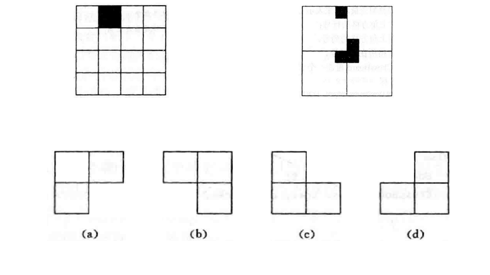

## 递归与分治策略

#### 1. 递归概念

- 直接或简洁的调用自身的算法成为递归算法
- 用函数自身给出定义的函数称为递归函数
- 优点: 结构清晰, 可读性强, 且容易用数学归纳法证明的算法的正确性, 为设计算法和调试程序带来很大方便
- 缺点: 运行效率较低, 无论是耗费的计算时间还是站用的存储空间都比非递归算法要多

---

#####   1.1  [阶乘函数](./Factorial.cpp)

> 求n的阶乘

#####   1.2 [Fibonacci数列](./Fibonacci.cpp)

> 1, 1, 2, 3, 5, 8, ...求第n个数

##### 1.3 双递归函数概念

- 双递归函数无法使用非递归方式定义
- Ackerman函数: 当一个函数及它的一个变量由函数自身定义时, 这个函数是双递归函数

##### 1.4 [全排列问题](Perm.cpp)

> 如数组{1, 2}, 全排列为1 2, 2 1; 求数组的全排列

##### 1.5 [整数划分问题](./divide.cpp)

> 将正整数n表示成一系列正整数之和, 如 3 = 1 + 2, 1 + 1 + 1

##### 1.6 [汉诺塔问题](./hanoi.cpp)

> 三根柱子a, b, c，在a柱子上从下往上 由大到小顺序叠着n个圆盘。需要按大小顺序重新摆放在b柱子上。并且规定，任何时候，在小圆盘上都不能放大圆盘，且在三根柱子之间一次只能移动一个圆盘。

#### 2. 分支法基本思想

- 将一个规模为n的问题分解为k个规模较小的子问题, 这些子问题互相独立且与原问题相同

  递归的解这些子问题, 然后将各个子问题合并得到原问题的解

---

#### 3. 二分搜索技术

##### 3.1  [二分搜索算法](./binarySearch.cpp)

> 在数组(已从大到小排序)中, 查找目标值的索引位置

#### 4. 大整数乘法

##### 4.1 [大整数的乘法](./bigNumMultiply.cpp)

> 计算两个大整数X和Y的积, 基本原理如下: 
>
> 

#### 5. Strassen矩阵乘法

##### 5.1[基于分治的Strassen矩阵乘法](./strassenMatrixMutiply.cpp)

>设A和B是两个 n × n的矩阵，其中 n可以写成 2[^k]。将A和B分别等分成4个小矩阵，此时如果把A和B都当成 2 × 2矩阵来看,每个元素就是一个 ( n / 2 ) × ( n / 2 )的矩阵C
>
>利用斯特拉森方法得到7个小矩阵M
>
>矩阵 M 1 ∼ M 7可以通过7次矩阵乘法、6次矩阵加法和4次矩阵减法计算得出，
>
>4个小矩阵 C 1 ∼ C 4可以由矩阵 M 通过6次矩阵加法和2次矩阵减法得出, 最终合并得到结果
>
>

#### 6. 棋盘覆盖

##### 6.1 [棋盘覆盖问题](./chessBoard.cpp)

> 在一个 2[^k] 2[^k] 个方格组成的棋盘中，若恰有一个方格与其他方格不同，则称该方格为特殊方格。显然，特殊方格在棋盘上出现的位置有 4[^k]种情形。
>
> 用图示的 4 种不同形态的 L L L 型骨牌覆盖一个给定的特殊棋盘上除特殊方格以外的所有方格，且任何 2个L 型骨牌不得重叠覆盖(L型骨牌数为 (4[^k] - 1) / 3 个)
>
> 

#### 7. 合并排序

##### 7.1 [合并|归并排序](./mergeSort.cpp)

#### 8. 快速排序

##### 8.1 [快速排序](./quickSort.cpp)

#### 9. 线性时间选择

##### 9.1 [线性时间选择第k小元素](./kSmallestElement.cpp)

> 给定线性序集中 n 个元素和一个正数 k， 1 ≤ k ≤ n，要求找出这 n 个元素中第 k 小的元素
>
> - 使用RandomizedSelect算法
>
>   在数组 a [ p : r ] 中随机找一个数 i 将数组划分成两个子数组 a [ p : i ]和 a [ i + 1 : r ]，如果数组 a [ p : i ]的长度大于等于 k ，说明第 k 小的数在这个数组，将其递归(等于则直接返回 a[i]) ，否则递归数组 a [ i + 1 : r ] ，直到 p = r ，数组被分割成只剩下一个元素，该元素就是第 k 小的元素。
>
> - 使用Select算法
>
>   将原数组分成⌈5n⌉组，每组有5个元素（最后一个数组的元素个数可能不等于5）, 将每组5个元素排序后找到其中位数并将中位数置于每组的开头，递归调用Select算法找到各组中位数的中位数作为划分基准x（ 最后一个数组个数为奇数时找其中位数，为偶数时找其中位数中较大的那个），划分后的处理与RandomizedSelect算法相同。

