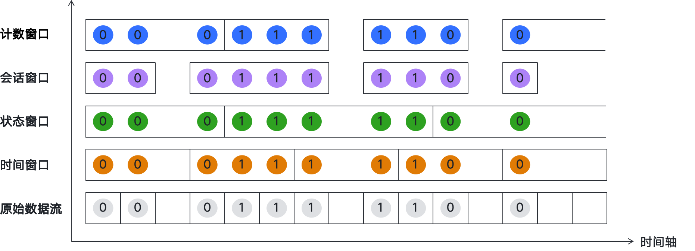
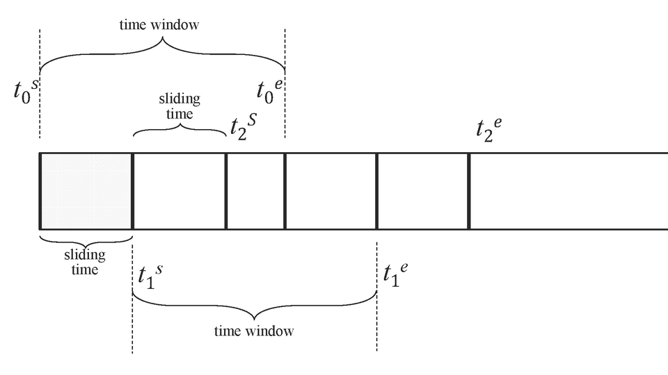

# Database


## TDengine

> 笔记参考智能电表数据库

### Basic

> [!Note]
>
> 时序数据, 即时间序列数据(Time-Series Data)
>
> 它们是一组按照时间发生先后顺序进行排列的序列数据, 数据表的第一列必须是时间戳
>
> 使用命令行`taosBenchMark`建立一个智能电表的测试数据库, [参考文档](https://docs.taosdata.com/3.4.1/reference/tools/taosbenchmark/)
> > ```bash
> > # 创建一个名为db的数据库, 建立默认超表meters,并创建100张子表, 每张子表写入1000条数据
> > taosBenchmark -d db -t 100 -n 1000 -T 4 -I stmt -y
> > ```

#### 数据模型

- **超级表**

  超级表是一种数据结构, 它能将某一特定类型的数据采集点聚集在一起, 形成一张逻辑上的统一表

  这些数据采集点具有相同的表结构, 但各自的静态属性可能不同, 创建超级表时, 除了定义采集量的结构之外, 还需定义超级表的标签, 一张超级表至少包含一个时间戳列, 一个或多个采集量列以及一个或多个标签列, 超级表的标签可以灵活地进行增加、修改或删除操作

- **子表**

  隶属于某张超级表的具体表, 可以将超级表的定义作为模板, 并通过指定子表的标签值来创建子表

  > - 一张超级表包含多张子表, 这些子表具有相同的表结构, 但标签值各异
  > - 子表的表结构不能直接修改, 但可以修改超级表的列和标签, 且修改对所有子表立即生效。
  > - 超级表定义了一个模板, 自身并不存储任何数据或标签

- **虚拟表**

  一种不存储实际数据而可以用于分析计算的表, 表的数据是每次查询计算时动态生成的(将各个原始表的不同列的数据按照时间戳排序、对齐、合并的方式来生成虚拟表)

  虚拟表不能写入和删除数据, 虚拟表也可以分为虚拟超级表、虚拟子表、虚拟普通表, 因此可以灵活地根据业务需要进行定义

  > - 列选择与拼接: 可从多个原始表中选择指定的列, 按需组合到一张虚拟表中, 形成统一的数据视图
  > - 基于时间戳对齐: 以时间戳为依据对数据进行对齐, 如果多个表在相同时间戳下存在数据, 则对应列的值组合成同一行; 若部分表在该时间戳下无数据, 则对应列填充为 NULL
  > - 动态更新: 虚拟表根据原始表的数据变化自动更新, 确保数据的实时性

- 普通表

  > 子表在普通表的基础上增加了静态标签(标签可增删改查)
  >
  > 子表总是隶属于某张超级表, 它们是超级表的一部分, 而普通表则独立存在, 不属于任何超级表
  >
  > 普通表无法直接转换为子表, 子表也无法转换为普通表

- 创建数据库

  ```sql
  CREATE DATABASE power PRECISION 'ms' KEEP 3650 DURATION 10 BUFFER 16;
  ```

  > - `PRECISION 'ms'`: 这个数据库的时序数据使用毫秒精度的时间戳
  > - `KEEP 3650`: 这个库的数据将保留 3650 天, 超过 3650 天的数据将被自动删除
  > - `DURATION 10` : 每 10 天的数据放在一个数据文件中
  > - `BUFFER 16` : 写入使用大小为 16MB 的内存池

- 创建超级表

  ```sql
  CREATE STABLE meters (
      ts timestamp, 
      current float, 
      voltage int, 
      phase float
  ) TAGS (
      location varchar(64), 
      group_id int
  );
  ```

- 创建子表

  ```sql
  CREATE TABLE d1001 
  USING meters (
      location,
      group_id
  ) TAGS (
      "California.SanFrancisco", 
      2
  );
  ```

  > 对超级表进行写入或查询操作时, 可以使用伪列 tbname 来指定或输出对应操作的子表名

- 插入数据时自动建表

  ```sql
  INSERT INTO d1002 
  USING meters 
  TAGS (
      "California.SanFrancisco", 
      2
  ) VALUES (
      NOW, 
      10.2, 
      219, 
      0.32
  );
  ```

  > 当子表d1002存在时, 写入数据; 不存在时, 基于meters为超表创建子表d1002并写入数据

- 创建虚拟表

  ```sql
  -- 原始超表表
  CREATE STABLE current_stb (
      ts timestamp, 
      current float
  ) TAGS (
      device_id varchar(64),
      location varchar(64), 
      group_id int
  );
  
  CREATE STABLE voltage_stb (
      ts timestamp, 
      voltage int
  ) TAGS (
      device_id varchar(64),
      location varchar(64), 
      group_id int
  );
   
  CREATE STABLE phase_stb (
      ts timestamp, 
      phase float
  ) TAGS (
      device_id varchar(64),
      location varchar(64), 
      group_id int
  );
  
  -- 创建子表并写入数据
  create table current_d1001 using current_stb(device_id, location, group_id) tags("d1001", "California.SanFrancisco", 2);
  create table voltage_d1001 using voltage_stb(device_id, location, group_id) tags("d1001", "California.SanFrancisco", 2);
  create table phase_d1001 using phase_stb(device_id, location, group_id) tags("d1001", "California.SanFrancisco", 2);
  
  -- 创建虚拟超表(后缀加 VIRTUAL 1)
  CREATE STABLE meters_v (
      ts timestamp, 
      current float, 
      voltage int, 
      phase float
  ) TAGS (
      location varchar(64), 
      group_id int
  ) VIRTUAL 1;
  
  -- 创建虚拟子表(VTABLE标识, 字段不标注类型, 后用from标注来源)
  CREATE VTABLE d1001_v (
      current from current_d1001.current,
      voltage from voltage_d1001.voltage, 
      phase from phase_d1001.phase
  ) 
  USING meters_v 
  TAGS (
      "California.SanFrancisco", 
      2
  );
  
  -- 创建虚拟表(VTABLE标识, 字段标注类型, 后用from标注来源)
  CREATE VTABLE current_v (
      ts timestamp,
      d1001_current float from current_d1001.current,
      d1002_current float from current_d1002.current, 
      d1003_current float from current_d1003.current,
      d1004_current float from current_d1004.current
  );
  ```

  

#### 数据写入

- 写入

  - 单条写入

    ```sql
    insert into d1001 (ts, current, voltage, phase) values ( "2018-10-03 14:38:05", 10.3, 219, 0.31)
    
    -- 指定部分列写入
    insert into d1004 (ts, voltage, phase) values("2018-10-04 14:38:06", 223, 0.29)
    
    -- values中包含所有列时, 可省略字段
    insert into d1001 values("2018-10-03 14:38:05", 10.3, 219, 0.31)
    
    -- 对于第一列可用时间戳
    INSERT INTO d1001 VALUES (1538548685000, 10.3, 219, 0.31);
    ```

  - 一次写多条

    ```sql
    insert into d1001 values
     ( "2018-10-03 14:38:05", 10.2, 220, 0.23),
     ( "2018-10-03 14:38:15", 12.6, 218, 0.33),
     ( "2018-10-03 14:38:25", 12.3, 221, 0.31)
    ```

  - 一次写多表

    ```sql
    INSERT INTO d1001 VALUES 
        ("2018-10-03 14:38:05", 10.2, 220, 0.23),
        ("2018-10-03 14:38:15", 12.6, 218, 0.33),
        ("2018-10-03 14:38:25", 12.3, 221, 0.31) 
    d1002 VALUES 
        ("2018-10-03 14:38:04", 10.2, 220, 0.23),
        ("2018-10-03 14:38:14", 10.3, 218, 0.25),
        ("2018-10-03 14:38:24", 10.1, 220, 0.22)
    d1003 VALUES
        ("2018-10-03 14:38:06", 11.5, 221, 0.35),
        ("2018-10-03 14:38:16", 10.4, 220, 0.36),
        ("2018-10-03 14:38:26", 10.3, 220, 0.33)
    ;
    ```

  - 写入时自动建表

    ```sql
    insert into d1005
    using meters (location)
    tags ( "beijing.chaoyang")
    values ( "2018-10-04 14:38:07", 10.15, 217, 0.33)
    
    -- 对多表写入多条数据, 并写入时自动建表
    INSERT INTO d1001 USING meters TAGS ("California.SanFrancisco", 2) VALUES 
        ("2018-10-03 14:38:05", 10.2, 220, 0.23),
        ("2018-10-03 14:38:15", 12.6, 218, 0.33),
        ("2018-10-03 14:38:25", 12.3, 221, 0.31) 
    d1002 USING meters TAGS ("California.SanFrancisco", 3) VALUES 
        ("2018-10-03 14:38:04", 10.2, 220, 0.23),
        ("2018-10-03 14:38:14", 10.3, 218, 0.25),
        ("2018-10-03 14:38:24", 10.1, 220, 0.22)
    d1003 USING meters TAGS ("California.LosAngeles", 2) VALUES
        ("2018-10-03 14:38:06", 11.5, 221, 0.35),
        ("2018-10-03 14:38:16", 10.4, 220, 0.36),
        ("2018-10-03 14:38:26", 10.3, 220, 0.33)
    ;
    ```

- 更新

  ```sql
  -- 通过写入重复时间戳的一条数据来更新时序数据
  INSERT INTO d1001 (ts, current) VALUES ("2018-10-03 14:38:05", 22);
  ```

- 删除

  ```sql
  delete from meters where ts < '2021-10-01 10:40:00.100' ;
  ```


#### 数据查询

- 基础查询

  ```sql
  -- 支持基础的sql语法
  SELECT * FROM meters 
  WHERE voltage > 230 
  ORDER BY ts DESC
  LIMIT 5;
  
  SELECT groupid, avg(voltage) 
  FROM meters 
  WHERE ts >= "2022-01-01T00:00:00+08:00" 
  AND ts < "2023-01-01T00:00:00+08:00" 
  GROUP BY groupid;
  ```

- 聚合查询

  > 内置的聚合函数
  >
  > |     函数     |                             说明                             |
  > | :----------: | :----------------------------------------------------------: |
  > | APERCENTILE  | 统计表/超级表中指定列的值的近似百分比分位数, 与 PERCENTILE 函数相似, 但是返回近似结果 |
  > |     AVG      |                     统计指定字段的平均值                     |
  > |    COUNT     |                    统计指定字段的记录行数                    |
  > |   ELAPSED    | elapsed 函数表达了统计周期内连续的时间长度, 和 twa 函数配合使用可以计算统计曲线下的面积, 在通过 INTERVAL 子句指定窗口的情况下, 统计在给定时间范围内的每个窗口内有数据覆盖的时间范围; 如果没有 INTERVAL 子句, 则返回整个给定时间范围内的有数据覆盖的时间范围. 注意, ELAPSED 返回的并不是时间范围的绝对值, 而是绝对值除以 time_unit 所得到的单位个数 |
  > | LEASTSQUARES | 统计表中某列的值的拟合直线方程, start_val 是自变量初始值, step_val 是自变量的步长值 |
  > |    SPREAD    |               统计表中某列的最大值和最小值之差               |
  > |    STDDEV    |                     统计表中某列的均方差                     |
  > |     SUM      |                   统计表/超级表中某列的和                    |
  > | HYPERLOGLOG  | 采用 hyperloglog  算法, 返回某列的基数, 该算法在数据量很大的情况下, 可以明显降低内存的占用, 求出来的基数是个估算值, 标准误差(标准误差是多次实验,每次的平均数的标准差, 不是与真实结果的误差)为 0.81%. 在数据量较少的时候该算法不是很准确, 可以使用 select count(data) from (select  unique(col) as data from table) 的方法 |
  > |  HISTOGRAM   |                统计数据按照用户指定区间的分布                |
  > |  PERCENTILE  |                 统计表中某列的值百分比分位数                 |

- 数据切分查询

  `PARTITION BY`子句在where语句之后

  可按一定的维度对数据进行切分, 然后在切分出的数据空间内再进行一系列的计算

  ```sql
  PARTITION BY part_list
  -- part_list 可以是任意的标量表达式,包括列、常量、标量函数和它们的组合
  ```

- **窗口切分查询**

  > 
  >
  > - 时间窗口: 根据时间间隔划分数据, 支持滑动时间窗口和翻转时间窗口, 适用于按固定时间周期进行数据聚合
  > - 状态窗口: 基于设备状态值的变化划分窗口, 相同状态值的数据归为一个窗口, 状态值改变时窗口关闭
  > - 会话窗口: 根据记录的时间戳差异划分会话, 时间戳间隔小于预设值的记录属于同一会话
  > - 事件窗口: 基于事件的开始条件和结束条件动态划分窗口, 满足开始条件时窗口开启, 满足结束条件时窗口关闭
  > - 计数窗口: 根据数据行数划分窗口, 每达到指定行数即为一个窗口, 并进行聚合计算
  > - 外部窗口: 窗口的时间范围由子查询显式给出, 适合做跨事件关联、窗口复用、分层过滤等复杂分析
  >
  > **窗口使用原则**: 
  >
  > 1. 窗口子句位于数据切分子句之后, 不可以和 GROUP BY 子句一起使用
  > 2. 窗口子句将数据按窗口进行切分, 对每个窗口进行 SELECT 列表中的表达式的计算, SELECT 列表中的表达式只能包含: 常量; 伪列: 窗口起始时间`_wstart`、时间窗口结束时间`_wend`、时间窗口持续时间`_wduration`, 聚合函数: 包括选择函数和可以由参数确定输出行数的时序特有函数
  > 3. WHERE 语句可以指定查询的起止时间和其他过滤条件

  - 时间戳伪列

    可以在 select 子句中使用与时间戳相关的伪列, 如时间窗口起始时间`_wstart`、时间窗口结束时间`_wend`、时间窗口持续时间`_wduration`; 

    以及与查询整体窗口相关的伪列, 如查询窗口起始时间`_qstart`和查询窗口结束时间`_qend`

  - 时间窗口

    > ```sql
    > INTERVAL(interval_val [, interval_offset]) 
    > [SLIDING (sliding_val)] 
    > [fill_clause]
    > ```
    >
    > 时间窗口子句包括 3 个子句：
    >
    > 1. INTERVAL 子句: 用于产生相等时间周期的窗口, interval_val  指定每个时间窗口的大小,interval_offset 指定窗口偏移量; 默认情况下, 窗口是从 Unix time 0(1970-01-01  00:00:00 UTC)开始划分的; 如果设置了 interval_offset, 那么窗口的划分将从`Unix time 0 +  interval_offset`开始
    > 2. SLIDING 子句: 用于指定窗口向前滑动的时间
    > 3. FILL: 用于指定窗口区间数据缺失的情况下, 数据的填充模式
    >
    > 对于时间窗口, `interval_val`和 `sliding_val` 都表示时间段, 语法上支持三种方式: 
    >
    > 1. INTERVAL(1s, 500a) SLIDING(1s),带时间单位的形式,其中的时间单位是单字符表示,分别为: a(毫秒)、b(纳秒),d(天)、h(小时)、m(分钟)、n(月)、s(秒)、u(微秒)、w(周)、y(年)；
    > 2. INTERVAL(1000, 500) SLIDING(1000), 不带时间单位的形式, 将使用查询库的时间精度作为默认时间单位, 当存在多个库时默认采用精度更高的库
    > 3. INTERVAL('1s', '500a') SLIDING('1s'),带时间单位的字符串形式,字符串内部不能有任何空格等其它字符
    >
    > 示例:
    >
    > ```sql
    > SELECT tbname, _wstart, _wend, avg(voltage) 
    > FROM meters 
    > WHERE ts >= "2022-01-01T00:00:00+08:00" 
    > AND ts < "2022-01-01T00:05:00+08:00" 
    > PARTITION BY tbname 
    > INTERVAL(1m, 5s) 
    > SLIMIT 2;
    > -- SLIMIT 2表取前 2 个分片的数据作为结果
    > ```
    >
    > - **滑动窗口**
    >
    >   连续查询的时候需要指定时间窗口大小和每次前向增量时间
    >
    >   INTERVAL 和 SLIDING 子句需要配合聚合和选择函数来使用
    >
    >   SLIDING 的向前滑动的时间不能超过一个窗口的时间范围
    >
    >   
    >
    >   示例:
    >
    >   ```sql
    >   SELECT tbname, _wstart, _wend, avg(voltage)
    >   FROM meters
    >   WHERE ts >= "2022-01-01T00:00:00+08:00" 
    >   AND ts < "2022-01-01T00:05:00+08:00" 
    >   PARTITION BY tbname
    >   INTERVAL(1m) SLIDING(30s)
    >   SLIMIT 1;
    >   ```
    >
    > - **翻转窗口**
    >
    >   当 SLIDING 与 INTERVAL 相等的时候, 滑动窗口即为翻转窗口, 翻转窗口没有数据重叠
    >
    >   ```sql
    >   SELECT tbname, _wstart, _wend, avg(voltage)
    >   FROM meters
    >   WHERE ts >= "2022-01-01T00:00:00+08:00" 
    >   AND ts < "2022-01-01T00:05:00+08:00" 
    >   PARTITION BY tbname
    >   INTERVAL(1m) SLIDING(1m)
    >   SLIMIT 1;
    >   
    >   -- INTERVAL(1m) 和 INTERVAL(1m) SLIDING(1m) 是等效的
    >   ```
    >
    > - **FILL字句**
    >
    >   FILL 子句来指定数据缺失时的数据填充方法, [参考文档](https://docs.taosdata.com/3.4.1/reference/taos-sql/select/#fill-%E5%AD%90%E5%8F%A5)
    
  - **状态窗口**
  
    使用整数(布尔值)或字符串来标识产生记录时候设备的状态量
  
    ```sql
    -- 统计的结果1和0显示在字段status
    SELECT tbname, _wstart, _wend,_wduration, CASE WHEN voltage >= 225 and voltage <= 235 THEN 1 ELSE 0 END status
    FROM meters
    WHERE ts >= "2022-01-01T00:00:00+08:00" 
    AND ts < "2022-01-01T00:05:00+08:00" 
    PARTITION BY tbname 
    STATE_WINDOW(
        CASE WHEN voltage >= 225 and voltage <= 235 THEN 1 ELSE 0 END
    )
    SLIMIT 2;
    ```
  
  - **会话窗口**
  
    会话窗口根据记录的时间戳主键的值来确定是否属于同一个会话, 即两条数据时间间隔在指定时间范围内的, 划分到一个时间窗口
  
    ```sql
    -- 根据 10 分钟的会话窗口进行切分, 统计窗口内的数据条数
    SELECT tbname, _wstart, _wend, _wduration, count(*)
    FROM meters 
    WHERE ts >= "2022-01-01T00:00:00+08:00" 
    AND ts < "2022-01-01T00:10:00+08:00" 
    PARTITION BY tbname
    SESSION(ts, 10m)
    SLIMIT 10;
    ```
  
  - **事件窗口**
  
    根据开始条件和结束条件来划定窗口, 当 start_trigger_condition 满足时则窗口开始, 直到 end_trigger_condition 满足时窗口关闭
  
    ```sql
    -- 电压大于等于 225V,且小于 235V 进行切分
    SELECT tbname, _wstart, _wend, _wduration, count(*)
    FROM meters 
    WHERE ts >= "2022-01-01T00:00:00+08:00" 
    AND ts < "2022-01-01T00:10:00+08:00" 
    PARTITION BY tbname
    EVENT_WINDOW START WITH voltage >= 225 END WITH voltage < 235
    LIMIT 5;
    ```
  
  - **计数窗口**
  
    一种基于固定数据行数来划分窗口的方法
  
    首先将数据按照时间戳进行排序, 然后根据 count_val 的值将数据划分为多个窗口, 最后进行聚合计算
  
    ```sql
    -- 每 1000 条数据为一组,返回每组的开始时间、结束时间和分组条数
    select _wstart, _wend, count(*)
    from meters
    where ts >= "2022-01-01T00:00:00+08:00" and ts < "2022-01-01T00:30:00+08:00"
    count_window(1000);
    ```
  
  - **外部窗口**
  
    用于"先定义窗口,再在窗口内计算", 外部查询会在每个窗口范围内独立计算
  
    ```sql
    -- 基本语法, 子查询的前两列必须是 timestamp 类型, 分别表示窗口开始时间和窗口结束时间
    -- 第 3 列及之后的列会成为"窗口属性列",可通过 window_alias.column_name 引用
    SELECT ... 
    FROM table_name
    [PARTITION BY expr_list]
    EXTERNAL_WINDOW (
        (subquery_that_defines_windows) window_alias
    )
    [HAVING condition]
    [ORDER BY ...]
    ```
  
    示例:
  
    ```sql
    SELECT _wstart, _wend, COUNT(*), AVG(voltage)
    FROM meters
    EXTERNAL_WINDOW (
        (SELECT start_time, end_time FROM grid_events) w
    )
    HAVING COUNT(*) > 0;
    ```
  
- 数据库特有函数

  > |     函数      |                           功能说明                           |
  > | :-----------: | :----------------------------------------------------------: |
  > |     CSUM      |            累加和(Cumulative sum),忽略 NULL 值。             |
  > |  DERIVATIVE   | 统计表中某列数值的单位变化率。其中单位时间区间的长度可以通过 time_interval 参数指定,最小可以是 1 秒(1s)；ignore_negative 参数的值可以是 0 或 1,为 1 时表示忽略负值。 |
  > |     DIFF      | 统计表中某列的值与前一行对应值的差。ignore_negative 取值为 0\|1,可以不填,默认值为 0。不忽略负值。ignore_negative 为 1 时表示忽略负数。 |
  > |     IRATE     | 计算瞬时增长率。使用时间区间中最后两个样本数据来计算瞬时增长速率；如果这两个值呈递减关系,那么只取最后一个数用于计算,而不是使用二者差值。 |
  > |     MAVG      | 计算连续 k 个值的移动平均数(moving average)。如果输入行数小于 k,则无结果输出。参数 k 的合法输入范围是 1≤ k ≤ 1000。 |
  > |  STATECOUNT   | 返回满足某个条件的连续记录的个数,结果作为新的一列追加在每行后面。条件根据参数计算,如果条件为 true 则加 1,条件为 false 则重置为 -1,如果数据为 NULL,跳过该条数据。 |
  > | STATEDURATION | 返回满足某个条件的连续记录的时间长度,结果作为新的一列追加在每行后面。条件根据参数计算,如果条件为 true 则加上两个记录之间的时间长度(第一个满足条件的记录时间长度记为 0),条件为 false 则重置为 -1,如果数据为 NULL,跳过该条数据 |
  > |      TWA      |  时间加权平均函数。统计表中某列在一段时间内的时间加权平均。  |

- 积分计算

  ```sql
  SELECT twa(voltage * current) * _wduration
  FROM meters
  PARTITION BY tbname
  INTERVAL(1d);
  ```

- 嵌套查询

  ```sql
  SELECT max(voltage), * 
  FROM (
      SELECT tbname, last_row(ts), voltage, current, phase, groupid, location 
      FROM meters 
      PARTITION BY tbname
  ) 
  GROUP BY groupid;
  ```

  > 嵌套查询遵循以下规则：
  >
  > 1. 内层查询的返回结果将作为“虚拟表”供外层查询使用, 此虚拟表建议起别名, 以便于外层查询中方便引用。
  > 2. 外层查询支持直接通过列名或列名的形式引用内层查询的列或伪列。
  > 3. 在内层和外层查询中, 都支持普通表间/超级表间 JOIN。内层查询的计算结果也可以再参与数据子表的 JOIN 操作。
  > 4. 内层查询支持的功能特性与非嵌套的查询语句能力是一致的。内层查询的 ORDER BY 子句一般没有意义, 建议避免这样的写法以免无谓的资源消耗。
  > 5. 与非嵌套的查询语句相比, 外层查询所能支持的功能特性存在如下限制：
  > 6. 如果内层查询的结果数据未提供时间戳, 那么计算过程隐式依赖时间戳的函数在外层会无法正常工作。例如：INTERP、DERIVATIVE、IRATE、LAST_ROW、FIRST、LAST、TWA、STATEDURATION、TAIL、UNIQUE。
  > 7. 如果内层查询的结果数据不是按时间戳有序, 那么计算过程依赖数据按时间有序的函数在外层会无法正常工作。例如：LEASTSQUARES、ELAPSED、INTERP、DERIVATIVE、IRATE、TWA、DIFF、STATECOUNT、STATEDURATION、CSUM、MAVG、TAIL、UNIQUE。
  > 8. 计算过程需要两遍扫描的函数, 在外层查询中无法正常工作。例如：PERCENTILE

- UNION语句

  用于合并多个 SELECT 子句的查询结果, 多个 SELECT 子句需满足以下两个条件：

  1. 各 SELECT 子句返回结果的列数必须一致；
  2. 对应位置的列需保持相同的顺序, 且数据类型必须相同或兼容

  ```sql
  (SELECT tbname, * FROM d1 limit 1) 
  UNION ALL 
  (SELECT tbname, * FROM d11 limit 2) 
  UNION ALL 
  (SELECT tbname, * FROM d21 limit 3);
  ```

- 关联查询

  > |         Join 类型         |                             定义                             |
  > | :-----------------------: | :----------------------------------------------------------: |
  > |        Inner Join         | 内连接, 只有左右表中同时符合连接条件的数据才会被返回, 可以视为两张表符合连接条件的数据的交集 |
  > |   Left/Right Outer Join   | 左/右(外)连接, 既包含左右表中同时符合连接条件的数据集合, 也包括左/右表中不符合连接条件的数据集合 |
  > |   Left/Right Semi Join    | 左/右半连接, 通常表达的是 in、exists 的含义, 即对左/右表任意一条数据来说, 只有当右/左表中存在任一符合连接条件的数据时才返回左/右表行数据 |
  > | Left/Right Anti-Semi Join | 左/右反连接, 同左/右半连接的逻辑正好相反, 通常表达的是 not in、not exists 的含义, 即对左/右表任意一条数据来说, 只有当右/左表中不存在任何符合连接条件的数据时才返回左/右表行数据 |
  > |   left/Right ASOF Join    | 左/右不完全匹配连接, 不同于其他传统 Join 操作的完全匹配模式, ASOF Join 允许以指定的匹配模式进行不完全匹配, 即按照主键时间戳最接近的方式进行匹配 |
  > |  Left/Right Window Join   | 左/右窗口连接, 根据左/右表中每一行的主键时间戳和窗口边界构造窗口并据此进行窗口连接, 支持在窗口内进行投影、标量和聚合操作 |
  > |      Full Outer Join      | 全(外)连接, 既包含左右表中同时符合连接条件的数据集合, 也包括左右表中不符合连接条件的数据集合 |
