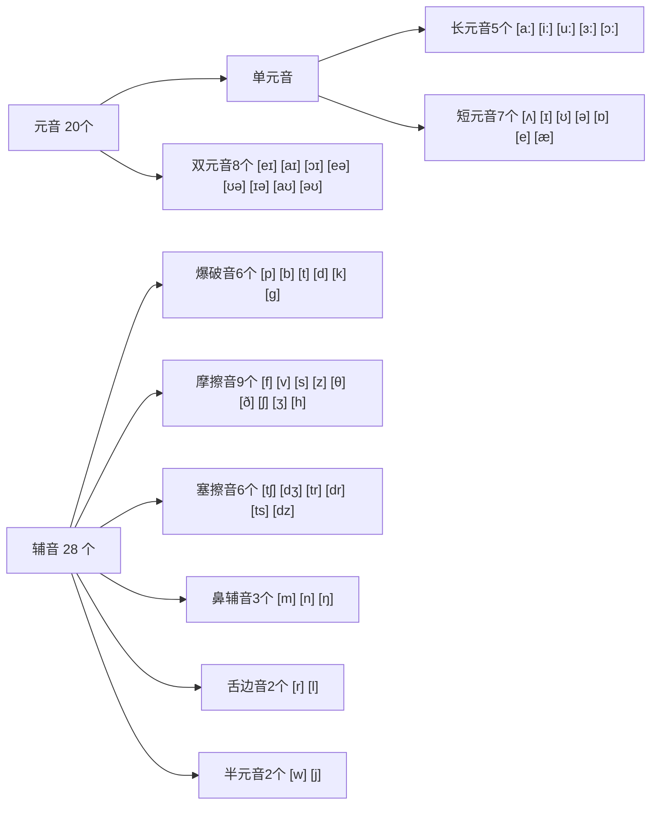
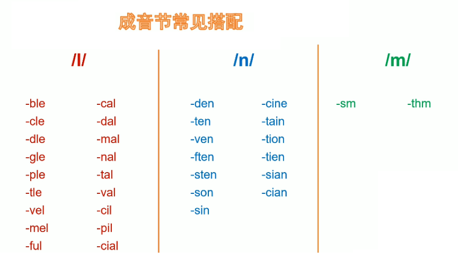

# English


## Basic Verb

### 音标

#### 元辅音


| 区别     | 辅音                                       | 元音                         |
| -------- | ------------------------------------------ | ---------------------------- |
| 发声方式 | 无论声带振动与否, 气流通过口腔或鼻腔时受阻 | 声带振动, 气流通过口腔不受阻 |
| 功能     | 一般不能独立构成音节(成音节除外)           | 一个元音音素就可构成一个音节 |

- 示例组合:

| 单词  | 音标   | 组合               |
| ----- | ------ | ------------------ |
| I     | [aɪ]   | 单个元音           |
| and   | [ænd]  | 元音 + 辅音        |
| she   | [ʃi:]  | 辅音 + 元音        |
| check | [tʃek] | 辅音 + 元音 + 辅音 |


#### 音节

> 即: 有元音和辅音组成, 一个音节中必有一个元音音素, 是读音的基本单位(不包含成音节)
>
> 作用
>
> - 确认 5 个元音字母在单词中的发音
> - 有助于单词分词和快速拼写(两元音字母间有两个辅音字母则各分一个, 只有一个则归属后一个)
> - 有助于确认单词轻重音
>
> 三个及以上称为多音节单词

- **成音节**

> 由特殊辅音 [l] [m] [n] 和辅音音素构成的音节(本质上由元音弱化而来)
>
> 如:	table ['teɪbl]  <-- ['teɪbəl]
>
> 

- **开音节和闭音节**

> 开音节: 
>
> - 绝对开音节:    no, hi    元音开放, 发字母本身的音
> - 相对开音节:    note, hide    有不发音的e辅助, 发字母本身的音
>
> 闭音节:
>
> - not, hid    发字母对于的短音

- **重音和次重音**

> 示例:	information	[,infər'meiʃn]
>
> , 为次重音符号
>
> '为重音符号 
>
> **在单音节单词中只有一个元音, 直接重读该元音**


#### 重读闭音节

> **以辅元辅**结尾(看音标, 不看字母)的**重读**音节(**读短元音**)
>
> 注: 所有单音节(只有一个元音音标)都是重读音节, 不需要重音符号
>
> 示例: 
>
> - run	 是
> - swim    是
> - put    是
> - play    否
> - begin    是
> - today    否
> - limit    否
> - pig    是

---


### 词性说明

```markdown
英语词性有10种，另有2种特殊词性 分别是及物、不及物。
10种词性：
    1、名词(n.)，Nouns 表示人或事物的名称 box, pen,tree,apple
    2、代词(pron.)，Pronouns 代替名词、数词、形容词We, this, them,myself
    3、形容词(adj.)， Adjectives 用来修饰名词，表示人或事物的特征 good, sad, high, short
    4、数词(num.)，Numerals表示数目或顺序 one,two, first
    5、动词(v.)，Verb 表示动作或状态 Jump,sing,visit
    6、副词(adv.)，Adverbs 修饰动、形、副等词，表示动作特征 there,widely,suddenly
    7、冠词(art.)，Articles 用在名词前，帮助说明名词所指的范围 a, an, the
    8、介词(prep.)，Prepositions 用在名词或代词前，说明它与别的词的关系 in,on,down,up
    9、连词(conj.)，Conjunctions 表示人或事物的名称if,because,but
    10、感叹词(int.)， Interjections 代替名词、数词、形容词等 oh,hello,hi,yeah

特殊词性——及物、不及物：
    vt.是及物动词，vt.后必须跟宾语：sing a song
    vi.是不及物动词，vi.后不直接带宾语或不带宾语:jump high
```

#### 名词

- **可数名词**(词前可加 a|an 或量词)
  1. 一般在末尾加 **s**
  2. 以 s、z、x、ch、sh 结尾的词, 末尾加 **es**
  3. 辅音字母 +y 结尾的名词, 将 y 改为 i 再加 **es**
  4. 以 o 结尾的名词, 若不是外来词或缩写, 就加 **es**
- **不可数名词**(词前不可加 a|an , 但可加量词: a cup of coffee)


#### 指示代词和不定代词

- 指示代词: 标识人或事物的代词, 用以代替已提到过得名词(this, these, that, those)
- 不定代词: 指代不确定的人或事物(one, some, the other, any, somthing, noting)


#### 形容词

- 通常放在名词前, be动词后
- **The + 形容词 = 复数名词**, 后面的动词用复数形式, 如the old, the young


#### 副词

- 修饰动词, 形容词

- 常用的频度副词(always, usually, often, sometinmes, never … )

  通常放在一般动词前, be动词后, 助动词和释义动词之间

- 通常放在助动词之后, 实意动词之前或之后; 形容词之前, 其他副词之前或之后

- 有多个助动词, 副词通常放在第一个助动词之后

  示例: They have <u>already</u> been repaired.


---


### 五种句式

| 基本句式 | 句式                                                       |
| -------- | ---------------------------------------------------------- |
| 句式一   | S    +    V    (主 + 谓)                                   |
| 句式二   | S    +    V    +    P    (主 + 系 + 表)                    |
| 句式三   | S    +    V    +    O    (主 + 谓 + 宾)                    |
| 句式四   | S    +    V    +    o    +    O    (主 + 谓 + 间宾 + 直宾) |
| 句式五   | S    +    V    +    O    +    C    (主 + 谓 + 宾 + 宾补)   |


### 系动词 Be

- be	am	is	are	was	were	bing	been
- 后面接名词、形容词、地点副词或短语做补足语


### 人称词汇

| 主格 | 宾格 | 形容词性物主代词 | 名词性物主代词 | 反身代词              |
| ---- | ---- | ---------------- | -------------- | --------------------- |
| I    | me   | my               | mine           | myself                |
| he   | him  | his              | his            | himself               |
| she  | her  | her              | hers           | herself               |
| it   | it   | its              | its            | itself                |
| you  | you  | your             | yours          | youself \| yourselves |
| we   | us   | our              | ours           | ourselves             |
| they | them | their            | theirs         | themselves            |


### 实义动词

- 助动词:	do	does	did	done	had done	 has	 have
- 受时态的变换
- 否定使用 don't 	doesn't


### 疑问句

**一般疑问句**

- 谓语动词是Be动词时:	**Am/Is/Are + 主语 + 其他 ?**
- 谓语动词是实义动词时: **助动词 + 主语 + 其他 ?**


**特殊疑问句(5w1h)**

- 当**提问对象是主语**时: 	**特殊疑问词 + 动词 + 其他 ?**

- 谓语动词是Be动词时(**提问对象非主语**):    **特殊疑问词 + am/is/are + 主语 + 其他 ?**
- 谓语动词是实义动词时(**提问对象非主语**): **特殊疑问词 + 助动词 + 主语 + 动词原型 + 其他 ?**


### 不定量表达

1. **some, any** 都表示 "一些"

   some 主要用于肯定句, 希望得到肯定回答时, 也可用在疑问句

   any 主要用在否定和疑问句

2. **most** 作副词时表示大部分的, 后面可接复数名词

3. **every** 后接单数名词(Every one likes ...)

4. **all** 后接可数名词复数

5. **both** 可做形容词, 代词和副词

   **either**       两者之一, 后动词用单数

   **neither**	两者都不, 后动词用复数

6. **many** 修饰可数名词

   **much** 修饰不可数名词

   **a lot of | lots of | plenty of** 均可修饰可数和不可数

7. **a few** 表 "几个",

   **few** 表 "没几个"

   二者均和*可数名词复数*连用

8. **a little** 表肯定含义"一点儿", 用于肯定句

   **little**  表否定含义 "没多点", 用于否定句

   二者均可与*可数或不可数名词*连用

9. **none** 和 **no one** 都表"一个也不, 一点也不"

   none 可接 of 短语, 动词可用单数或复数(None of us ...)

   no one 不可接 of 短语, 动词只能接单数(No none ...)


### There | Here be

- There | Here + (be) , 表"有, 是", 为倒装句, 后面的名词才是主语

  be动词根据后面的名词有单复数变化


### 倒装句

> 即为了强调某些信息而颠倒了原有的语序
>
> 分三类: 
>
> - 完全倒装(谓语动词完全在主语前)
> - 部分倒装(助动词和谓语动词分离, 仅助动词提前)
> - 形式倒装(谓语动词不提前)

- **完全倒装**

> 完全倒装分类:
>
> - 副词|介词短语在句首的倒装
>
>   - 地点副词在句首的倒装
>
>     > There goes the last bus.
>
>   - 时间副词在句首的倒装
>
>     > Now comes the wolf's turn.
>
>   - 表运动方向的副词在句首的倒装
>
>     > Up went the carrots into the air.
>
>   - 介词短语在句首的倒装
>
>     > At the table set a woman.
>
> - 主语补语(表语)的倒装
>
>   > 将作表语的形容词、分词、介词短语、such等完成倒装
>   >
>   > 示例：
>   >
>   > Seated on the ground is a grounp of students.

- **部分倒装**

> 部分倒装分类:
>
> - 句首有否定意义词的倒装
>
>   > Never before <u>have</u> I eaten such delicious food.
>
> - 句首有 **only** 时的倒装
>
>   > Only in this way <u>can</u> we grow beautiful flowers.
>   >
>   > Only then <u>did</u> the rabbit meet the wolf.
>
> - **if... should...** 构成虚拟语气的倒装
>
>   > If I should win the lottery, I would buy it.(这是原句)
>   >
>   > <u>Should</u> I win the lottery, I would buy it.(去掉if后倒装should)
>
> - 固定句型中的倒装
>
>   > 示例:
>   >
>   > So was I. (我也是)
>   >
>   > so do I.(我也一样)
>   >
>   > Neither|nor can the teacher.(老师也不会)

- **形式倒装**

> 形式倒装分类:
>
> - 感叹句中的倒装
>
>   > What a delicious carrot it is!
>
> - 比较句型中的倒装
>
>   > The more vegetables you eat, the more healthier you become.
>
> - **however, whatever** ...引导让步状语从句时的倒装
>
>   > However long the rout is, you should stay the course.
>
> - **as, though** ...引导让步状语从句时的倒装
>
>   > Much as he likes the movie, he doesn’t want to watch it. 

---


## Tense

> | 状态\时间 | 现在                                         | 过去                                 | 将来                                       | 过去将来                                        |
> | --------- | -------------------------------------------- | ------------------------------------ | ------------------------------------------ | ----------------------------------------------- |
> | 一般      | 一般现在时 **study**                         | 一般过去时 **studied**               | 一般将来时 **will study**                  | 过去将来时 **would study**                      |
> | 进行      | 现在进行时 **am \| is \| are studying**      | 过去进行时 **was \| were studying**  | 将来进行时 **will be studying**            | 过去将来进行时 **would be studying**            |
> | 完成      | 现在完成时 **have \| has stduied**           | 过去完成时 **had studied**           | 将来完成时 **will be studying**            | 过去将来完成时 **would have studied**           |
> | 完成进行  | 现在完成进行时 **have \| has been studying** | 过去完成进行时 **had been studying** | 将来完成进行时 **will have been studying** | 过去将来完成进行时 **would have been studying** |


### 一般现在时

> 表示通常性、规律性、习惯性的状态或者动作。
>
> 动词：先看时态， 再看主语
>
> **主语是单数第三人称时，动词有第三人称单数的变化**

- **动词的第三人称单数变化**：
  1. 在动词尾直接加 **s**
  2. 以字母 **s**、**x**、**ch**、**sh**或 **o** 结尾的动词加 **es**
  3. 以辅音字母 **+y** 结尾的动词， 该 y 为 i 再加 **es**


### 现在进行时

> 表示现在正在进行或发生的动作
>
> 句中通常有now等时间副词呼应
>
> - **基本构成形式： be + doing**

- **动词的现在分词变化**：

  1. 直接在动词后加 **ing**

  2. 动词以不发音的 **e** 结尾， 去 **e** 加 **ing**

     > 如 take -> taking

  3. 重度闭音节的动词， 要双写词尾字母 再加 **ing**

     > 如 cut -> cutting

  4. 以 ie 结尾的动词， 要 变为 **y** 再加 **ing**

     > 如 lie -> lying


### 一般过去时

> 表示过去某个时间里发生的动作或状态, 过去习惯性, 经常性发生的行为
>
> - **主语 + 动词过去式 + 其他**

- **动词过去分词变换:**
  1. 一般动词后加 **ed**
  2. 字母以 **e** 结尾的加 **d**
  3. 以 辅音字母 +y 结尾的动词, 改 **y 为 i 加 ed**
  4. 以重读闭音节结尾且末尾只有一个辅音字母后, 双写最后一个辅音字母再加 **ed**
  5. **不规则变换**


### 过去进行时

> 表过去的某一时刻或某一时间段内进行或或发生的动作
>
> - **was | were + doing**


### 将来时

> 表将来某一时刻的动作或状态, 或将来某一端时间内经常发生的动作或状态
>
> 常常和表示将来的时间状语连用
>
> - **助动词 will | shell + 动词原型**
>- **be going to + 动词原型**
> - **be doing** -> 表示位置转移的动词: **go come leave start arrive**
> 

- **will 和 shell**

  主语是 I 或 We时, 可以使用 shell

  主语非第一人称时通常用 will, 第一人称也可以用will

- **be going to + 动词原型**

  表示近期或事先考虑过将要发生的动作, 以及有迹象表明必将发生的某事, 意为"打算, 就要"

- **be doing**  表示位置转移

  仅限几个动词, 如 go come leave start arrive

  > They are leaving to China. 


### 完成时

> **现在完成时:**
>
> 表动作过去发生, 已经完成, 对现在造成影响, 动作可能还会持续
>
> 可使用的时间状语为: **already 和 yet 等**
>
> - **have + 动词过去分词**
>
>  
>
> **过去完成时:**
>
> 表动作发生在过去之前, 即过去的过去, 已经完成, 对过去造成了影响
>
> - **had + 动词过去分词**


### 动词用法

> ```mermaid
> graph LR
> A["动词"]
> A-->B["实义动词Notional"]
> B-->Ba["及物(后接名词构成SVO, 即动宾)"]
> B-->Bb["不及物(直接构成SV; 或后接介词 +名词构成SVO, 即介宾)"]
> A-->C["系动词Link"]
> A-->D["助动词Auxiliary"]
> A-->E["情态动词Model"]
> ```

- **数量和时态的变化**, **通常: 现在, 过去, 将来时**

- **进行的状态的变化, 通常: 现在时, 进行时, 完成时**

- 以上二者构成基本的 9 种时态, 形成动词的基本变化形式, 示例:

  | 原型 | 第三人称单数 | 现在分词 | 过去式 | 过去分词 |
  | ---- | ------------ | -------- | ------ | -------- |
  | play | palys        | playing  | played | played   |
  | have | has          | having   | had    | had      |
  | go   | goes         | going    | went   | gone     |
  
- **谓语动词的强调**

  要强调谓语动词可以直接前面加上do|does|did, 然后把谓语动词变回原型, 

  do和does表强调的是现在的动作, did强调的是过去的动作, 通常强调谓语动词不用将来时态

  > The court <u>did suggest</u> that accepting favors in return for opening doors is “distasteful” and “nasty”

---


### 情态动词

#### **can  |  could**

> can | could 表示能力, 可使用 be able to 来代替
>
> 表现在 | 过去的能力, 
>
> 表示客观可能性(can可能性大, could比较委婉), 
>
> 表请求和允许


#### may | might

> may | might 表可能性(may的可能性大, might比较委婉)
>
> 表请求, 允许


#### must | have to

> must | have to 表必须, 必要(must表主观多一点, have to表客观多一点)
>
> have to 有时态和数量的变化
>
> must和have to的否定意义不太相同:
>
> - mustn't	表不准, 禁止
> - don’t have to    表不必, 同needn't


#### shoud | ought to

> should | ought to 表应该, 劝告, 建议, 命令(should强调主观看法, ought to强调客观要求)
>
> 疑问句中, 通常用should代替ought to


#### need

> 表需要, 可以作情态动词和实义动词:
>
> - 情态动词: 后接动词原型(he need come here)
> - 实义动词: 有第三人称单数和时态的变化, 后可接to的不定式(he needs to come here)


#### had better

> had better表 最好做某事
>
> had 虽然是过去式, 但不表过去, better 后接动词原型
>
> 否定: had better not


#### would rather

> would rather 表 宁愿, 宁可, 最好, 还是...为好
>
> 语感上比had better轻一些
>
> 否定: would rather not


#### used to |would to

> used to , would 表 过去习惯性动作, 可译为 过去常常......
>
> - userd to 可指过去的状态和情况, would则不能
> - would 表 反复发生的动作, 若某一动作没有反复性, 就不能用would, 只能用used to
> - used to 表 过去经常性或习惯性的动作或状态现在已经结束, would则表示有可能再发生


#### 否定和疑问

> - 情态动词的否定
>
>   情态动词 + not + 动词原形, 
>
>   have to 否定为 don't | doesn't have to
>
> - 情态动词的疑问
>
>   情态动词 + 主语 + 动词原形
>
>   have to 要使用助动词 do | does 提前
>
>   > Does he have to go there ?


#### 情态动词 + have + 过去分词

> 即: **情态动词 + 完成时**
>
> - 表 过去事实
>
> - 表 推测的含义(should除外)
>
>   > He can | could | may | might have arrived. 可能到
>
> - should + have + 过去分词:  表本应该 ... ...
>
>   > He should have arrived. 本应该到了(否定, 表未到)
>
> - needn't have + 过去分词:  本不应该 ... ...
>
>   > You needn't have done so. 本不需要那么做的(表否定, 要这么做)
>
> - must + have + 过去分词: 准是已经 ... ...
>
>   > He must have arrived. 准是已经到了
>
> - can't + have + 过去分词:  不可能已经 ... ...
>
>   > He can’t have arrived.不可能已经到了

---


## Voice Grammar

### 被动语态

> - 如果主语是动作的承受者, 则用动词的被动语态做谓语
>
> - **表现时态时, 主动语态中要变幻谓语动词, 被动语态中要变幻的是 be 动词, 而不是动作所对应的词**
>
> - 构成 : **be + 动词的过去分词 + ... + by sb.**    若动作行为者不分明或不重要或上下文已提及, 可省略by sb.
>
> - 被动语态有各种时态
>
>   > 现在:  The information is needed by us.
>   >
>   > 过去进行: The book was being read by him.
>   >
>   > 将来: The room will be cleaned.
>   >
>   > 完成: The computer has been used by her.
>   >
>   > 综上:  **[情态] + [时态] + [状态be] + 被动语态(p.p) + [by sb.]**


#### 被动语态和情态动词

> can|could + be + 动词的过去分词
>
> 注:  need + doing|to do + 动词过去分词
>
> 示例: 
>
> > The food could be taken away.
> >
> > The food had batter be taken away.
> >
> > The food needs taking away.(表达客观事件, need为实义动词, 不是情态动词)


#### 被动语态的疑问

> 一般疑问句:	**(第一个)助动词 + 主语 + (其他助动词) + 动词的过去分词 + 其他 ?**
>
> > Is the information needed?
> >
> > Has the computer been used ?
>
> 特殊疑问句:	 **疑问词 + (第一个)助动词 + 主语 + (其他助动词) + 动词的过去分词 + 其他 ?**


### 非谓语动词

#### 基本形式

- **动词不定式: to + 动词原形**

> 由 to + 动词原形 构成, 可做主语、宾语，宾补、定语、表语和状语
>
> 示例:
>
> > 主语: To get there by bike will take us an hour.
> >
> > 宾语: The driver failed to see the car in time.
> >
> > 宾补: We believe him to be guility.
> >
> > 定语: The next train to arrive is from Seoul.
> >
> > 表语: My suggestion is to put off the meeting.
> >
> > 状语: I come here only to see you.
> >
> > 分句: The students went out of the classroom, laughing and talking.

- **动名词: 动词 + ing**

> 动词 + ing 可做名称用, 具有动词的特征和变换形式, 
>
> 句中用法类似名词, 可做主语、宾语、表语、定语，也可被副词修饰或支配宾语
>
> 示例：
>
> > 主语：Reading is an art.
> >
> > 定语:  This is a reading room.


#### 形式主宾表语

- 动词不定式 和 动名词 可在主语的位置上, 但一般用 **It** 代替它作形式主语, 这种情况 it 叫形式主语

> 示例:
>
> <u>It</u>'s a great honor <u>to be invited</u>
> 
> <u>It</u> is use <u>crying over spilt milk</u>.

- 动词不定式 和 动名词在宾语的位置上, 用it代替作形式宾语

> 示例:
>
> We think <u>it</u> important <u>to learn English</u>.

- 动词不定式 和 动名词否定时, 前加 not 即可

> 示例:
>
> He pretended <u>not to see her.</u>
>
> He regrets <u>not joining them.</u>

- 形式表语

> 主系表中使用 **There + 系动词** 句式
>
> 示例: 
>
> There is a book <u>on the table.</u> (There 是形式表语, on the table 是真正的表语)
>
> There stands a tree <u>on the hill.</u>
>
> There exists no air <u>on the moon.</u>


#### 不定式表目的

- **in order to + v 表目的** , 引导的目的状语置于句首句尾都可以, 否定形式为 to 前加 not
- **so as to + v 表目的**, 引导的目的状语只能置于句尾, 否定形式为 to 前加 not

> 示例:
>
> I have written it down <u>in order [not] to</u> remember it.
> 
> He shouted and waved <u>so as [not] to</u> be noticed.


#### 常用搭配

- **too ~ to ... 太 ~ 而不能 ...**(有否定含义)

  > The room too small to live.

- **enough + n + to + v | adj + enough + to + v 足够 ... 可以**

  > There is <u>enough food to</u> eat.
  >
  > The box is <u>big enough to</u> contain six apples.	

- **On ~ing 一 ... 就...**(on + 动名词)

  > On seeing the snake,  the girl was very frightened.

- **There is no hope of ~ing 没希望...**(动名词)

  > There is no hope of seeing him.

- **feel like \~ing 想要...**(动名词)

  > I feel like eating ice cream now.

- **have a hard time ~ing 做 … 艰难**(动名词)

  > The have a hard time solving the problem.


### 原型不定

#### 使役动词

- 使役动词, 表 使|让 ... ...

  **have, make, let 作使役动词, 构成形式:  have|make|let + 宾语 + v**

> 示例: 
>
> He made me laugh.
>
> I let him go.
>
> Please have him come here.

- **get|help作使役动词, 表 让|使 … …**

  **get使役动词句式:  get + 宾语 + to + v**

  **help使役动词句式:  help + 宾语 + (to) + v**

> 示例:
>
> I can't get anyone to do the work properly
>
> I helped him (to) repair the car.

- **使役动词 + 宾语 + 过去分词  , 表  让某物|人被别人 ... ...**

> 示例:
>
> I must get my hair cut.


#### 感官动词

- **see|watch|observe|notice|hear|smell|taste|fell + 宾语 + 动词原型|现在分词**

  **+ 动词原型  表动作的真实性**

  **+ 现在分词  表动作的连续性, 进行性**

> 示例:
>
> I saw him work in thegarden yesterday. (在工作, 表达真实情况)
>
> I saw him working in thegarden yesterday.(在一直工作, 表达工作情况, 连续性)

- **感官动词 + 宾语 + 过去分词  表达被动含义, 宾语被  ... ...**

> 示例:
>
> John saw the man knocked down by the car.
>
> I heard sam sent to the hospital.


### 假设

#### 单纯条件假设

- 条件状语从句, 用 if 引导条件状语从句, 从句为现在时(主句为将来时), 表 如果 ... ...

> If you get up early, you will catch up with train.

- **if 引导条件状语从句可放在句首或句尾(主句用将来时)**

> She will be upset if you fail the exam. 


#### 与现在事实相反的虚拟假设

- if从句是一种虚拟的条件或假设， 和现在事实相反

  **从句：动词过去式(be用were)**, 即表达对过去的假设

  **主句:  would|could|should|might**

> 示例:
>
> If I were you, I would join them.
>
> She would come with you if you invited her.


#### 与过去事实相反的虚拟假设

- if从句是一种虚拟的条件或假设， 和过去事实相反

  **从句: had + 动词过去分词** 即 过去完成

  **would|could|should|might  + have + 动词过去分词** 即 情态动词+现在完成时

> 示例:
>
> If I had got there early, I should have meet her.
>
> If he had taken my advice , he would no have made such a mistake.


#### wish

> 译为 :  希望 ... ... 就好了

- 与现在事实相反愿望

> I wish I were as tall as you.

- 与过去事实相反愿望

> He wished he hadn't said that.

- 表达不太可能实现的愿望

> I wish it would rain tomorrow.


#### as if

> 译为: 看起来好像 ... ... 

- 若从句表示与**现在**事实相反(从句过去时)

> You look as if you didn't care.

- 从句表示与**过去**事实相反(从句过去完成时)

> He talks about Rome as if he had been there before.

- 从句表示与**将来**事实相反(从句情态动词+现在时)

> He opened his mouth as if he would say something.


### 比较|最高级

- **通常在形容词|副词后面加 er**

> hard  -  harder  -  hardest

- **词尾是不发音的单音节 e 时, 加 r**

> nice  -  nicer  -  nicest

- **词尾是辅音 +y 的双音节时, 改 y 为 i 加 er | est**

> dry  -  drier  -  driest

- **以一个辅音字母结尾的重读闭音节时, 双写最后一个字母, 加 er | est**

> hot  -  hotter  -  hottest

- **多音节和双音节, 在形容词|副词前加:**
  - **程度加强:  more	the most**
  - **程度减弱:  less    the least**

> insterestting  -  more|less interesting  -  the most|least interesting

- **不规则变化:**

> good  -  better  -  the best
>
> many  -  more  -  the most
>
> little  -  less  -  the least

---


## Parallelism

> 并列句指将多件事并列: **多个简单句 + 并列连词**

### 并列句的构成

- **表示顺接的并列连词**

| 并列连词                    | 含义            |
| --------------------------- | --------------- |
| ...and...                   | ...和....       |
| both... and...              | ...和....       |
| not only... but... as well  | 不但... 而且... |
| not only... but also...     | 不但... 而且... |
| not only... but...          | 不但... 而且... |
| not just... but (also)...   | 不仅... 而且... |
| not merely... but (also)... | 不止... 而且... |

- **表示转折的并列连词**

| 并列连词  | 含义       |
| --------- | ---------- |
| ...but... | ...但是... |
| ...yet... | ...但是... |

- **表示选择的并列连词**

| 并列连词         | 含义                       |
| ---------------- | -------------------------- |
| ...or...         | ...或者...                 |
| either...or...   | 要么...要么...(二选一)     |
| neither...nor... | 既不...也不...(二者都不选) |

- **表示因果的并列连词**

| 并列连词  | 含义             |
| --------- | ---------------- |
| ...for... | ...因为...       |
| ...so...  | ...所以\|因此... |


### 并列句的省略

> 并列句的独有特点: **相同的成分可以省略, 余下的成分保持不变**

> 示例:
>
> The program keeps track of your progress <u>and</u> provides detailed feedback on your performance and inprovement.

---


## Clauses

> 从句是主句中的作为某种词性或句子成分的句子
>
> 可以按从句在主句中充当的成分或词性来划分从句类型
>
> **按词性划分:**
>
> - 名词从句
> - 形容词从句
> - 副词从句


### 形容词从句-定语从句

> 定语从句(又称形容词从句, 关系从句): 用一个句子来修饰限定一个名称或代词, 
>
> 被修饰的词称为**先行词**, 其后的句子为定语从句, 由**关系代词|副词**来连接
>
> 根据限定形式又分为**限定性定语从句和非限定性定语从句**

#### 关系代词

> 在句中做一定的成分, 代替先行词, 起到链接先行词和从句的作用
>
> 常见关系代词: **that、who、which、whom、whose**
>
> 示例:  
>
> > The girl <u>whom|that I spoke to</u> is my cousin.(the girl 是 I spoke to 的宾语)
> >
> > He is the man <u>whose wife is a teacher.</u>
>
> ---
>
> | 关系代词 | 指人            | 指物        |
> | -------- | --------------- | ----------- |
> | 主格     | who\|that       | which\|that |
> | 宾格     | whom\|who\|that | which\|that |
> | 属格     | whose           | whose       |
>
> - 先行词是人的话用 that, who, whom, whose(谁的, 用于属格)来引导定语从句
>
>   **whom 在句中作宾语**
>
>   **who和that在从句中即可做主语又可作宾语**
>
> - 先行词是动物|事物的话, 用which、that、whose来引导定语从句
>
>   **which和that在句中可作主语和宾语, 作宾语时可以省略**
>   
>   通常, that和which可以互换, 先行词是唯一的用that, 先行词是多选一的用which

#### 关系副词

> 关系副词: **why, when, where, 可使用 介词 + which替换**
> why->for which
>
> when->on which
>
> where->at which

- **why  用于修饰表示原因的名词**

> We don't know the reason <u>why he didn’t show up.</u>

- **when  修饰表示时间的名词**

> We'll put off the picnic until next week, <u>when the weather may be beetter.</u>

- **where  修饰表示地点的名词**

> We don't know the place <u>where he lives.</u> 

#### 限定性和非限定性

- **限定性定语从句**

  明确限定了先行词的作用|范围|性质等

  > The rabbit ate the carrot which was on the table.(限定carrot的范围)

- **非限定性定语从句**
  从句使用**逗号链接**, 其实没有限定, 只是接着说另一个信息(对上一句子的补充), 作插入语(直接去掉也不影响)

  关系词可以补充上一句子的先行词, 甚至指代整个句子

  > The rabbit ate the carrot, which was on the table.(which补充the carrot状态)
  >
  > The rabbit ate the carrot, which was not surprising. (which指代整句话)
  
  当非限制性定语从句补充说明前面整段话, 关系词只能用 which 和 as, which和as在用法上没有区别, 主要区别在位置上: **which引导的非限制性定语从句只能位于主句后, as引导的可以在主句前, 中, 后**
  
  > Nevertheless, <u>as any biographer knows</u>, a person's early life and its conditions are often the greatest gift to an individual.(这里在主句前, 就只能用as)

---


### 名词从句-主语从句

> 主语从句: 由引导词开头的从句作句子的主语

#### 引导词(连接代词)

> 可以使用: that、whether、when、how、who、what等
>
> 示例：
>
> <u>That[Whether|when|how|who|what] the rabbit ate a carrot</u> is obvious.
>
> <u>That the rabbit ate a carrot</u> is a secret.
>
> <u>That the rabbit ate a carrot</u> happened.

#### 形式主语

> 显然, <u>That the rabbit ate a carrot</u> is obvious.这样的句子不利于阅读
>
> 通常使用 It 作为形式主语来实现主语从句: 
>
> 示例: 
>
> It is obvious <u>that the rabbit ate a carrot</u>.
>
> It’s a secret <u>that the rabbit ate a carrot</u>.
>
> It happened <u>that the rabbit ate a carrot</u>.


### 名词从句-宾语从句

> 宾语从句: 在句子中作为宾语的从句, 引导词同样在从句开头
>
> 从句通常和主语时态一致, 除非从句描述的是客观事实
>
> be + 形容词 + that ... 根据句意, 有时可归属为宾语|同位语|状语从句

#### 引导词

> **从属连词:  that、if、whether**, 引导词that常常可以省略
>
> > He doesn't know if|whether he was there
>
> **连接代词：who、whom、whose、what**
>
> > Do you know who has won the games ?(who 是主语)
> >
> > Do you know whom he likes ?(whom不是主语, 作为疑问词提前)
>
> **连接副词：when、where、why、how**
>
> > He wants to know where the part is.

#### 形式宾语

> 示例: 
>
> That kind of activity makes <u>it</u> less likely <u>that the court is decisions will be accepted as impartial judgments.</u> 


### 名词从句-表语从句

>表语从句: 表语即主语补语, 表语从句即用一个句子充当系动词(不一定是be)后的表语
>
>主 + 系 + 引导词 + 从句

#### 引导词

>同主语从句, 引导词开头
>
>示例: 
>
>The problem is <u>that the rabbit is hungry.</u>
>
>It seams <u>that the rabbit is hungry.</u>


### 名词从句-同位语从句

> 同位语: 即用不同的方式把一个概念再说一遍, 用逗号隔开, 用于解释抽象名词
>
> 常出现的抽象名词: 
>
> **idea, opinion, view, fact, evidence, qiestion, doubt, reson,  demand, theory, belief, possibility, chance, hope, contention, guarantee…**
>
> 示例: 示例: I love her, my wife. (句中, my wife即为her的同位语)
>
> 同位语从句: 用从句充当句中的同位语, 用引导词隔开可以不用逗号

#### 引导词

> 同主语从句
>
> 示例:
>
> The fact <u>that the rabbit ate the carrot</u> did not surprise me.(由that引导, 不需要用逗号隔开)
>
> The question <u>whether the rabbit will eat the carrot is on all our minds</u>
>
> I have no idea <u>who ate the carrot.</u>


### 名词从句-宾语补语从句

> 宾语补语从句: 用于补充说明宾语, 引导词同主语从句, 有形容词从句的性质
>
> 示例: 
>
> You can call me <u>what you like.</u>
> My education made me <u>smart.</u>(形容词充当, 即使役动词用法中)

---


### 副词从句-时间状语从句

> 时间状语从句: 用于补充说明动词, 形容词, 副词等, 在句中充当时间状语

#### 在某一时间点之前

> 引导词: **before(在 ... 之前)**
>
> 示例: 
>
> The rabbit ate a carrot at home <u>before the wolf stopped by.</u>
>
> <u>Before the wolf stopped by</u>, the rabbit ate a carrot at home.(需要假如逗号用于断句)

#### 在某一时间点之中

> 引导词: **when(强调时间点, 有突然之意), while(强调时间段内, 在 ... 时), as(强调同时, 一边...一边)**
>
> 示例: 
>
> The rabbit was eating a carrot <u>when I reached home.</u>
>
> The rabbit was eating a carrot <u>while I was cooking.</u>
>
> I ate a carrot <u>as I made the video.</u>

#### 在某一时间点之后

> 引导词: **after(在 ... 之后)**
>
> 示例: 
>
> The rabbit ate a carrot at home <u>after the wolf stopped by.</u>

#### 从之前某一时间点开始算

> 引导词: **since(暗示对之后有影响, 一般用完成时态, 自从 ... )**
>
> 示例:
>
> The rabbit has shared three carrots <u>since the wolf stopped by.</u>

#### 直到之后某一时间点

> 引导词: **until(像是since对立面, 直到...)**
>
> 示例:
>
> The rabbit wated <u>until the wolf stopped by.</u>

#### 一 ... 就 ... 

> 引导词: **as soon as(一个动作紧跟着另一个动作发生)**
>
> 示例:
>
> The rabbit will eat a cattot <u>as soon as the wolf leaves.</u>

#### 下次 ...

> 引导词: **the next time**
>
> 示例:
>
> The rabbit will share the biggest carrot <u>the next time the wolf stops by.</u>


### 副词从句-地点状语从句

> 地点副词从句: 用于直接替换主句中的地点位置
>
> 引导词: **where + 强调形式**
>
> 强调形式可替换为: wherever , everywhere , anywhere
>
> 示例: 
>
> The rabbit ate the carrot <u>where he found it.</u>(where he found it 直接作为地点, 这是地点副词从句)
>
> The rabbit ate the carrot *at the place* <u>where he found it.</u>(作为定语修饰place, 这是定语从句)


### 副词从句-比较状语从句

> 比较状语从句: 用比较的方式对主句进行补充说明
>
> 引导词: **then(更 ...) , as 比较级 as (同样的 ...), the 比较级 ... the 比较级(越... 就越...)**
>
> 示例:
>
> He is smarter **then me.**(其实这是一种省略)
>
> He is smarter **then I am.**(这是完整的比较状语从句)
>
> He is <u>as smarter as I am.(me)</u>
>
> The more you practice, the more fluent you become.


### 副词从句-条件状语从句

> 条件状语从句: 用于提供不确定的条件来迎合主句
>
> 引导词: **if, unless(除非...), provided(提供...), as long as(只要...), in case(倘若...)**
>
> 示例: 
>
> <u>If I see a carrot,</u> I will eat it.(主将从现)
>
> <u>If I saw a carrot,</u> I would eate it.
>
> 从句比主句落后一个时间段, 主将从现


### 副词从句-让步状语从句

> 让步状语从句: 类似条件状语从句, **但进一步作出相反假设**, 即通常主语用否定
>
> 引导词: 
>
> **Even if(即使|就算...也不...),**
>
> **Although/though/even though(即使|虽然...但是…),**
>
> **no matter + 疑问词(不管...都不..., 用于未知情况)**
>
> 示例: 
>
> <u>Even if I see a carrot,</u> I will not eat it.(加了even, 主句让步为否定)
>
> <u>Although I saw a carrot,</u> I will not eat it. (已有从句让步主句为否定, 故主句不需要but连词)
>
> <u>No matter what happens</u>, I will not eat the carrot.(未知情况下的让步)


### 副词从句-方式状语从句

> 方式状语从句: 用于作相反的假设来修饰现在的(主句)状态
>
> 好像某事**发生过**的方式
>
> 好像某事**正在发生**的方式
>
> 引导词: **as if (就好像..)**
>
> 示例:
>
> I feel good <u>as if I had just eat a carrot.</u>(从句内容并没有发生, 但用于修饰主句已发生状态)
>
> If I had eaten a carrot, I would have felt good.(对比, 条件状语从句内容没有发生, 主句内容也没有发生)


### 副词从句-原因状语从句

> 原因状语从句: 作为原因补充说明主句
>
> 引导词: **because(因为...), since(既然... 此处的since不指时间), as(因为...此处as表原因)**
>
> because(明确因果, 可在主句前后) > since(众多周知, 只能在主句前引导) > as(显而易见, 只能在主句前引导)
>
> 注: for不可替换because, for用于构成复合句来推测上一个句子的原因
>
> 示例: 
>
> The rabbit ate the carrot <u>because he was hungry.</u>
>
> 用because不用so, because引导从句构成复杂句, 而so是连词用于构成复合句
>
> <u>Since you are hungry,</u> you can eat the carrot.
>
> <u>As you were not here,</u> we aet the carrot without you.


### 副词从句-目的状语从句

> 目的状语从句: 作为目的补充说明主句, 即主句做某事, 达到从句目的
>
> 引导词: **in order that, so that, in case, for fear等** 常用情态动词辅助
>
> 示例: 
>
> <u>In order that I could finish work in time,</u> I pulled an all-nighter.
>
> I pulled an all-nighter <u>so that I could finish work in time.</u>(等价上方句子)
>
> <u>In case he comes,</u> let me know.


### 副词从句-结果状语从句

> 结果状语从句: 类似目的状语从句, 作为结果补充说明主句, 即主句做某事, 达到从句结果
>
> 引导词: **so that(若有形容词, 要放在so之后, 即有so修饰, that展现结果)**
>
> 示例: 
>
> The temperature was low <u>so that the lake froze.</u>(表结果, 而不是目的)
>
> I ate <u>so</u> many carrots for launch <u>that I felt sick afterwards.</u>(so修饰many, that引导结果)

