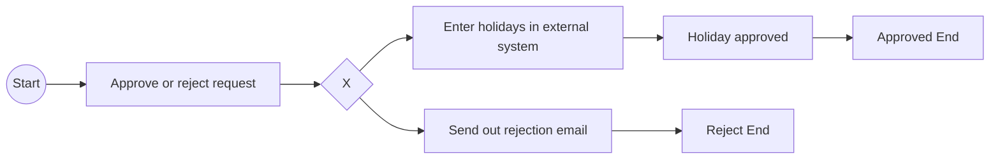

# Flowable

> Flowable 是一个用 Java 编写的轻量级业务流程引擎

## Fundamental

> 参考基本的请假流程案例: [flowable-holidayrequest](./flowable-holidayrequest/src/main/java/org/flowable)

### BPMN

> - 参考文件: [holiday-request.bpmn20.xml](./flowable-holidayrequest/src/main/resources/holiday-request.bpmn20.xml)
>
> BPMN Flowable-Diagram

