# Flowable

> Flowable 是一个用 Java 编写的轻量级业务流程引擎


## Fundamental

> 参考基本的请假流程案例: [flowable-holidayrequest](./flowable-holidayrequest/src/main/java/org/flowable)
>
> > 参考文件: [holiday-request.bpmn20.xml](./flowable-holidayrequest/src/main/resources/holiday-request.bpmn20.xml)
> >
> > BPMN Flowable-Diagram
>
> ```mermaid
> graph LR
> A(("Start"))
> B["Approve or reject request"]
> C{"X"}
> D["Send out rejection email"]
> E["Enter holidays in external system"]
> F["Holiday approved"]
> G["Reject End"]
> H["Approved End"]
> A-->B-->C-->E-->F-->H
> C-->D-->G
> ```
>


### BPMN

> Business Process Modeling Notation, 即业务流程建模符号
>
> **BPMN2.0定义了三类基本要素：Events（事件）、Gateways（网关）、Activities（活动）**

#### 事件

> 件用来表明流程的生命周期中发生了什么事, 事件总是画成一个圆圈

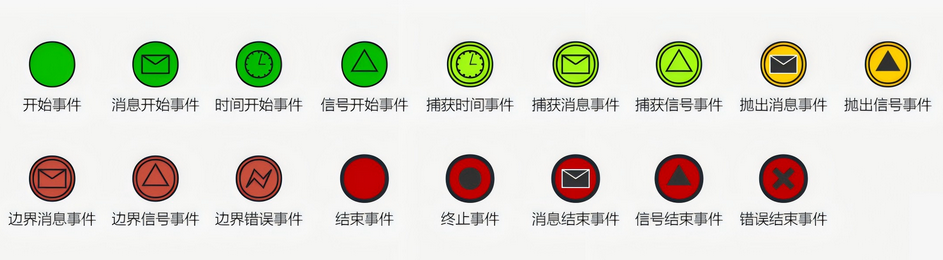

##### 1. 开始事件

> 开始事件用来指明流程从哪里开始
>
> 开始事件启动一个流程的新实例, 它只有一个唯一的无条件输出顺序流, 没有输入连线

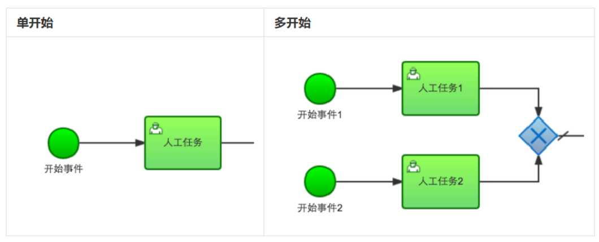

##### 2. 时间开始事件

> 时间(定时)开始事件用来在指定的时间启动一个流程, 也可以在指定周期内循环启动多次流程

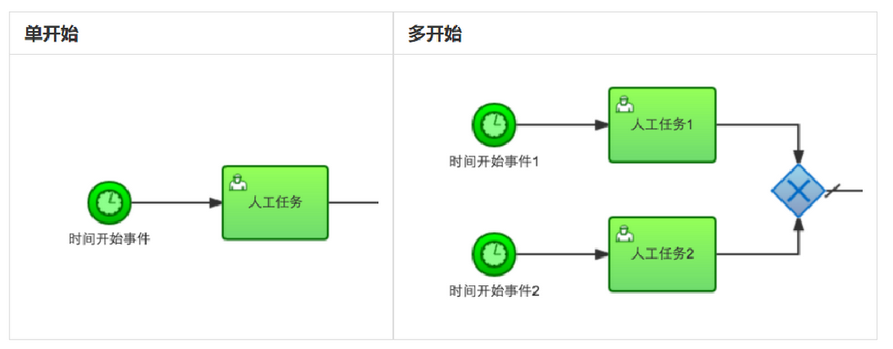

##### 3. 信号开始事件

> 当接收到特定的信号后信号开始事件被触发, 启动一个流程实例(可以触发多个流程)

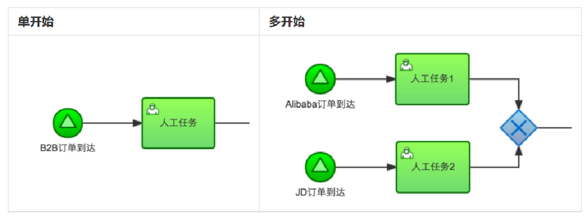

##### 4. 消息开始事件

> 当接受到特定的消息后消息开始事件被触发, 启动一个流程实例(每个消息只允许有一个订阅者)

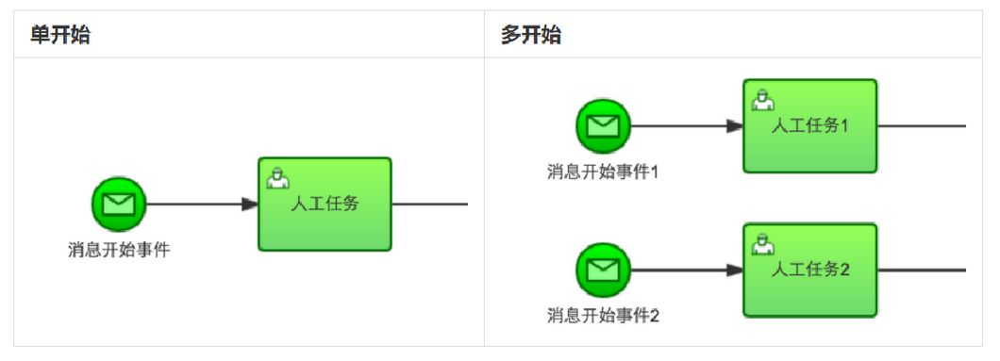

##### 5. 结束事件

> 结束事件表示流程或分支的**自然结束**，什么都不做

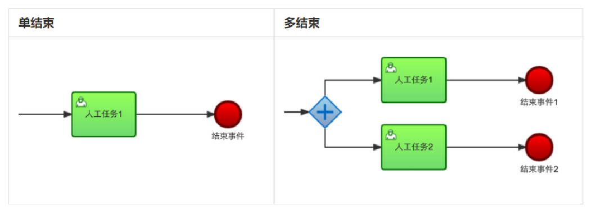

##### 6. 终止事件

> 表示流程被强制终止, 什么都不做
>
> 当流程有多个分支路线被激活时, 这些**分支上的活动任务也被终止**

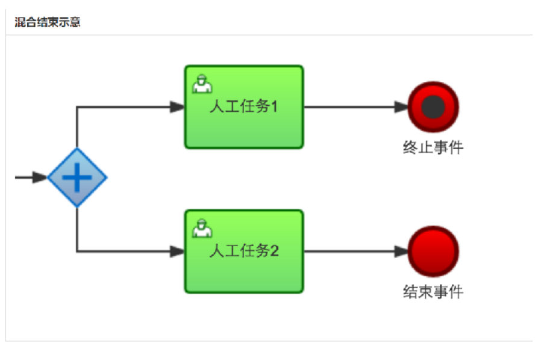

##### 7. 信号结束事件

> 在信号事件结束之前, 引擎向系统内部发出一个信号，随即结束该事件，所在流程分支结束

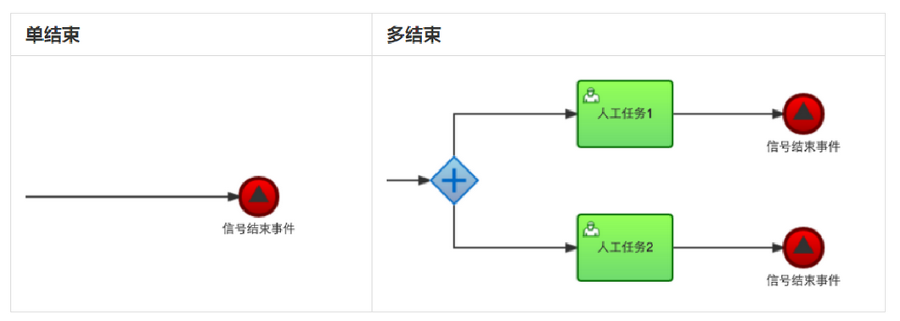

##### 8. 消息结束事件

> 在消息事件结束之前, 引擎向系统内部(又叫内部消息)发出一条消息或者调用外部系统接口, 随即事件结束，所在流程分支结束
>
> 如果当前分支是最后一个活动分支, 流程实例结束

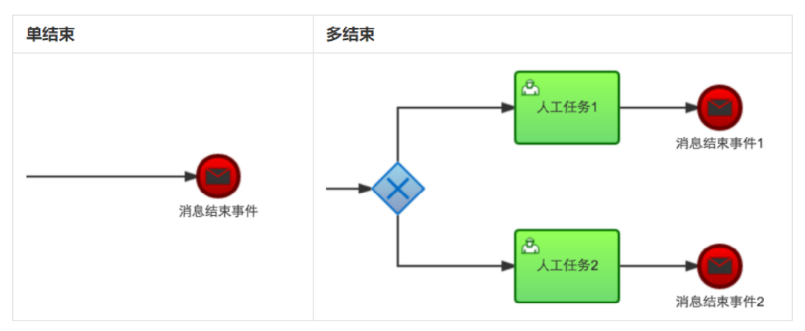

##### 9. 错误结束事件

> 当执行到达错误结束事件时抛出 BPMNError 业务异常, 表示流程或分支在发生业务错误后结束
>
> 如果抛出的异常未被捕获, 该流程不会结束

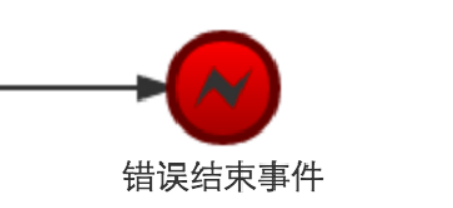

##### 10. 补偿结束事件

> 当执行到达补偿结束事件时触发该流程已完成任务的边界补偿事, 表示流程或分支在发生业务补偿后结束
>
> 如果执行业务补偿时抛出的异常, 该流程不会结束

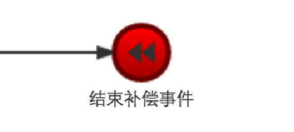

##### 11. 捕获时间事件

> 在开始事件和结束事件之间发生的事件都称为中间事件
>
> 当执行到达捕获时间事件时中断在这里, 引擎会创建一个定时器, 当定时器触发后事件结束, 流程沿后继路线继续执行

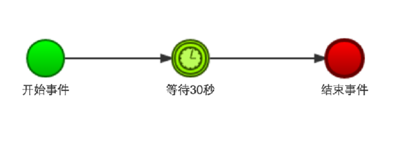

##### 12. 捕获信号事件

> 当执行到达捕获信号事件时中断在这里, 等待抛出信号事件或者API发出匹配的信号后结束, 流程沿后继路线继续执行

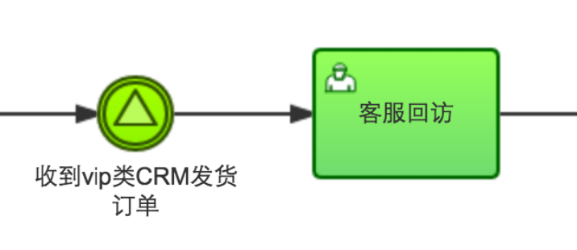

##### 13. 捕获消息事件

> 当执行到达捕获消息事件时中断在这里, 等待抛出消息事件或者API发出匹配的消息后结束, 流程沿后继路线继续执行

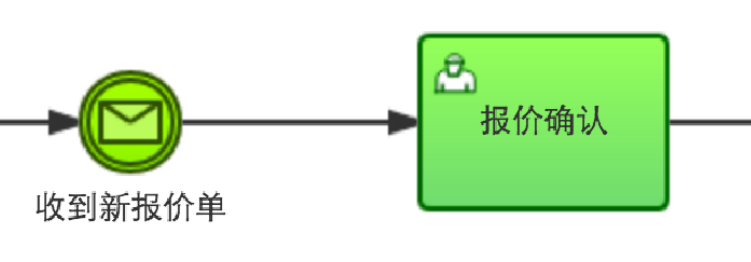

##### 14. 抛出信号事件

> 当执行到达抛出信号事件时, 引擎向系统内部发出一个信号, 信号发出后事件结束, 流程沿后继路线继续执行
>
> 抛出的信号可以被信号开始事件、中间捕获信号事件、边界信号事件订阅处理

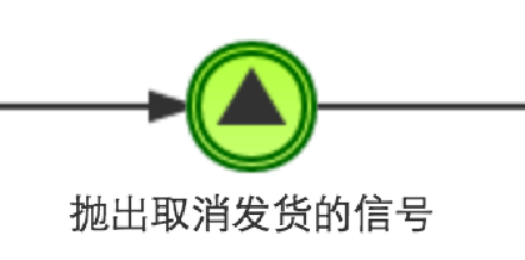

##### 15. 抛出消息事件

> 当执行到达抛出消息事件时, 引擎向系统内部(又叫内部消息)发出一条消息或者调用外部系统接口, 随即该事件结束，流程沿后继路线继续执行

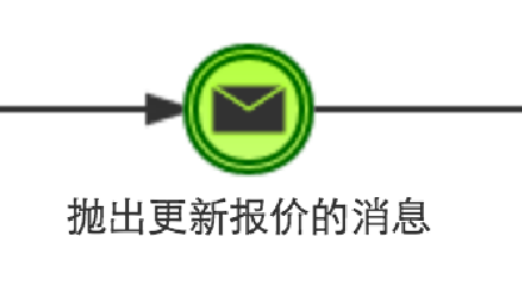

##### 16. 抛出补偿事件

> 当执行到达抛出补偿事件时触发该流程已完成任务的边界补偿事件, 完成补偿操作后自动执行后继路线

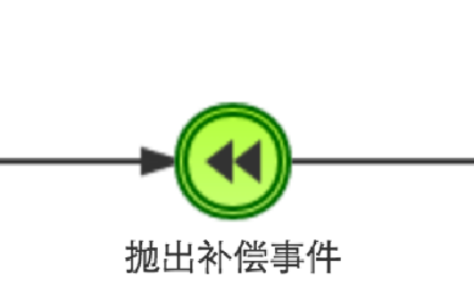

##### 17. 边界时间事件

> 当执行到达边界时间事件依附的任务时(如人工任务、系统任务、子流程), 引擎会创建一个定时器, 当定时器触发后, 流程沿边界时间事件的后继路线继续执行
>
> 如果该边界事件设置为中断, 依附的任务将中断执行

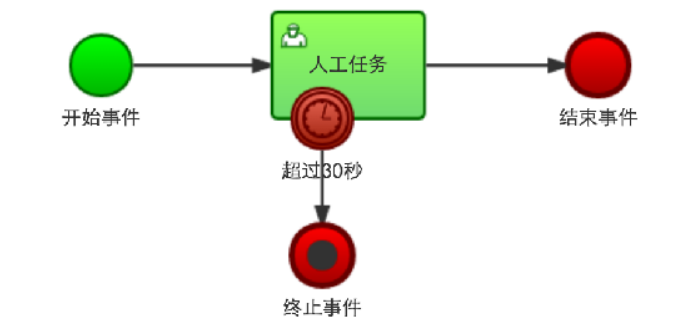

##### 18. 边界信号事件

> 当执行到达边界信号事件依附的任务时(如人工任务、系统任务、子流程), 引擎会创建一个捕获事件, 在其依附的任务的生命周期内等待一个抛出信号, 该信号来自信号抛出事件或者API, 被触发后后继路线继续执行
>
> 如果该边界事件设置为中断, 依附的任务将中断执行

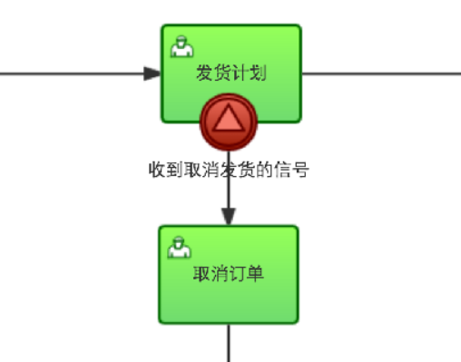

##### 19. 边界消息事件

> 当执行到达边界消息事件依附的任务时(如人工任务、子流程), 引擎会创建一个捕获事件, 在其依附的任务的生命周期内等待一个抛出消息, 该消息来自消息抛出事件或者API, 被触发后后继路线继续执行
>
> 如果该边界事件设置为中断, 依附的任务将中断执行

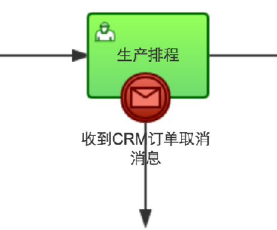

##### 20. 边界补偿事件

> 当边界补偿事件依附的节点触发回退操作时, 边界补偿事件自动被激活, 执行补偿事件后继路线上的任务

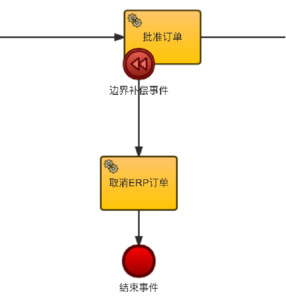

##### 21. 边界错误事件

> 当边界错误事件依附的节点任务抛出 BPMNError 业务异常时中断该任务, 边界错误事件自动被激活, 执行错误事件后继路线上的任务

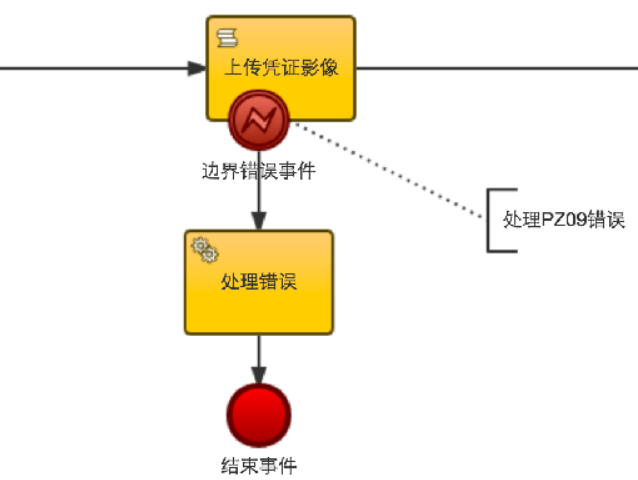


#### 网关

> 网关用来控制流程的执行流向, 当在拆分路径时产生令牌, 在合并路径时消费令牌


##### 1. 排他网关

> 排他网关定义了一组分支的唯一决策
>
> 所有流出的分支被按顺序评估, 第一个条件被评估为true的分支被执行, 并且不再继续评估下面的分支
>
> 如果所有分支条件决策都为false且该网关定义了一个默认的连线, 那么该默认分支将被执行
>
> 如果没有可到达的分支, 抛出异常, 该网关所处的分支被中断
>
> 排他网关有分支和合并两种行为, 允许一进一出

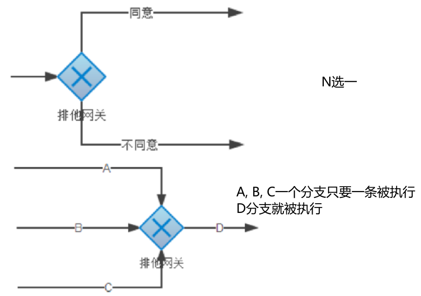


##### 2. 并行网关

> 并行网关用于无条件的拆分或合并分支, 该类网关对连线条件是忽略的
>
> 并行网关有分支和合并两种行为, 允许多进多出

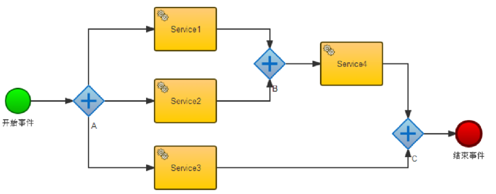

##### 3. 包容网关

> 包容网关是排他网关和并行网关的综合体
>
> 当进行决策判断时, 与排他网关所不同的是, 所有条件为true的后继分支都会被依次执行
>
> 如果所有分支条件决策都为false且该网关定义了一个默认的连线, 那么该默认分支将被执行
>
> 如果没有可到达的分支, 抛出异常, 该网关所处的分支被中断
>
> 包容网关有分支和合并两种行为, 允许多进多出

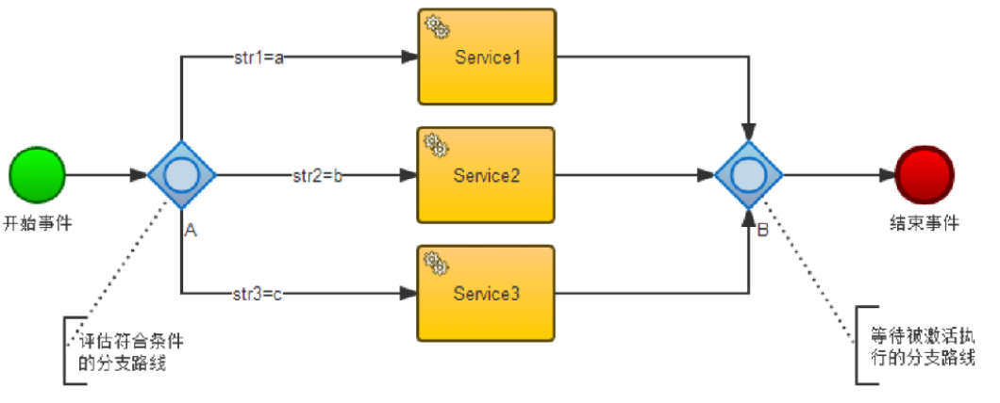

##### 4. 复杂网关

> 复杂网关具有与包容网关相似的行为, 但是可以根据特定业务场景, 自定义路径拆分和合并算法
>
> 复杂网关为开发者提供 ComplexGatewayInterface 程序接口

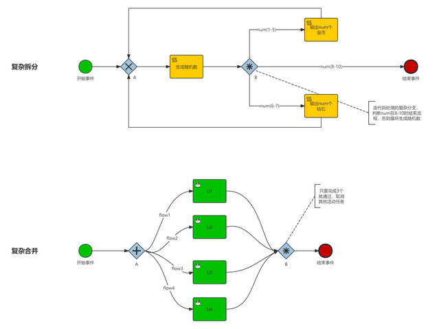

##### 5. 事件网关

> 通常网关根据连线条件来决定后继路径, 这就要求条件信息必须存在于流程自身之中
>
> 但当需要选择的后继路径的条件不能来自该流程时, 就可以使用事件网关
>
> 事件网关只有分支行为, 允许从多个候选分支中选择事件最先到达的分支(如时间事件、消息事件), 并取消其他分支

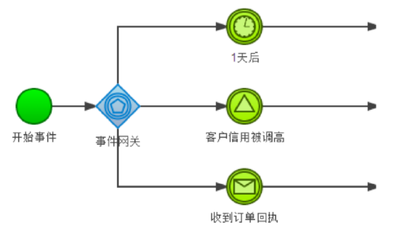

#### 活动

> 一个活动可以是流程中一个基本处理单元(如人工任务、服务任务), 也可以是一个组合单元(如外部子流程、嵌套子流程)

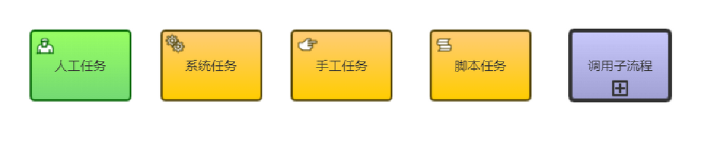

##### 1. 人工任务

> 人工任务用来表示业务流程中由人参与完成的工作
>
> 当引擎处理到该节点时, 给指定的用户或者一组用户 创建待处理的任务项, 等待用户的处理
>
> 人工任务可分为: 
>
> - 单例任务
> - 顺序多例任务
> - 并行多例任务


##### 2. 系统任务

> 系统任务是一个自动化任务
>
> 当流程到达系统任务时, 自动执行编写的Java程序, 完毕后继续执行后继路线


##### 3. 脚本任务

> 脚本任务是一个自动化任务
>
> 当流程到达脚本任务时, 自动执行编写的脚本, 完毕后继续执行后继路线


##### 4. 调用子任务

> 调用子流程又称为子流程任务, 是一个特殊的自动化容器任务, 其内在包含了对子流程(Sub Process)的创建、启动和调度管理
>
> 当流程到达子流程任务时, 按照配置策略自动启动子流程实例, 父流程的该分支中断在这里等待子流程实例全部结束后继续执行后继路线


##### 5. 手工任务

> 手工任务是BPMN引擎的外部任务, 用来表示需要线下人工处理的活动


