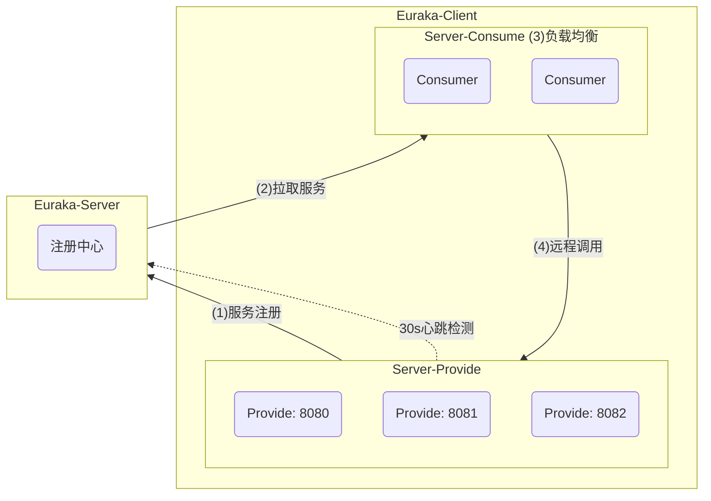

# SpringCloud

## Fundamental

### Euraka

#### 服务提供消费

> 提供者与消费者角色其实是相对的, 任何一个服务可以同时是服务提供者和服务消费者

- 服务提供者：暴露接口给其它微服务调用

- 服务消费者：调用其它微服务提供的接口

#### Euraka注册中心

- 注册中心简介

- 服务信息交互流程
    1. 服务提供者启动时向 Eureka 注册自己的信息
    2. Eureka 保存这些服务提供者的信息
    3. 消费者根据服务名称向 Eureka 拉取提供者信息, 通过负载均衡选中一个

- 服务状态监控

    > 服务提供者会每隔 30 秒向 Eureka-Server 发送心跳请求, 报告健康状态
    >
    > Eureka 会更新记录服务列表信息，心跳不正常会被剔除, 消费者就可以拉取到最新的信息