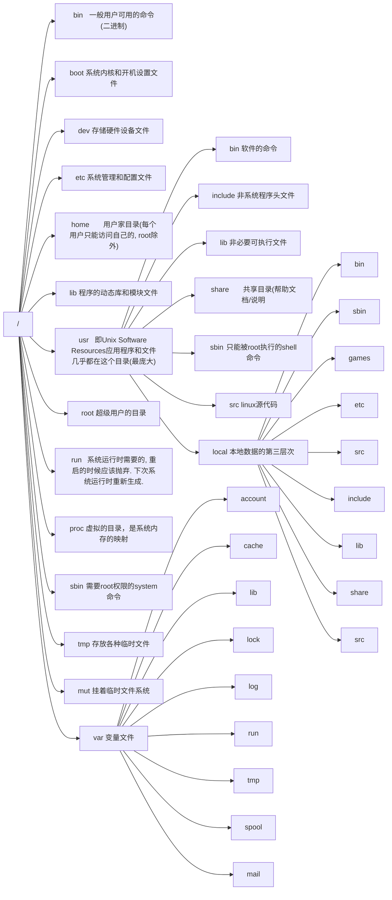

# Linux基础


## 目录结构




## 命令基础

> 命令基本构成
>
> 命令本身 + [选项] + [参数]
>
> ```bash
> command [-options] [parameter]	
> ```


### 常用命令

---

#### ls [ -a	-l	-h ] [ path ]

- **即list	默认平铺展示当前工作目录**

> -a	即all, 展示全部文件(包括以 . 开头的隐藏文件或文件夹)
>
> -l	即list, 可替换为`ll`表示以列表展示文件(包括*权限, 用户组, 大小, 创建时间, 文件名称*)
>
> -h	与 -l 同用, 展示文件大小后缀 `ll -h`


#### cd [ path ]

- **即change directory, 切换目录**

> 无需选项, 只有参数
>
> cd	无参数即回到用户的目录下
>
> cd .. 	回到上一目录


#### pwd

- **即 print work directory, 展示当前工作目录(绝对路径)**

> 无选无参
>
> 特殊路径符: 
>
> - **.**	表示当前目录
> - **..**   表示上一级目录
> - **~**    表示用户home目录(等价与 /home/user )


#### mkdir [ -p ] path

- **即make directory, 创建 path 目录**

> -p	表示自动创建不存在的父目录(适用于穿件多级目录)
>
> 参数 path 必填, 表要创建的目录名称(相对绝对路径均可)
>
> 示例: mkdir ~/Desktop/ResFile


#### touch path

- **创建文件**

> 参数 path 必填, 可携带路径


#### cat path

- **在终端展示文件全部内容**

> 无选项, 参数 path 必填


#### more path

- **在终端展示文件内容, 支持翻页**

> 无选项, 参数 path 必填
>
> 空格翻页, q 退出查看


#### cp [ -r ] originPath targetPath

- **即copy path, 用于复制文件夹|文件**

> -r	用于复制文件夹使用, 表示递归复制文件夹下的所有内容
>
> originPath	复制的文件夹|文件位置
>
> targetPath	要粘贴的地方


#### mv originPath targetPath

- **即move, 移动文件夹|文件**

> 无选项
>
> 对于文件移动, 若targetPath也是文件名则会自动重命名
>
> 例如: mv text.txt demo.txt 表示重命名test.txt为demo.txt


#### rm [ -r -f ] param1 param2 ...

- **即remove, 表删除文件|文件夹**

> -r	表递归的删除, 用于文件夹删除
>
> -f	即force, 强制删除, 不弹出提示确认信息
>
> 多参数表示要删除的文件|文件夹, 用空格隔开
>
> **支持通配符 \* **
>
> - \* 	  	 匹配任意内容
>
> - test\* 	配置任意以test开头的内容
> - \*test     匹配任意以test结尾的内容
> - \*test\*   匹配任意包含test的内容


#### which commandPath

- **查找执行命令的位置, 获得命令的目录**


#### find directory {  -name "fileName"| -size  +|- n[ KMG ]} 

- **在directory目录下搜索文件, 返回文件路径**
- 可使用 find directory -name fileName 直接搜索指定文件

> -name "fileName"	带搜索名为fileName的文件
>
> -size	按文件大小查找文件 +, - 表示大于和小于, n表示数组, KMG即单位
>
> 例如: find ~/Desktop -size +100k -size-400k  表查找桌面大于100K小于400K的文件
>
> **支持通配符**
>
> - \* 	  	 匹配任意内容
>
> - test\* 	配置任意以test开头的内容
> - \*test     匹配任意以test结尾的内容
> - \*test\*   匹配任意包含test的内容


#### grep [ -n ] keyWord path

- **即global regular expression, 从文件中查找关键字所在位置**

> -n	在结果中显示匹配的关键字的行的行号
>
> keyWord	表示要查找的关键字, 带有空格或其他符号建议用引号引起来
>
> path	表示要查找的文件路径, 可多个, 可作为内容输入端口


#### wc [ -c -m -l -w ] path

- **即word count, 用于统计path文件字数**

> -c	统计bytes数量
>
> -m	统计字符数量
>
> -l	统计行数
>
> -w	统计单词数量
>
> 不带选项返回 *行数  单词数  字节数 文件名*


#### 管道符 | 和重定向符 command [ > >> < ] path

- **将左边命令的结果作为右边命令的输入, 可以嵌套**
- **将内容追加写入或覆盖写入文件, 从文件中读取内容**

> 例如: 
>
> ll ~/Desktop | wc -l	表示统计desktop目录下有多少个文件|文件夹
>
> cat test.txt | grep "hello"	表示将test.txt文件中搜索包含"hello"的行
>
> cat test.txt | grep "hello" | grep "world"	表示在包含"hello"的行中搜索包含"world"的行
>
> cat test.txt | grep "hello" | grep "world" | wc 	表示在包含"hello"和"world"的行字数
>
>  
>
> \>	表将左侧命令的输出结果覆盖写入右侧文件
>
> \>>	表将左侧命令的输出结果追加写入右侧文件
>
> 例如: 
>
> ls >> test.txt	表将目录输出结果追加写入test.txt


#### echo [ -e ] content [ > path ,  >>  path , < path]

- **在命令行输出content内容, 类似print**

> -e	允许解释反斜线转义
>
> content参数可用引号包裹
>
> **使用 \` 包裹的content后被当做命令执行**
>
> 例如: echo "current work directory : \`pwd\`"
>
> ***支持重定向符:***
>
> **使用 > 向文件覆盖内容, 使用 >> 向文件追加内容**
>
> echo "This is a new line" >> test.txt
>
> **使用 < 将文件内容最为content输入**
>
> echo < Input.txt


#### tail [ -f -num ] path

- **可以查看文件尾部内容, 追踪最新更改**

> -f	表示持续追踪更改
>
> -num	表示查看尾部多少行, 默认10行
>
> path	表文件路径
>
> 例如: 
>
> tail -5 test.txt	查看尾部5行
>
> tail -f -5 test.txt	在终端中持续显示尾部的5行内容(变更)


## 用户权限

> root 用户拥有系统最高权限
>
> 普通用户的权限一般在home目录是不受限的(出了home目录, 普通用户仅有只读和执行权限)
>
> 命令切换到 root 用户(su - userName), 按 \<ctrl + D \>回到原用户
>
> ```bash
> # su - userName	用于切换用户
> # - 表加载环境变量
> # su 不加任何参数默认切换到root用户
> 
> # 以下命令都表示切换到 root
> su 
> su -
> su - root
> ```
>
> > 通常普通用户试用 sudo command 需要输入密码, 可在 root 用户下配置无需密码: 
> >
> > 1. 切换到 root 用户(或使用 sudo visudo  或 sudo vi /etc/sudoers )
> >
> > 2. 输入命令修改sudo的配置文档/etc/sudoers
> >
> >    ```bash
> >    # 输入visudo进入配置文档的vi编辑页面(或者 sudo vi /etc/sudoers)
> >    visudo
> >    
> >    # 在文档的最后添加一行(注意有tab和空格)
> >    #<userName> ALL=(ALL)	NOPASSWD: ALL
> >    favian ALL=(ALL)	NOPASSWD: ALL
> >    ```
> >
> > 3. 移除权限同样只需删除此行即可


### 用户和用户组

> linux系统可以: 
>
> - 配置多个用户
> - 配置多个用户组
> - 用户可以加入多个用户组
>
>  
>
> linux 权限管控的 2 个级别: 
>
> - 针对用户的权限控制
> - 针对用户组的权限控制


#### 用户组管理

> 需要 root 权限
>
> 查看当前系统中有哪些用户组(返回:	**组名称:组认证:组ID** )
>
> ```bash
> getent group
> ```

- 创建用户组

  ```bash
  groupadd <userGroupName>
  ```

- 删除用户组

  ```bash
  groupdel <userGroupName>
  ```

  

#### 用户管理

> 需要 root 权限
>
> 查看当前系统中有哪些用户(返回: **用户名:密码(x):用户ID:组ID:描述信息:HOME目录:执行终端**)
>
> ```bash
> getent passwd
> ```

- 创建用户

  ```bash
  useradd [ -g -d ] <userName>
  
  # -g 表示用户的组, 不指定-g会自动创建同名组并自动加入
  #	 指定-g需要组已经存在, 若已存在同名组, 必须使用-g
  #	 如 useradd -g testGroup userTest
  
  # -d 表示指定用户的home路径, 若不指定默认在 /home/<userName>
  # 	 如 useradd -g testGroup -d /home/testGroup userTest 
  ```

- 删除用户

  ```bash
  userdel [ -r ] <userName>
  
  # -r 表示删除用户的home目录, 不使用的话, home目录会保留
  ```

- 查看用户所属组

  ```bash
  id [<userName>]
  
  # 不写参数则查看自身
  ```

- 修改用户所属组

  ```bash
  usermod -aG <userGroupName> <userName>
  
  # 指定用户加入某一用户组
  ```

  


### 权限控制信息

> - r 表读权限(对于文件夹, 可查看其内容)
> - w 表写权限(对于文件夹, 可创建, 修改, 删除, 重命名)
> - x 即execute, 表执行权限(对于文件夹, 可将其作为工作目录, cd )

- 使用命令 `ll` 输入的列表信息内容

  ```bash
  # 示例
  drwxr-xr-x. 3 favian favian 17 jul 2 01:28 Desktop
  ```
  
  ```mermaid
  graph TB
  A["7 列内容"]
  A-->B["类型和权限(10个槽位)"]
  B-->Ba["文件类型1位"]
  B-->Bb["所属用户权限3位"]
  B-->Bc["所属用户组权限3位"]
  B-->Bd["其他用户权限3位"]
  A-->C["第一级子目录的个数"]
  A-->D["所属用户"]
  A-->E["所属用户组"]
  A-->F["文件大小"]
  A-->G["最后更新时间"]
  A-->H["文件|夹名称"]
  ```
  
- 其中文件类型: 
  - “-”表示普通文件；
  - “d”表示目录；
  - “l”表示链接文件；
  - “p”表示管理文件；
  - "b”表示块设备文件；
  - “c”表示字符设备文件
  - “s”表示套接字文件；
- 对于文件名称: 
  - 灰白色表示普通文件；
  - 亮绿色表示可执行文件；
  - 亮红色表示压缩文件；
  - 灰蓝色表示目录；
  - 亮蓝色表示链接文件；
  - 亮黄色表示设备文件；


### 修改权限控制

> 仅当前用户 和 root 用户可修改目录下的文件权限
>
> 仅 root 用户可修改文件|夹所属用户

---

#### chmod [ -R ] permission path

- **修改用户、用户组、其他用户的文件|夹权限**

> - R表示递归修改文件夹内的全部文件权限
>
> path	为文件或文件夹
>
> permission 表权限, 有两种表示法: 
>
> - chmod u=rwx, g=rx, o=x test.txt	表将test.txt文件权限修改为等号后的
>
>   - u	即 user, 表当前用户权限修改
>   - g    即 group, 表用户组权限修改
>   - o    即 other, 表其他用户权限修改
>
> - chmod 751 test.txt    功能同上, 依次表u g o
>
>   - 即采用二进制数表示权限rwx
>
>     0 表无权限, 即 ---
>
>     1 表有x权限, 即 --x
>
>     2 表有w权限, 即 -w-
>
>     3 表有wx权限, 即 -wx
>
>     4 表有r权限, 即 r--
>
>     5 表有rx权限, 即r-x
>
>     6 表有rw权限, 即rw-
>
>     7表有rxw权限, 即 rwx


#### chown [ -R ] [userName] [ : ] [userGroupName] path

- **修改文件|夹所属用户|组**

> - -R表示递归修改文件夹下全部文件
>
> 示例: 
>
> chown root test.txt	表仅将test.txt的用户修改为root
>
> chown :root test.txt	表仅将test.txt的用户组修改为root
>
> chown root:favian test.txt 	表将test.txt的用户修改为root, 用户组修改为favian


## 系统操作

> 快捷键和快捷命令
>
> - **\<ctrl\> + c**	强行停止 | 退出当前命令
>
> - **\<ctrl\> + d**    快速退出账户登录 | 退出特定程序页面(如python)
>
> - **history**         产看历史输入过的命令
>
>   history | grap ch	表搜索历史命令中以 ch 开头的命令
>
> - **!command 或 !命令序号**  对history命令自下而上的匹配(最近)以command开头的命令
>
>   如 之前输入过python命令, 可使用 !p 实现命令自动输入(相当于输入python回车 )
>
> - **\<Ctrl\> + r**      输入内容模糊匹配历史命令, 对匹配的命令回车可直接执行(左右方向键修改)
>
> - **\<Ctrl\> + a**      跳转命令开头
>
> - **\<Ctrl\> + e**       跳转命令结尾处
>
> - **\<Ctrl\> + left**    向左跳一个单词
>
> - **\<Ctrl\> + right**  向右跳一个单词
>
> - **\<Ctrl\> + l**         清空终端内容(即 clear)


### 程序配置

#### yum [ -y ] [ install | remove | search ] softwareName

>yum : RPM包软件管理器, 用户自动化安装配置Linux软件, 需要 root 权限, 
>
>​		适用 Fedora，centos，BClinux，RedHat 以及 CentOS 中
>
>-y	表自动确认, 无需手动确认安装和卸载过程
>
>[镜像配置](https://blog.csdn.net/qq_43475285/article/details/129479198)


#### apt [ -y ] [ install | remove | search ] softwareName

>apt : RPM包软件管理器, 用户自动化安装配置Linux软件, 需要 root 权限
>
>​		适用于 Ubuntu 
>
>-y	表自动确认, 无需手动确认安装和卸载过程


### systemctl

> linux 系统中有很多软件支持使用 systemctl命令: 启动， 停止， 开机自启
>
> 能够被systemctl管理的软件一般也称为**服务**
>
> 例如系统内置的服务： 
>
> - NetworkManager	主网络服务
> - network                     副网络服务
> - firewalld                     防火墙服务
> - sshd                            ssh服务


#### systemctl [ start | stop | status | enable | disable ] \<serverName\>

- **systemctl用于控制系统内置服务的启停(ctl 即 control)**

>start	启动
>
>stop	关闭
>
>status	查看状态
>
>enable	开启开机自启
>
>disable	关闭开机自启
>
>系统内置服务均可以被systemctl控制
>
>第三方软件若注册了系统服务可以被systemctl控制, 若没有注册则可以手动注册

`systemctl`是 Systemd 的主命令，用于管理系统。

> ```bash
> # 重启系统
> sudo systemctl reboot
> 
> # 关闭系统，切断电源
> sudo systemctl poweroff
> 
> # CPU停止工作
> sudo systemctl halt
> 
> # 暂停系统
> sudo systemctl suspend
> 
> # 让系统进入冬眠状态
> sudo systemctl hibernate
> 
> # 让系统进入交互式休眠状态
> sudo systemctl hybrid-sleep
> 
> # 启动进入救援状态（单用户状态）
> sudo systemctl rescue
> ```

`systemd-analyze`命令用于查看启动耗时。

> ```bash
> # 查看启动耗时
> systemd-analyze                                                                                       
> 
> # 查看每个服务的启动耗时
> systemd-analyze blame
> 
> # 显示瀑布状的启动过程流
> systemd-analyze critical-chain
> 
> # 显示指定服务的启动流
> systemd-analyze critical-chain atd.service
> ```

`hostnamectl`命令用于查看当前主机的信息。

> ```bash
> # 显示当前主机的信息
> hostnamectl
> 
> # 设置主机名。
> sudo hostnamectl set-hostname rhel7
> ```

`localectl`命令用于查看本地化设置。

> ```bash
> # 查看本地化设置
> localectl
> 
> # 设置本地化参数。
> sudo localectl set-locale LANG=en_GB.utf8
> sudo localectl set-keymap en_GB
> ```

`timedatectl`命令用于查看当前时区设置。

> ```bash
> # 查看当前时区设置
> timedatectl
> 
> # 显示所有可用的时区
> timedatectl list-timezones                                                                                   
> 
> # 设置当前时区
> sudo timedatectl set-timezone America/New_York
> sudo timedatectl set-time YYYY-MM-DD
> sudo timedatectl set-time HH:MM:SS
> ```

`loginctl`命令用于查看当前登录的用户。

> ```bash
> # 列出当前session
> loginctl list-sessions
> 
> # 列出当前登录用户
> loginctl list-users
> 
> # 列出显示指定用户的信息
> loginctl show-user ruanyf
> ```


### 软硬连接

> 软硬链接区别
>
> ##### 1. 原理与本质
>
> - **硬链接**：硬链接实际上是同一文件系统中同一个文件的多个“入口”。每个硬链接指向的是同一个文件的inode（索引节点），所有硬链接共享相同的inode和数据块。当所有硬链接都被删除（以及没有其他引用）时，文件内容才会真正被删除。
> - **软链接**：软链接则是一个独立的特殊类型的文件，它存储的是目标文件或目录的路径。如果原文件被删除或移动，软链接将失效，因为系统找不到其所指向的目标。
>
> ##### 2. 文件系统范围
>
> - **硬链接**：只能在同一文件系统内部创建，不支持跨文件系统操作。
> - **软链接**：可以跨越不同的文件系统，不受此限制。
>
> ##### 3. 目录链接
>
> - **硬链接**：不支持对目录创建硬链接，虽然现代一些Linux版本允许对目录做硬链接, 因为可能导致循环引用等问题。
> - **软链接**：可以对文件或目录创建软链接，经常被用来链接目录。
>
> ##### 4. 删除源文件的影响
>
> - **硬链接**：即使源文件（即其他硬链接所指向的文件）被删除，只要存在至少一个硬链接，文件内容仍能通过其它硬链接访问，不会消失。
> - **软链接**：如果删除了软链接所指向的源文件，那么通过软链接尝试访问文件将会失败，因为软链接失去了有效的指向。
>
> ##### 5. inode 号
>
> - **硬链接**：所有硬链接共享同一个inode号。
> - **软链接**：软链接拥有自己的inode号，不同于它所指向的文件。
>
> ##### 6. 使用场景
>
> - **硬链接**：通常用于确保重要的文件不会因误删或重命名而丢失，尤其适合备份和保护关键数据。
> - **软链接**：更多地用于灵活的文件组织结构，例如提供程序的别名或创建易于维护的软件环境，因为它能够跟随源文件的移动和更改。
>
> ##### 7. 创建方式
>
> - **硬链接**：使用 `ln` 命令创建，无需 `-s` 参数，例如：`ln source_file target_link`
> - **软链接**：使用 `ln -s` 命令创建，例如：`ln -s /path/to/source_file target_link`
>
> 综上所述，硬链接提供了对同一文件的多个访问点，而软链接则是对文件路径的一个引用或指示器。在决定使用哪种链接时，需要根据实际需求和上下文来考虑它们之间的差异。
>
> 在系统中可以创建软链接, 将文件|夹 链接到其他位置, 以路径形式存在(快捷方式)

#### ln -s -b -d -f -i -n -v originPath targetPath

> -s	 创建软链接
>
> -b 	删除，覆盖以前建立的链接
>
> -d 	允许超级用户制作目录的硬链接
>
> -f 	强制执行
>
> -i 	交互模式，文件存在则提示用户是否覆盖
>
> -n 	把符号链接视为一般目录
>
> -v 	显示详细的处理过程
>
> originPath	被链接的文件|夹
>
> targetPath	新创建的软链接位置
>
> 示例:
>
> `ln -s /etc/yum	~/yum`


### 日期时区

> 修改linux时区: 
>
> ```bash
> # 删除原时区
> rm -f /etc/localtime
> 
> # 置新时区链接
> sudo ln -s /usr/share/zoneinfo/Asia/Shanghai /etc/localtime
> ```
>
> 使用 ntp 联网校正时间: 
>
> - 安装 ntp
>
>   ```bash
>   sudo yum -y install ntp
>   ```
>
> - 设置启动
>
>   ```bash
>   systemctl start ntpd
>   
>   systemctl enable ntpd
>   ```
>
> - 手动校正
>
>   ```bash
>   ntpdate -u ntp.aliyun.com
>   ```

 

#### date [ -d ] [ +\<formatString\> ]

- **格式化显示时间**

> -d 	用于日期加减, 支持: 
>
> - year
> - month
> - day
> - hour
> - minute
> - second
>
> 示例: 
>
> `data -d "+1 day" +%Y%-m%-%d`
>
> formatString
>
> - %Y	年 
> - %y    年份的后两位数
> - %m   月份
> - %d    日期
> - %H    小时
> - %M    分钟
> - %S      秒
> - %s       时间戳的秒
>
> 示例: 
>
> `date +%Y%-m%-%d`
>
> `date "+%Y 年 %m 月 %d 日 %H 时 %M 分 %S 秒 时间戳: %s"`


### 主机和IP

> 使用 `ifconfig`命令查看本机ip地址
>
> 若不存在命令, 可先安装 net-tools
>
> ```bash
> sudo yum -y install net-tools
> 
> ipconfig
> ```
>
>  
>
> 主机名
>
> ```bash
> # 查看
> hostname
> 
> # 修改
> sudo hostnamectl set-hostname <newName>
> ```


#### ping [ -c num] domainName|ip

- **测试地址ip是否连通**

> -c	表指定ping的次数为num次


#### wget [ -b ] url

- **在命令行中非交互式的下载文件**

> -b	即后台下载, 不在前台显示进度, 会将日志显示在工作目录的wget-log文件
>
> ​		可使用tail -f 1 wget-log 继续下载进度
>
> url	下载的网络链接


#### curl [ -O ] url

- **发送网络请求, 可以测试、获取信息和下载文件**

> -O	表下载文件, 同wget, 可显示下载进度
>
> 示例: 
>
> `curl cip.cc`可获取本机的公网ip地址信息
>
> `curl bing.com` 可发起网页请求测试
>
> `curl -O test.zip`可下载url的文件


#### nmap localhost

- **用于查看系统的端口占用**

> 同 nmap 127.0.0.1
>
> 若不存在命令, 可先安装 nmap
>
> ```bash
> sudo yum -y install nmap
> ```
>
> **端口划分规范: **
>
> - 公认端口: 1~1023	用于系统内置和指明软件使用
> - 注册端口: 1024~49151    用于松散绑定使用, 第三方程序和用户自定义使用
> - 动态端口: 49152~65535    用于临时使用(如程序向外发出信息)


#### netstat -anp | grep portName

- **查看指定端口的占用, 判断和使用端口**

> 若不存在命令, 可先安装net-tools
>
> ```bash
> sudo yum -y install net-tools
> ```


### 进程状态

#### 进程管理

##### ps [ -e -f ]

- **查看系统进程信息**
- **过滤显示: `ps -ef | grep threadName`**

> -e	表查看全部进程
>
> -f	即format, 格式化显示
>
> 示例: 
>
> `ps -ef` 格式化显示全部进程信息
>
> **显示的信息: **
>
> - UID: 进程所属的用户ID
> - PID: 进程号
> - PPID: 进程的父ID
> - C: 进程cpu占用
> - STIME: 进程启动时间
> - TTY: 启动此进程的终端序号(?表非终端启动)
> - TIME: 进程累计占用cpu时间
> - CMD: 进程启动命令|启动路径


##### kill [ -9 ] threadID

- **关闭进程**

> -9	表示系统强制关闭该进程
>
> 可通过`ps -ef`查看进程号后, 在使用kill命令关闭程序


#### 资源监控

##### top [ -p PID ] [ -d num ] [ -n num] [ -u userName ] [ -c -i -b]

- **查看系统资源占用状态**

> -p	显示某个进程的信息
>
> -d	设置刷新时间, 默认5s
>
> -n	设置刷新次数, 刷新完退出
>
> -u	显示特定用户的进程
>
> -c	显示产出进程的完整命令
>
> -i	不显示任何显示|无用进程
>
> -b	非交互非全屏运行, 如以批次重定向到文件`top -b -n 3 > test.txt`
>
>  
>
> **交互式选项(top界面按下): **
>
> - h 键, 会显示帮助画面
> - c 键，会显示产生进程的完整命令，等同于-c参数，再次按下c键，变为默认显示
> - f 键，可以选择需要展示的项目
> - M 键，根据驻留内存大小（RES）排序
> - P 键，根据CPU使用百分比大小进行排序
> - T 键，根据时间/累计时间进行排序
> - E 键，切换顶部内存显示单位
> - e 键，切换进程内存显示单位
> - l 键，切换显示平均负载和启动时间信息
> - i 键，不显示闲置或无用的进程，等同于-i参数，再次按下，变为默认显示
> - t 键，切换显示CPU状态信息
> - m 键，切换显示内存信息
>
> 
>
> **输出的前5行信息: **
>
> - 首行: 程序名称, 系统时间, 系统运行时间, 系统登录的用户数, 平均负载(1分钟, 5分钟和15分钟的)
>
> - 第二行: 全部进程数, 正在运行进程数, 睡眠进程数, 停止进程数, 僵尸进程数
>
> - 第三行: 表cpu占用率->us用户, sy系统, ni高优先级进程, 
>
>   ​				id表cpu空闲率, wa表io等待cpu占用, hi硬件中断率, si软件中断率, st强制等待cpu占用率
>
> - 第四五行: 
>
>   Kib mem 表物理内存, 总量、空闲、使用，buff|cache占用
>
>   KibSwap 虚拟内存(交换空间), 总量、空闲，使用，buff|cache占用
>
> **输出的列表信息：**
>
> - PID： 进程ID
> - USER：进程所属用户
> - PR：进程优先级
> - NI：负值表示最高优先级， 正值表示低优先级
> - VIRT：进程使用的虚拟内存KB
> - RES：进程使用的物理内存KB
> - SHR：进程使用的共享内存KB
> - S：进程状态（S休眠，R运行， Z僵死，N负数优先级，I空闲）
> - %CPU：cpu占用率
> - %MEM：进程内存占用率
> - TIME+：进程使用CPU总时间， 单位10毫秒
> - COMMAND： 进程命令或程序文件地址


##### df [ -h ]

- **查看硬盘占用情况**

> -h	人性化显示


### 环境变量

> 环境变量是操作系统运行时, 记录一些关键的信息, 以辅助系统运行
>
> `env`命令可查看系统中记录的环境变量
>
> **环境变量是一种 KeyValue 型的结构**


#### $符号

> **$**符号用于去变量的值
>
> 示例: 
>
> ```bash
> # 取值
> echo $PATH
> 
> # 取值
> echo ${PATH}AAA
> ```


#### 自定义

> linux自定义环境变量有临时设置和永久设置:
>
> - 临时设置(退出登录后失效): 
>
>   ```bash
>   export varable=123
>   
>   # 测试
>   echo $varable
>   # 输出: 123
>   ```
>
> - 永久设置(设置后 `source <congfigFile>` 生效): 
>
>   - 针对当前用户生效: 
>
>     ```bash
>     # 配置在当前用户的 ~/.bashrc 文件中
>     # 例如在文件最后添加
>     varable = 123
>     ```
>
>   - 针对所有用户生效:
>
>     ```bash
>     # 配置在系统的 /etc/profile 文件中
>     ```

- **自定义环境变量PATH**

> PATH中存储了系统中执行命令的搜索路径
>
> 可以自行添加搜索路径到PATH中
>
> **临时修改: **
>
> ```bash
> export PATH=$PATH:/home/favian/myenv
> ```
>
> **永久添加:**
>
> ```bash
> # 将PATH=$PATH:/home/favian/myenv 添加到/etc/profile中
> # 注: 一定要加 $PATH , 路径前添加冒号分隔
> ```


### 解压压缩

> linux 常用的两种压缩格式: 
>
> - **.tar** 即tarball归档文件, 简单的将文件封账到一个 .tar 的文件内, 并没有太多文件体积的减少
> - **.gz** 即gzip格式压缩文件, 常见为.tar.gz, 使用gzip压缩算法将文件压缩到一个文件夹内, 极大压缩体积


#### tar [ -c -v -x -f -z -C ] param1 param2 ...

- **用于压缩和解压文件**

> -c	创建压缩文件, 用于压缩模式
>
> -v	显示压缩过程, 用于查看进度
>
> -x	解压模式
>
> -f	要创建或要解压的文件, **-f 选项必须在所有选项中位置处于最后一个**
>
> -z	即gzip模式, 不使用-z则为tarball格式, **-z通常在所有选项中位置处于第一个**
>
> -C	选择解压的目的地, 用于解压模式, **-C选项要单独使用, 用于接收路径参数**

> 压缩示例: 
>
> `tar -cvf test.tar 1.txt 2.txt 3.txt`将三个txt文件以tarball格式压缩到test.tar文件中
>
> `tar -zcvf test.tar.gz 1.txt 2.txt 3.txt`将三个txt文件以gzip格式压缩到test.tar.gz文件中

> 解压示例:
>
> `tar -xvf test.tar`解压至当前目录
>
> `tar -xvf test.tar -C /home/favian` 解压到指定目录
>
> `tar -zxvf test.tar -C /home/favian` 以gzip模式解压到指定目录


#### zip [ -r ] param1 param2 ...

- **对文件压缩, 到zip格式压缩包**

> -r	表递归压缩, 用于文件夹
>
> 示例:
>
> `zip test.zip 1.txt 2.txt 3.txt`将三个txt文件以zip格式压缩到test.zip文件中
>
> `zip -r test.zip 1.txt res download`将txt文件和两个文件夹以zip格式压缩到test.zip文件中


#### unzip [ -d ] param

- **对zip压缩包解压**

> -d	表设置解压路径
>
> 示例:
>
> `unzip test.zip`将test.zip压缩包解压到当前文件夹(解压后有同名内容会被替换)
>
> `unzip test.zip -d ~/res`将test.zip压缩包解压到~/res文件夹下
