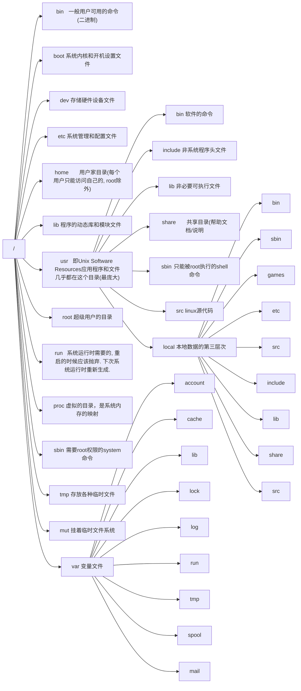

# Linux


## 目录结构




## 命令基础

> 命令基本构成
>
> 命令本身 + [选项] + [参数]
>
> ```bash
> command [-options] [parameter]	
> ```


### 常用命令

---

#### ls [ -a	-l	-h ] [ path ]

- **即list	默认平铺展示当前工作目录**

> -a	即all, 展示全部文件(包括以 . 开头的隐藏文件或文件夹)
>
> -l	即list, 可替换为`ll`表示以列表展示文件(包括*权限, 用户组, 大小, 创建时间, 文件名称*)
>
> -h	与 -l 同用, 展示文件大小后缀 `ll -h`


#### cd [ path ]

- **即change directory, 切换目录**

> 无需选项, 只有参数
>
> cd	无参数即回到用户的目录下
>
> cd .. 	回到上一目录


#### pwd

- **即 print work directory, 展示当前工作目录(绝对路径)**

> 无选无参
>
> 特殊路径符: 
>
> - **.**	表示当前目录
> - **..**   表示上一级目录
> - **~**    表示用户home目录(等价与 /home/user )


#### mkdir [ -p ] path

- **即make directory, 创建 path 目录**

> -p	表示自动创建不存在的父目录(适用于穿件多级目录)
>
> 参数 path 必填, 表要创建的目录名称(相对绝对路径均可)
>
> 示例: mkdir ~/Desktop/ResFile


#### touch path

- **创建文件**

> 参数 path 必填, 可携带路径


#### cat path

- **在终端展示文件全部内容**

> 无选项, 参数 path 必填


#### more path

- **在终端展示文件内容, 支持翻页**

> 无选项, 参数 path 必填
>
> 空格翻页, q 退出查看


#### cp [ -r ] originPath targetPath

- **即copy path, 用于复制文件夹|文件**

> -r	用于复制文件夹使用, 表示递归复制文件夹下的所有内容
>
> originPath	复制的文件夹|文件位置
>
> targetPath	要粘贴的地方


#### mv originPath targetPath

- **即move, 移动文件夹|文件**

> 无选项
>
> 对于文件移动, 若targetPath也是文件名则会自动重命名
>
> 例如: mv text.txt demo.txt 表示重命名test.txt为demo.txt


#### rm [ -r -f ] param1 param2 ...

- **即remove, 表删除文件|文件夹**

> -r	表递归的删除, 用于文件夹删除
>
> -f	即force, 强制删除, 不弹出提示确认信息
>
> 多参数表示要删除的文件|文件夹, 用空格隔开
>
> **支持通配符 \* **
>
> - \* 	  	 匹配任意内容
>
> - test\* 	配置任意以test开头的内容
> - \*test     匹配任意以test结尾的内容
> - \*test\*   匹配任意包含test的内容


#### which commandPath

- **查找执行命令的位置, 获得命令的目录**


#### find directory {  -name "fileName"| -size  +|- n[ KMG ]} 

- **在directory目录下搜索文件, 返回文件路径**
- 可使用 find directory -name fileName 直接搜索指定文件

> -name "fileName"	带搜索名为fileName的文件
>
> -size	按文件大小查找文件 +, - 表示大于和小于, n表示数组, KMG即单位
>
> 例如: find ~/Desktop -size +100k -size-400k  表查找桌面大于100K小于400K的文件
>
> **支持通配符**
>
> - \* 	  	 匹配任意内容
>
> - test\* 	配置任意以test开头的内容
> - \*test     匹配任意以test结尾的内容
> - \*test\*   匹配任意包含test的内容


#### grep [ -n ] keyWord path

- **即global regular expression, 从文件中查找关键字所在位置**

> -n	在结果中显示匹配的关键字的行的行号
>
> keyWord	表示要查找的关键字, 带有空格或其他符号建议用引号引起来
>
> path	表示要查找的文件路径, 可多个, 可作为内容输入端口


#### wc [ -c -m -l -w ] path

- **即word count, 用于统计path文件字数**

> -c	统计bytes数量
>
> -m	统计字符数量
>
> -l	统计行数
>
> -w	统计单词数量
>
> 不带选项返回 *行数  单词数  字节数 文件名*


#### 管道符 | 和重定向符 command [ > >> < ] path

- **将左边命令的结果作为右边命令的输入, 可以嵌套**
- **将内容追加写入或覆盖写入文件, 从文件中读取内容**

> 例如: 
>
> ll ~/Desktop | wc -l	表示统计desktop目录下有多少个文件|文件夹
>
> cat test.txt | grep "hello"	表示将test.txt文件中搜索包含"hello"的行
>
> cat test.txt | grep "hello" | grep "world"	表示在包含"hello"的行中搜索包含"world"的行
>
> cat test.txt | grep "hello" | grep "world" | wc 	表示在包含"hello"和"world"的行字数
>
>  
>
> \>	表将左侧命令的输出结果覆盖写入右侧文件
>
> \>>	表将左侧命令的输出结果追加写入右侧文件
>
> 例如: 
>
> ls >> test.txt	表将目录输出结果追加写入test.txt


#### echo [ -e ] content [ > path ,  >>  path , < path]

- **在命令行输出content内容, 类似print**

> -e	允许解释反斜线转义
>
> content参数可用引号包裹
>
> **使用 \` 包裹的content后被当做命令执行**
>
> 例如: echo "current work directory : \`pwd\`"
>
> ***支持重定向符:***
>
> **使用 > 向文件覆盖内容, 使用 >> 向文件追加内容**
>
> echo "This is a new line" >> test.txt
>
> **使用 < 将文件内容最为content输入**
>
> echo < Input.txt


#### tail [ -f -num ] path

- **可以查看文件尾部内容, 追踪最新更改**

> -f	表示持续追踪更改
>
> -num	表示查看尾部多少行, 默认10行
>
> path	表文件路径
>
> 例如: 
>
> tail -5 test.txt	查看尾部5行
>
> tail -f -5 test.txt	在终端中持续显示尾部的5行内容(变更)


## 用户权限

> root 用户拥有系统最高权限
>
> 普通用户的权限一般在home目录是不受限的(出了home目录, 普通用户仅有只读和执行权限)
>
> 命令切换到 root 用户(su - userName), 按 \<ctrl + D \>回到原用户
>
> ```bash
> # su - userName	用于切换用户
> # - 表加载环境变量
> # su 不加任何参数默认切换到root用户
> 
> # 以下命令都表示切换到 root
> su 
> su -
> su - root
> ```
>
> > 通常普通用户试用 sudo command 需要输入密码, 可在 root 用户下配置无需密码: 
> >
> > 1. 切换到 root 用户(或使用 sudo visudo  或 sudo vi /etc/sudoers )
> >
> > 2. 输入命令修改sudo的配置文档/etc/sudoers
> >
> >    ```bash
> >    # 输入visudo进入配置文档的vi编辑页面(或者 sudo vi /etc/sudoers)
> >    visudo
> >    
> >    # 在文档的最后添加一行(注意有tab和空格)
> >    #<userName> ALL=(ALL)	NOPASSWD: ALL
> >    favian ALL=(ALL)	NOPASSWD: ALL
> >    ```
> >
> > 3. 移除权限同样只需删除此行即可


### 用户和用户组

> linux系统可以: 
>
> - 配置多个用户
> - 配置多个用户组
> - 用户可以加入多个用户组
>
>  
>
> linux 权限管控的 2 个级别: 
>
> - 针对用户的权限控制
> - 针对用户组的权限控制


#### 用户组管理

> 需要 root 权限
>
> 查看当前系统中有哪些用户组(返回:	**组名称:组认证:组ID** )
>
> ```bash
> getent group
> ```

- 创建用户组

  ```bash
  groupadd <userGroupName>
  ```

- 删除用户组

  ```bash
  groupdel <userGroupName>
  ```

  

#### 用户管理

> 需要 root 权限
>
> 查看当前系统中有哪些用户(返回: **用户名:密码(x):用户ID:组ID:描述信息:HOME目录:执行终端**)
>
> ```bash
> getent passwd
> ```

- 创建用户

  ```bash
  useradd [ -g -d ] <userName>
  
  # -g 表示用户的组, 不指定-g会自动创建同名组并自动加入
  #	 指定-g需要组已经存在, 若已存在同名组, 必须使用-g
  #	 如 useradd -g testGroup userTest
  
  # -d 表示指定用户的home路径, 若不指定默认在 /home/<userName>
  # 	 如 useradd -g testGroup -d /home/testGroup userTest 
  ```

- 删除用户

  ```bash
  userdel [ -r ] <userName>
  
  # -r 表示删除用户的home目录, 不使用的话, home目录会保留
  ```

- 查看用户所属组

  ```bash
  id [<userName>]
  
  # 不写参数则查看自身
  ```

- 修改用户所属组

  ```bash
  usermod -aG <userGroupName> <userName>
  
  # 指定用户加入某一用户组
  ```

  


### 权限控制信息

> - r 表读权限(对于文件夹, 可查看其内容)
> - w 表写权限(对于文件夹, 可创建, 修改, 删除, 重命名)
> - x 即execute, 表执行权限(对于文件夹, 可将其作为工作目录, cd )

- 使用命令 `ll` 输入的列表信息内容

  ```bash
  # 示例
  drwxr-xr-x. 3 favian favian 17 jul 2 01:28 Desktop
  
  
  ```

  ```mermaid
  graph TB
  A["7 列内容"]
  A-->B["类型和权限(10个槽位)"]
  B-->Ba["文件类型1位"]
  B-->Bb["所属用户权限3位"]
  B-->Bc["所属用户组权限3位"]
  B-->Bd["其他用户权限3位"]
  A-->C["第一级子目录的个数"]
  A-->D["所属用户"]
  A-->E["所属用户组"]
  A-->F["文件大小"]
  A-->G["最后更新时间"]
  A-->H["文件|夹名称"]
  ```

- 其中文件类型: 
  - “-”表示普通文件；
  - “d”表示目录；
  - “l”表示链接文件；
  - “p”表示管理文件；
  - "b”表示块设备文件；
  - “c”表示字符设备文件
  - “s”表示套接字文件；
- 对于文件名称: 
  - 灰白色表示普通文件；
  - 亮绿色表示可执行文件；
  - 亮红色表示压缩文件；
  - 灰蓝色表示目录；
  - 亮蓝色表示链接文件；
  - 亮黄色表示设备文件；
