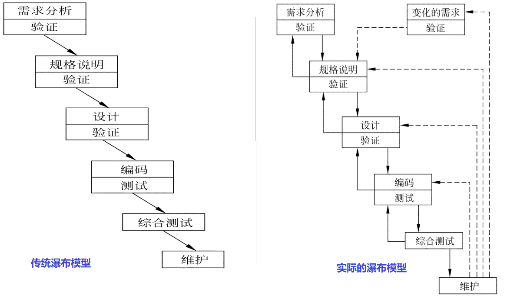
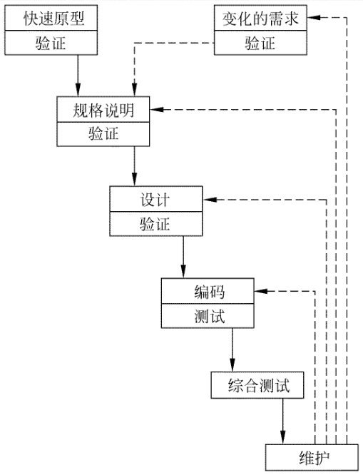
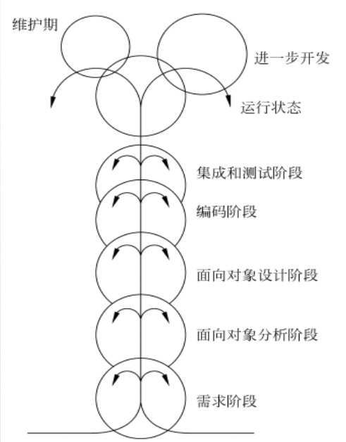
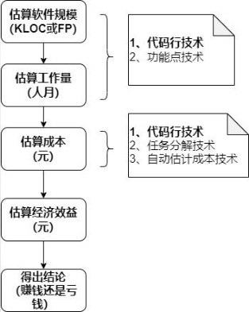
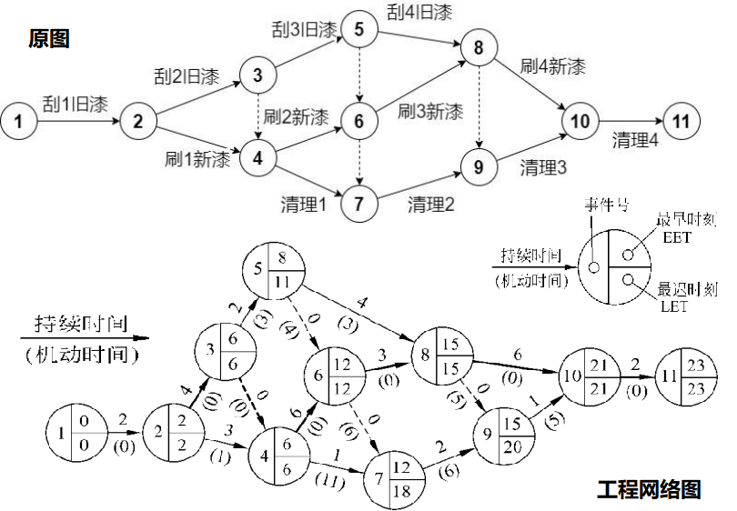

# 软件工程

## 基本概述

#### 软件及其特点

---

- ###### 软件的定义: 程序 + 文档(方法/规则) + 数据

- ###### 软件的特点: 

  - 是**无形的、不可见**的逻辑实体
  - 是**设计开发**的，而不是生产制造的
  - 在使用过程中**没有磨损、老化**的问题
  - 需要具备**演化**能力
  - 是**定制**开发的
  - 是**复杂的**
  - **开发成本高**
  - 易于**复制**
  - **质量要求较高**
  - 开发与运行都离不开相关的**计算机系统环境**
  - 开发工作牵涉到许多**社会因素**

#### 软件开发四个阶段

---

- ###### **个人程序**(20世纪60年代中期以前)

  - 软件是为某个具体的应用和特定的硬件而定制的；
  - 通常是规模较小的程序；
  - 程序设计完全凭程序员的经验和技艺以个人或小组
    方式进行。

-  ###### **软件作坊**(20世纪60年代中期-70年代中期)

  - 由专门软件开发组织开发；
  - 软件开发组织，沿用早期个体化软件开发方法；
  - 在这一时期，出现了若干高级程序设计语言，如：
    FORTRAN、COBOL等。

- ###### **软件工程**(20世纪70年代中期-80年代中期)

  - 概念的提出：其目的是倡导以工程的原理、原则和方法进行软件
    的开发，以解决软件危机。

- ###### **第四阶段**(20世纪80年代中期-现在)

- ###### 软件危机

  - 软件危机是指在计算机软件的开发和维护过程中所遇到的一系列严重问题。
  - 软件危机包含下述两方面的问题：
    ➢ 如何开发软件，以满足对软件日益增长的需求；
    ➢ 如何维护数量不断膨胀的已有软件。
  - 软件危机的典型表现: 
    - 对软件开发成本和进度的估计常常很不准确
    - 用户对“已完成的”软件系统不满意的现象经常发生
    - 软件产品的质量往往靠不住
    - 软件常常是不可维护的(**周期长、成本高、质量差、维护困难**)
    - 软件通常没有适当的文档资料
    - 软件成本在计算机系统总成本中所占的比例逐年上升
    - 软件开发生产率提高的速度，远远跟不上计算机应用迅速普及深入的趋势
  - 软件危机产生的原因：
    - 随着软件规模的增大，其复杂性往往呈指数级升高
    - 软件开发人员与用户交流存在障碍
    - 缺乏软件开发的经验和有关软件开发数据的积累，使得开发工作的计划很难制订
    - 缺少有效的软件评测手段，提交用户的软件质量差
    - 软件开发过程不规范，软件难以维护
  - 消除软件危机的途径：
    - 首先应该对计算机软件有一个正确的认识
    - 充分认识到软件开发不是某种个体劳动的神秘技巧 
    - 而应该是各类人员协同配合，共同完成的工程项目
    - 推广使用在实践中总结出来的开发软件的成功的技
    - 术和方法，并且研究探索更好更有效的技术和方法
    - 应该开发和使用更好的软件工具

#### 软件工程定义

---

- ###### 基本概述: 

  > 软件工程是指导计算机软件开发和维护的一门工程学科。采用工程的概念、原理、技术和方法来开发与维护软件，把经过时间考验而证明正确的管理技术和当前能够得到的最好的技术方法结合起来，以经济地开发出高质量的软件并有效地维护它，这就是软件工程。

- ###### 软件工程的定义:

  - 软件工程就是为了经济地获得可靠的且能在实际机器上有效地运行的软件，而建立和使用完善的工程原理。
  -  ①把系统的、规范的、可度量的途径应用于软件开发、运行和维护过程，也就是把工程应用于软件； ②研究①中提到的途径。

- ###### 软件工程的本质：

  |      是什么      |       不是什么       |
  | :--------------: | :------------------: |
  |   如何开发软件   |     如何使用软件     |
  |  较大规模的软件  |    小型、微型软件    |
  |     工程方法     | 作坊、个体、科研方法 |
  |     规范过程     |       混乱过程       |
  | 高质量、高可信度 |    低质量、不可信    |
  |     按时完成     |       拖延时间       |
  |     预算受控     |       超出预算       |

#### 软件工程的目标

---

- ###### 生产具有正确性、可用性以及开销合宜的产品：

  - 正确性：
    意指软件产品达到预期功能的程度；
  - 可用性：
    意指软件基本结构、实现及文档为用户可用的程度：
  - 开销合宜：
    指软件开发、运行的整个开销满足用户要求的程度。

#### 软件工程基本原理

---

> - 用分阶段的生命周期计划严格管理；
> - 坚持进行阶段评审；
> - 实行严格的产品控制；
> - 采用现代程序设计技术；
> - 结果应能清楚地审查；
> - 开发小组的人员应该少而精；
> - 承认不断改进软件工程实践的必要性。

#### 软件工程方法学

---

- ###### 方法: 

  > 完成软件开发的各项任务的技术方法，回答“怎样做”的问题

- ###### 工具: 

  > 为运用方法而提供的自动的或半自动的软件工程支撑环境

- ###### 过程: 

  > 为了获得高质量的软件所需要完成的一系列任务的框架，它规定了完成各项任务的工作步骤

  

---

- ###### 将世界视为过程:

  - 世界由一个个相互关联的小系统组成；
  - 每个小系统都有明确的开始和明确的结束，开始和结束之间有着严谨的因果关系。

- ###### 传统方法学:

  - 也称为生命周期方法学或结构化范型, 采用**结构化技术**(结构化分析、结构化设计和结构化实现)
  - 传统方法学把软件生命周期的全过程依次划分为若干个阶段，然后顺序地完成每个阶段的任务。
  - 每个阶段的开始和结束都有严格标准，对于任何两个相邻的阶段而言，前一阶段的结束标准就是后一阶段的开始标准。
  - 采用生命周期方法学可以大大提高软件开发的成功率，软件开发的生产率也能明显提高。
  - 目前，传统方法学仍然是人们在开发软件时使用得十分广泛的软件工程方法学。
  - 传统方法学在需求复杂度较低的时候非常管用，却在面对如今这个复杂的世界显得无能为力。
  - 传统方法学并非不正确，只是因为构成一个系统的因素太多，要把所有可能的因素都考虑到，把所有因素的因果关系都分析清楚，再把这个过程模拟出来实在是太困难了。

---

- ###### 将世界视为对象：

  - 世界由一个个相互独立的对象组成；
  - 对象相互之间并无因果关系；
  - 只有在某个外部力量的驱动下，对象之间才会依据某种规律相互传递信息。

- ###### 面向对象方法学基本原则：

  > 尽量模拟人类习惯的思维方式，使开发软件的方法与过程尽可能接近人类认识世界、解决问题的方法与过程，从而使描述问题的问题空间(也称为问题域)
  > 与实现解法的解空间(也称为求解域)在结构上尽可能一致。

- ###### 面向对象方法学四个要点：

  - 把对象(object)作为融合了数据及在数据上的操作行为的统一的软件构件。
  -  把所有对象都划分成类(class)。
  -  按照父类与子类的关系，把若干个相关类组成一个层次结构的系统。
  - 对象彼此间仅能通过发送消息互相联系。

- ###### 面向对象方法学的优点：

  - 尽量模拟人类习惯的思维方式，使开发软件的方法与过程尽可能接近人类认识世界、解决问题的方法与过程。
  - 降低了软件产品的复杂性，提高了软件的可理解性，简化了软件的开发和维护工作。
  - 面向对象方法特有的继承性和多态性，进一步提高了面向对象软件的可重用性。

---

- ###### 面向对象方法与传统方法的不同：

  - 面向对象方法不再把世界看做一个紧密关联的系统，而是看成一些相互独立的离散的小零件，这些零件依据某种规则组织起来。完成一个特定的功能。
  - 原来，过程并非这个世界的本源，过程是由通过特定规则组织起来的一些对象“表现”出来的，原始的对象既独立于过程，也独立于组装规则。

## 软件的生命周期

- ###### 软件生命周期： 

  - 软件从产生、发展到成熟、直至衰亡为止
  - 软件生命周期由软件定义、软件开发和运行维护(也称为软件维护)3个时期组成，每个时期又进一步划分成若干个阶段。

- ###### 软件生命周期分8个阶段：

  >**软件定义**
  >
  >1. 问题定义；
  >2. 可行性研究；
  >3. 需求分析；
  
  >**软件开发**
  >
  >4. 总体设计；
  >5. 详细设计；
  >6. 编码和单元测试（实现）；
  >7. 综合测试；
  
  >**运行维护**
  >
  >8. 软件维护。
  

#### 问题定义

---

- 确定“要解决的问题是什么”；
- 通过对客户的访问调查，系统分析员扼要地写出关于问题性质、工程目标和工程规模的书面报告，经过讨论和必要的修改之后这份报告应该得到客户的确认。

#### 可行性研究

---

- 确定“有行得通解决方法？粗略计划”；
- 可行性研究应该比较简短；
- 可行性研究的结果是客户作出是否继续进行这项工程的决定的重要依据；
- 可行性研究报告。

#### 需求分析

---

- 确定“为了解决这个问题，目标系统必须做什么？”；
- 需求分析是完整、准确、清晰、具体。；
- 需求规格说明书。

#### 总体设计

---

- 确定“概括地说，应该怎样实现目标系统？”；
- 根据需求设计方案；分析推荐最佳方案；设计软件结构等；
- 总体设计说明书。

#### 详细设计

---

- 确定“应该怎样具体地实现目标系统？”；
- 设计每个模块的算法和数据结构；
- 详细设计说明书。

#### 编码和单元测试

---

- 写出正确的容易理解、容易维护的程序模块；
- 选择语言、工具翻译详细设计结果、测试模块；
- 程序清单、单元测试报告。

#### 综合测试

---

- 通过各种类型的测试（及相应的调试）使软件达到预定的要求；
- 集成测试：将经过单元测试模块组装起来进行测试；
- 验收测试：由用户按需求规格说明书规定进行测试；
- 测试报告：测试计划、测试方案、测试结果。

#### 软件维护

> **系统维护占据工程的很大一部分成本。**

---

- 通过必要维护活动使系统持久满足用户要求；
- 改正性维护：软件运行过程中发现错误，进行维护；
- 适应性维护：软件运行软硬件环境变化，进行的维护；
- 完善性维护：用户要求改进或扩充软件，进行的维护；
- 预防性维护：为将来的维护作准备。

## 软件过程模型

#### 软件过程

---

###### 软件过程: 

- 软件过程是为了获得高质量软件所需要完成的一系列任务的框架，它规定了完成各项任务的工作步骤。
- 软件过程描述为了开发出客户需要的软件，什么人（who）、在什么时候（when）、做什么事（what）以及怎样（how）做这些事以实现某一个特定的具体目标。

###### 软件过程模型：

- 通常使用生命周期模型简洁地描述软件过程。
- 实际从事软件开发工作时，软件规模、类型、开发环境及技术方法等因素会影响到阶段划分，及各阶段的执行顺序，形成不同生存周期模型，又称过程模型。

#### 瀑布模型

---
> 传统的瀑布模型: 
>
> 一直是唯一被广泛采用的生命周期模型，现在它仍然是软件工程中应用得最广泛的过程模型。
>
> 实际的瀑布模型: 
>
> 1. 图中实线箭头表示开发过程，虚线箭头表示维护过程；
> 2. 当在后面阶段发现前面阶段的错误时，需要沿图中左侧的反馈线返回前面的阶段，修正前面阶段的产品之后再回来继续完成后面阶段的任务。
>
> 

- ###### 瀑布模型的特点: 

  - 阶段间具有顺序性和依赖性：
    ①必须等前一阶段的工作完成之后，才能开始后一阶段的工作；
    ②前一阶段的输出文档就是后一阶段的输入文档，因此，只有前一阶段的输出文档正确，后一阶段的工作才能获得正确的结果。
  - 推迟实现的观点：
    瀑布模型在编码之前设置了系统分析与系统设计的各个阶段，分析与设计阶段的基本任务规定，在这两个阶段主要考虑目标系统的逻辑模型，不涉及软件的
    物理实现。
  - 质量保证的观点：
    为了保证所开发的软件的质量，在瀑布模型的每个阶段都应坚持两个重要做法。
    ①每个阶段都必须完成规定的文档，没有交出合格的文档就是没有完成该阶段的任务。
    ②每个阶段结束前都要对所完成的文档进行评审，以便尽早发现问题，改正错误。

- ###### 瀑布模型的优点: 

  - 可强迫开发人员采用规范的方法（例如，结构化技术）；
  - 严格地规定了每个阶段必须提交的文档；
  - 要求每个阶段交出的所有产品都必须经过质量保证小组的仔细验证。

- ###### 瀑布模型的缺点: 

  - 客户必须能够完整、正确和清晰地表达他们的需求，开发人员一开始就必须理解需求；
  - 缺乏灵活性。一旦软件需求存在偏差，就会导致开发出的软件产品不能满足用户的实际需求；
  - 在一个项目的早期阶段，过分地强调了基线和里程碑处的文档，可能要花费更多的时间，建立一些用处不大的文档；
  - 直到项目结束之前，都不能演示系统的能力，增加了项目的风险。

- ###### 瀑布模型的适用情况: 

  - 需求已被很好地定义和理解；
  - 过程设计人员也很清楚：开发组织非常熟悉为实现这一模型所需要的过程。

#### 快速原型模型

---

> 快速原型是快速建立起来的可以在计算机上运行的程序，它所能完成的功能往往是最终产品能完成的功能的一个子集。
>
> 

- ###### 能基本上做到线性顺序开发的主要原因如下: 

  - 原型系统已经通过与用户交互而得到验证，据此产生的规格说明文档正确地描述了用户需求，因此，在开发过程的后续阶段不会因为发现了规格说明文档的错误而进行较大的返工。
  - 开发人员通过建立原型系统已经学到了许多东西（至少知道了“系统不应该做什么，以及怎样不去做不应该做的事情” ），因此，在设计和编码阶段发生错误的可能性也比较小，这自然减少了在后续阶段需要改正前面阶段所犯错误的可能性。

- ###### 快速原型模型的适用情况: 

  - 需求获取困难以及后期软件需求变更；
  - 快速：加速软件开发过程，节约软件开发成本。

#### 喷泉模型

---

> - 图中代表不同阶段的圆圈相互重叠，这明确表示两个活动之间存在交迭；
> - 图中在一个阶段内的向下箭头代表该阶段内的迭代（或求精）
> - 图中较小的圆圈代表维护，圆圈较小象征着采用了面向对象范型之后维护时间缩短了。
>
> 

- ###### 喷泉模型的适用情况:

  - 喷泉”这个词体现了面向对象软件开发过程迭代和无缝的特性。迭代是软件开发过程中普遍存在的一种内在属性。用面向对象方法学开发软件时，工作重点应该放在生命周期中的分析阶段。

#### 敏捷过程

---

> 敏捷过程为了使软件开发团队具有高效工作和快速响应变化的能力

- ###### 敏捷过程的四个价值观声明:

  - 个体和交互胜过过程和工具；
  - 可以工作的软件胜过面面俱到的文档；
  - 客户合作胜过合同谈判；
  - 响应变化胜过遵循计划。

#### 极限编程

---

> - 极限编程（eXtreme Programming,XP）是敏捷过程中最富盛名的一个，其名称中“极限”二字的含义是指把好的开发实践运用到极致。
> - 目前，极限编程已经成为一种典型的开发方法，广泛应用于需求模糊且经常改变的场合。

- ###### 极限编程的有效实践:

  - 客户作为开发团队的成员；
  - 使用用户素材；
  - 短交付周期；
  - 验收测试；
  - 结对编程；
  - 测试驱动开发；
  - 集体所有；
  - 持续集成；
  - 可持续的开发速度；
  - 开放的工作空间；
  - 及时调整计划；
  - 简单的设计；
  - 重构；
  - 使用隐喻。

- ###### 敏捷过程的适用情况:

  - 能较好地适应商业竞争环境下对小型项目提出的有限资源和有限开发时间的约束。

## 可行性研究

#### 可行性研究的任务

---

> 可行性研究的目的不是解决问题，而是确定问题是否值得去解决。

- ###### 可行性研究分析过程：

  - 进一步分析和澄清问题定义
  - 分析员应该导出系统的逻辑模型
  - 探索若干种可供选择的主要解法

- ###### 至少应该从下述3个方面研究每种解法的可行性

  - 技术可行性
  - 经济可行性
  - 操作可行性

#### 可行性研究过程

---

> 典型的可行性研究过程有下述8个步骤: 
>
> 1. 复查系统规模和目标；
> 2. 研究目前正在使用的系统；
> 3. 导出新系统的高层逻辑模型；
> 4. 进一步定义问题；
> 5. 导出和评价供选择的解法；
> 6. 推荐行动方针；
> 7. 草拟开发计划书；
> 8. 写文档提交审

- ###### 复查系统规模和目标

  - 分析员访问关键人员，仔细阅读和分析有关的材料，以便对问题定义阶段书写的关于规模和目标的报告书进一步复查确认，改正含糊或不确切的叙述，清
    晰地描述对目标系统的一切限制和约束。这个步骤的工作，实质上是为了确保分析员正在解决的问题确实是要求他解决的问题。

- ###### 研究目前正在使用的系统

  - 现有的系统是信息的重要来源。显然，如果目前有一个系统正被人使用，那么这个系统必定能完成某些有用的工作，因此，新的目标系统必须也能完成
    它的基本功能；另一方面，如果现有的系统是完美无缺的，用户自然不会提出开发新系统的要求，因此，现有的系统必然有某些缺点，新系统必须能解决旧系统中存在的问题。
  - 应该仔细阅读分析现有系统的文档资料和使用手册，也要实地考察现有的系统。
  - 常见的错误做法是花费过多时间去分析现有的系统。
  - 没有一个系统是在“真空”中运行的，绝大多数系统都和其他系统有联系。

- ###### 导出新系统的高层逻辑模型:

  - 优秀的设计过程通常是从现有的物理系统出发，导出现有系统的逻辑模型，再参考现有系统的逻辑模型，设想目标系统的逻辑模型，最后根据目标系统的逻辑模型建造新的物理系统

- ###### 进一步定义问题:

  - 可行性研究的前4个步骤实质上构成一个循环。分析员定义问题，分析这个问题，导出一个试探性的解；在此基础上再次定义问题，再一次分析这个问题，修改这个解；继续这个循环过程，直到提出的逻辑模型完全符合系统目标

- ###### 导出和评价供选择的解法:

  - 分析员应该从他建议的系统逻辑模型出发，导出若干个较高层次的物理解法供比较和选择。
  - 其次可以考虑操作方面的可行性。分析员应该根据使用部门处理事务的原则和习惯检查技术上可行的那些方案，去掉其中从操作方式或操作过程的角度看用户不能接受的方案。
  - 接下来应该考虑经济方面的可行性。分析员应该估计余下的每个可能的系统的开发成本和运行费用，并且估计相对于现有的系统而言这个系统可以节省的开支或可以增加的收入。
  - 最后为每个在技术、操作和经济等方面都可行的系统制定实现进度表，这个进度表不需要制定得很详细，通常只需要估计生命周期每个阶段的工作量。

- ###### 推荐行动方针:

  - 根据可行性研究结果应该决定的一个关键性问题是： 是否继续进行这项开发工程？分析员必须清楚地表明他对这个关键性决定的建议。如果分析员认为值得继续进行这项开发工程，那么他应该选择一种最好的解法，并且说明选择这个解决方案的理由。通常客户主要根据经济上是否划算决定是否投资于一项开发工程，因此分析员对于所推荐的系统必须进行比较仔细的成本/效益分析

- ###### 草拟开发计划:

  - 分析员应该为所推荐的方案草拟一份开发计划，除了制定工程进度表之外还应该估计对各类开发人员和各种资源的需要情况，应该指明什么时候使用以及使用多长时间。此外还应该估计系统生命周期每个阶段的成本。最后应该给出下一个阶段(需求分析)的详细进度表和成本估计

- ###### 书写文档提交审查

  - 应该把上述可行性研究各个步骤的工作结果写成清晰的文档，请用户、客户组织的负责人及评审组审查，以决定是否继续这项工程及是否接受分析员推荐的方案

#### 成本/效益分析

---

> 

- ###### 估算软件规模常用技术: 代码行技术 功能点技术

- ###### 代码行技术: 定量估算软件规模方法，估计实现一个功能所需要的源程序行数（LOC或KLOC）。

  - 为了使对程序规模的估计更接近实际值，可以由多名有经验的软件工程师分别作出估计。

    每个人估计程序的最小规模（a）、最大规模（b）和最可能规模（m），则程序规模的估计值为：
    $$
    L = \frac{\overline{a} + 4\overline{m} + \overline{b}}{6}
    $$

    > 用代码行技术估算软件规模时，当程序较小时常用的单位是代码行数（LOC），当程序较大时常用的单位是千行代码数（KLOC）。
    >
    > 代码行技术的主要优点是:
    >
    > - 代码是所有软件开发项目都有的“产品”，而且很容易计算代码行数。
    >
    > 代码行技术的缺点是：
    >
    > 1. 源程序仅是软件配置的一个成分，用它的规模代表整个软件的规模似乎不太合理；
    > 2. 用不同语言实现同一个软件所需要的代码行数并不相同；
    > 3.  这种方法不适用于非过程语言。

- ###### 功能点技术: 对软件信息域特性和软件复杂性的评估结果，估算软件规模。用功能点（FP）为单位度量。

- ###### 估算工作量常用技术(面向KLOC的估算模型, 面向FP的估算模型)

  - 软件估算模型使用由经验导出的公式来预测软件开发工作量，工作量是软件规模（KLOC或FP）的函数，工作量的单位通常是人月（pm)。

  - 总体结构形式如：
    $$
    E = A + B \times ev^c
    $$

    其中，A、B和C是由经验数据导出的常数，E是以人月为单位的工作量，ev是估算变量（KLOC或FP）。

  - 面向KLOC的常用估算模型: 
    Walston_Felix模型: 
    $$
    E= 5.2 + (KLPC)^{0.91}
    $$
    Bailey_Basili模型
    $$
    E= 5.5 + 0.73 + (KLPC)^{1.16}
    $$
    Boehm简单模型
    $$
    E= 3.2 \times (KLPC)^{1.05}
    $$
    Doty模型（在KLOC>9时适用）
    $$
    E= 5.288 \times (KLPC)^{1.047}
    $$

  - 对于相同的KLOC或FP值，用不同的模型估算将得出不同的结果。

  - 这些模型适用范围有限。

  - 必须根据当前项目的特点选择适用的估算模型，并且根据需要适当地调整（例如修改模型常数）估算模型。

- ###### 估算成本

  - 软件开发成本主要表现为人力消耗(乘以平均工资则得到开发费用)。

  - 成本估计不是精确的科学，因此应该使用几种不同的估计技术以便相互校验。

  - 使用代码行技术估算: 定量估算方法

    根据经验和历史数据估计实现一个功能需要的源程序行数，用每行代码的平均成本乘以行数就可以确定软件的成本。每行代码的平均成本主要取决于软件的复杂度和工资水平

- ###### 估计开发成本、运行费用和新系统将带来的经济效益

  - 运行费用：取决于系统的操作费用（操作员人数，工作时间，消耗的物资等）和维护费用；
  - 经济效益=使用新系统而增加的收入+使用新系统可以节省的运行费用。
  - 以后在进行成本/效益分析时一律假设生命周期为5年。

  > 成本/效益分析方法主要从四个方面考虑: 
  >
  > 1. 货币的时间价值
  > 2. 投资回收期
  > 3. 纯收入
  > 4. 投资回收率

- ###### 货币的时间价值

  - 通常用利率的形式表示货币的时间价值。

  - 假设年利率为i，如果现在存入P元，则n年后可以得到的钱数为：
    $$
    F = P(1 + i)^{n}
    $$

  - 反之，如果n年后能收入F元钱，那么这些钱的现在价值是：
    $$
    P = F / (1 + i)^{n}
    $$
    

- ###### 投资回收期

  - 通常用投资回收期衡量一项开发工程的价值。
  - 所谓投资回收期就是使累计经济效益等于最初投资所需要的时间。
  - 投资回收期仅仅是一项经济指标，为了衡量一项开发工程的价值，还应该考虑其他经济指标。

- ###### 纯收入

  - 衡量工程价值的另一项经济指标是工程的纯收入，也就是在整个生命周期之内系统的累计经济效益（折合成现在值）与投资之差。
  - 纯收入<0，不值得投资；
  - 纯收入=0，从经济观点看这项工程可能是不值得投资的。

- ###### 投资回收

  - 用投资回收率衡量投资效益的大小，并且可以把它和年利率相比较，在衡量工程的经济效益时，它是最重要的参考数据。

#### 进度计划

---

> 把工作量分配给特定的软件工程任务并规定完成各项任务的起止日期，从而将估算出的项目工作量分布于计划好的项目持续期内。
>
> 进度计划将随着时间的流逝而不断演化。
>
> 随着开发小组规模的扩大，个人生产率将下降，以致开发时间与从事开发工作的人数并不成反比关系

- ###### 工程网络

  - 工程网络是制定进度计划时一种常用的图形工具，它能描绘任务分解情况以及每项作业的开始时间和结束时间，此外，它还显式地描绘各个作业彼此间的依赖关系。因此，工程网络是系统分析和系统设计的强有力的工具。
  - 在工程网络中用箭头表示作业(例如，刮旧漆，刷新漆，清理等)，用圆圈表示事件(一项作业开始或结束)。
  - 事件仅仅是可以明确定义的时间点，它并不消耗时间和资源。
  - 作业通常既消耗资源又需要持续一定时间。
  - 画出工程网络之后，系统分析员就可以借助它的帮助估算工程进度了。为此需要在工程网络上增加一些必要的信息。

- ###### 估算工程进度

  > 

  - 首先，把每个作业估计需要使用的时间写在表示该项作业的箭头上方。注意，箭头长度和它代表的作业持续时间没有关系，箭头仅表示依赖关系，它上方的数字才表示作业的持续时间。

  - 其次，为每个事件计算下述两个统计数字：最早时刻EET和最迟时刻LET。这两个数字将分别写在表示事件的圆圈的右上角和右下角
  
    > 通常工程网络中第一个事件的最早时刻定义为零，其他事件的最早时刻在工程网络上从左至右按事件发生顺序计算。计算最早时刻EET使用下述3条简单规则。
    >
    > 考虑进入该事件的所有作业。
    > 对于每个作业都计算它的持续时间与起始事件的EET之和。
    > 选取上述和数中的最大值作为该事件的最早时刻EET。
  
    > 按照惯例，最后一个事件(工程结束)的最迟时刻就是它
    > 的最早时刻。其他事件的最迟时刻在工程网络上从右至
    > 左按逆作业流的方向计算。计算最迟时刻LET使用下述3
    > 条规则。
    > 考虑离开该事件的所有作业。
    > 从每个作业的结束事件的最迟时刻中减去该作业的持续时间。
    > 选取上述差数中的最小值作为该事件的最迟时刻LET。

  - 关键路径： 图中有几个事件的最早时刻和最迟时刻相同，这些事件定义了关键路径，在图中关键路径，用粗线箭头表示。 

    关键路径上的事件(关键事件)必须准时发生，组成关键路径的作业(关键作业)的实际持续时间不能超过估计的持续时间，否则工程就不能准时结束。

    工程项目的管理人员应该密切注视关键作业的进展情况，如果关键事件出现的时间比预计的时间晚，则会使最终完成项目的时间拖后；如果希望缩短工期，只有往关键作业中增加资源才会有效果。

  - 不在关键路径上的作业有一定程度的激动余地。
    机动时间=(LEF)结束 — (EET)开始 — 持续时间
    
    
    
    
    
    
    
    
    
    
    
    
    
    
    
    
