# 软件工程


## 基本概述

#### 软件及其特点

---

- ###### 软件的定义: 程序 + 文档(方法/规则) + 数据

- ###### 软件的特点: 

  - 是**无形的、不可见**的逻辑实体
  - 是**设计开发**的，而不是生产制造的
  - 在使用过程中**没有磨损、老化**的问题
  - 需要具备**演化**能力
  - 是**定制**开发的
  - 是**复杂的**
  - **开发成本高**
  - 易于**复制**
  - **质量要求较高**
  - 开发与运行都离不开相关的**计算机系统环境**
  - 开发工作牵涉到许多**社会因素**


#### 四个阶段和危机

---

- ###### **个人程序**(20世纪60年代中期以前)

  - 为某个具体的应用和特定的硬件而定制, 规模较小以个人或小组方式进行。

- ###### **软件作坊**(20世纪60年代中期-70年代中期, 出现若干高级语言)

  - 由专门软件开发组织开发, 沿用早期个体化软件开发方法

- ###### **软件工程**(20世纪70年代中期-80年代中期)

  - 倡导以工程的原理、原则和方法进行软件的开发，以解决软件危机。

- ###### **第四阶段**(20世纪80年代中期-现在)


- ###### 软件危机

  - 软件危机是指在计算机软件的**开发和维护**过程中所遇到的一系列严重问题。
  - 软件危机包含下述两方面的问题：
    -  如何开发软件，以满足对软件日益增长的需求；
    -  如何维护数量不断膨胀的已有软件。
  - 软件危机的典型表现: 
    - 对软件开发成本和进度的估计常常很不准确
    - 用户对“已完成的”软件系统不满意的现象经常发生
    - 软件产品的质量往往靠不住
    - 软件常常是不可维护的(**周期长、成本高、质量差、维护困难**)
    - 软件通常没有适当的文档资料
    - 软件成本在计算机系统总成本中所占的比例逐年上升
    - 软件开发生产率提高的速度，远远跟不上计算机应用迅速普及深入的趋势
  - 软件危机产生的原因：
    - 随着软件规模的增大，其复杂性往往呈指数级升高
    - 软件开发人员与用户交流存在障碍
    - 缺乏软件开发的经验和有关软件开发数据的积累，使得开发工作的计划很难制订
    - 缺少有效的软件评测手段，提交用户的软件质量差
    - 软件开发过程不规范，软件难以维护
  - 消除软件危机的途径：
    - 首先应该对计算机软件有一个正确的认识
    - 充分认识到软件开发不是某种个体劳动的神秘技巧 
    - 而应该是各类人员协同配合，共同完成的工程项目
    - 推广使用在实践中总结出来的开发软件的成功的技术和方法，并且研究探索更好更有效的技术和方法
    - 应该开发和使用更好的软件工具


#### 软件工程定义

---

- ###### 基本概述: 

  > 软件工程是指导计算机软件开发和维护的一门工程学科。采用工程的概念、原理、技术和方法来开发与维护软件，把经过时间考验而证明正确的管理技术和当前能够得到的最好的技术方法结合起来，以经济地开发出高质量的软件并有效地维护它，这就是软件工程。

- ###### 软件工程的定义:

  - 软件工程就是为了经济地获得可靠的且能在实际机器上有效地运行的软件，而建立和使用完善的工程原理。
  - ①把系统的、规范的、可度量的途径应用于软件开发、运行和维护过程，也就是把工程应用于软件； ②研究①中提到的途径。

- ###### 软件工程的本质：

  |      是什么      |       不是什么       |
  | :--------------: | :------------------: |
  |   如何开发软件   |     如何使用软件     |
  |  较大规模的软件  |    小型、微型软件    |
  |     工程方法     | 作坊、个体、科研方法 |
  |     规范过程     |       混乱过程       |
  | 高质量、高可信度 |    低质量、不可信    |
  |     按时完成     |       拖延时间       |
  |     预算受控     |       超出预算       |


#### 软件工程的目标

---

- ###### 生产具有正确性、可用性以及开销合宜的产品：

  - 正确性：
    意指软件产品达到预期功能的程度；
  - 可用性：
    意指软件基本结构、实现及文档为用户可用的程度：
  - 开销合宜：
    指软件开发、运行的整个开销满足用户要求的程度。


#### 软件工程基本原理

---

> - 用分阶段的生命周期计划严格管理；
> - 坚持进行阶段评审；
> - 实行严格的产品控制；
> - 采用现代程序设计技术；
> - 结果应能清楚地审查；
> - 开发小组的人员应该少而精；
> - 承认不断改进软件工程实践的必要性。


#### 软件工程方法学

---

- ###### 方法: 

  > 完成软件开发的各项任务的技术方法，回答“怎样做”的问题

- ###### 工具: 

  > 为运用方法而提供的自动的或半自动的软件工程支撑环境

- ###### 过程: 

  > 为了获得高质量的软件所需要完成的一系列任务的框架，它规定了完成各项任务的工作步骤

  

---

- ###### 将世界视为过程:

  - 世界由一个个相互关联的小系统组成；
  - 每个小系统都有明确的开始和明确的结束，开始和结束之间有着严谨的因果关系。

- ###### 传统方法学:

  - 也称为生命周期方法学或结构化范型, 采用**结构化技术**(结构化分析、结构化设计和结构化实现)
  - 传统方法学把软件生命周期的全过程依次划分为若干个阶段，然后顺序地完成每个阶段的任务。
  - 每个阶段的开始和结束都有严格标准，对于任何两个相邻的阶段而言，前一阶段的结束标准就是后一阶段的开始标准。
  - 采用生命周期方法学可以大大提高软件开发的成功率，软件开发的生产率也能明显提高。
  - 目前，传统方法学仍然是人们在开发软件时使用得十分广泛的软件工程方法学
  - 传统方法学在需求复杂度较低的时候非常管用，却在面对如今这个复杂的世界显得无能为力。
  - 传统方法学并非不正确，只是因为构成一个系统的因素太多，要把所有可能的因素都考虑到，把所有因素的因果关系都分析清楚，再把这个过程模拟出来实在是太困难了。


---

- ###### 将世界视为对象：

  - 世界由一个个相互独立的对象组成；
  - 对象相互之间并无因果关系；
  - 只有在某个外部力量的驱动下，对象之间才会依据某种规律相互传递信息。

- ###### 面向对象方法学基本原则：

  > 尽量模拟人类习惯的思维方式，使开发软件的方法与过程尽可能接近人类认识世界、解决问题的方法与过程，从而使描述问题的问题空间(也称为问题域)与实现解法的解空间(也称为求解域)在结构上尽可能一致。

- ###### 面向对象方法学四个要点：

  - 把对象(object)作为融合了数据及在数据上的操作行为的统一的软件构件
  - 把所有对象都划分成类(class)
  - 按照父类与子类的关系，把若干个相关类组成一个层次结构的系统
  - 对象彼此间仅能通过发送消息互相联系

- ###### 面向对象方法学的优点：

  - 尽量模拟人类习惯的思维方式，使开发软件的方法与过程尽可能接近人类认识世界、解决问题的方法与过程
  - 降低了软件产品的复杂性，提高了软件的可理解性，简化了软件的开发和维护工作
  - 面向对象方法特有的继承性和多态性，进一步提高了面向对象软件的可重用性


---

- ###### 面向对象方法与传统方法的不同：

  - 面向对象方法不再把世界看做一个紧密关联的系统，而是看成一些相互独立的离散的小零件，这些零件依据某种规则组织起来。完成一个特定的功能。
  - 过程并非这个世界的本源，过程是由通过特定规则组织起来的一些对象“表现”出来的，原始的对象既独立于过程，也独立于组装规则。


## 软件的生命周期

- ###### 软件生命周期： 

  - 软件从产生、发展到成熟、直至衰亡为止
  - 软件生命周期由软件定义、软件开发和运行维护(也称为软件维护)3个时期组成，每个时期又进一步划分成若干个阶段。

- ###### 软件生命周期分8个阶段：

  >**软件定义**
  >
  >1. 问题定义；
  >2. 可行性研究；
  >3. 需求分析；

  >**软件开发**
  >
  >4. 总体设计；
  >5. 详细设计；
  >6. 编码和单元测试（实现）；
  >7. 综合测试；

  >**运行维护**
  >
  >8. 软件维护。


#### 问题定义

---

- 确定“要解决的问题是什么”；
- 通过对客户的访问调查，系统分析员扼要地写出关于问题性质、工程目标和工程规模的书面报告，经过讨论和必要的修改之后这份报告应该得到客户的确认。


#### 可行性研究

---

- 确定“有行得通解决方法？粗略计划”；
- 可行性研究应该比较简短；
- 可行性研究的结果是客户作出是否继续进行这项工程的决定的重要依据；
- 可行性研究报告。


#### 需求分析

---

- 确定“为了解决这个问题，目标系统必须做什么？”；
- 需求分析是完整、准确、清晰、具体。；
- 需求规格说明书。


#### 总体设计

---

- 确定“概括地说，应该怎样实现目标系统？”；
- 根据需求设计方案；分析推荐最佳方案；设计软件结构等；
- 总体设计说明书。


#### 详细设计

---

- 确定“应该怎样具体地实现目标系统？”；
- 设计每个模块的算法和数据结构；
- 详细设计说明书。


#### 编码和单元测试

---

- 写出正确的容易理解、容易维护的程序模块；
- 选择语言、工具翻译详细设计结果、测试模块；
- 程序清单、单元测试报告。


#### 综合测试

---

- 通过各种类型的测试（及相应的调试）使软件达到预定的要求；
- 集成测试：将经过单元测试模块组装起来进行测试；
- 验收测试：由用户按需求规格说明书规定进行测试；
- 测试报告：测试计划、测试方案、测试结果。


#### 软件维护

> **系统维护占据工程的很大一部分成本。**

---

- 通过必要维护活动使系统持久满足用户要求；
- 改正性维护：软件运行过程中发现错误，进行维护；
- 适应性维护：软件运行软硬件环境变化，进行的维护；
- 完善性维护：用户要求改进或扩充软件，进行的维护；
- 预防性维护：为将来的维护作准备。


## 软件过程模型


#### 软件过程

---

###### 软件过程: 

- 软件过程是为了获得高质量软件所需要完成的一系列任务的框架，它规定了完成各项任务的工作步骤。
- 软件过程描述为了开发出客户需要的软件，什么人（who）、在什么时候（when）、做什么事（what）以及怎样（how）做这些事以实现某一个特定的具体目标。

###### 软件过程模型：

- 通常使用生命周期模型简洁地描述软件过程。
- 实际从事软件开发工作时，软件规模、类型、开发环境及技术方法等因素会影响到阶段划分，及各阶段的执行顺序，形成不同生存周期模型，又称过程模型。


#### 瀑布模型

---

> 传统的瀑布模型: 
>
> 一直是唯一被广泛采用的生命周期模型，现在它仍然是软件工程中应用得最广泛的过程模型。
>
> 实际的瀑布模型: 
>
> 1. 图中实线箭头表示开发过程，虚线箭头表示维护过程；
> 2. 当在后面阶段发现前面阶段的错误时，需要沿图中左侧的反馈线返回前面的阶段，修正前面阶段的产品之后再回来继续完成后面阶段的任务。
>
> 

- ###### 瀑布模型的特点: 

  - 阶段间具有顺序性和依赖性：
    ①必须等前一阶段的工作完成之后，才能开始后一阶段的工作；
    ②前一阶段的输出文档就是后一阶段的输入文档，因此，只有前一阶段的输出文档正确，后一阶段的工作才能获得正确的结果。
  - 推迟实现的观点：
    瀑布模型在编码之前设置了系统分析与系统设计的各个阶段，分析与设计阶段的基本任务规定，在这两个阶段主要考虑目标系统的逻辑模型，不涉及软件的
    物理实现。
  - 质量保证的观点：
    为了保证所开发的软件的质量，在瀑布模型的每个阶段都应坚持两个重要做法。
    ①每个阶段都必须完成规定的文档，没有交出合格的文档就是没有完成该阶段的任务。
    ②每个阶段结束前都要对所完成的文档进行评审，以便尽早发现问题，改正错误。

- ###### 瀑布模型的优点: 

  - 可强迫开发人员采用规范的方法（例如，结构化技术）；
  - 严格地规定了每个阶段必须提交的文档；
  - 要求每个阶段交出的所有产品都必须经过质量保证小组的仔细验证。

- ###### 瀑布模型的缺点: 

  - 客户必须能够完整、正确和清晰地表达他们的需求，开发人员一开始就必须理解需求；
  - 缺乏灵活性。一旦软件需求存在偏差，就会导致开发出的软件产品不能满足用户的实际需求；
  - 在一个项目的早期阶段，过分地强调了基线和里程碑处的文档，可能要花费更多的时间，建立一些用处不大的文档；
  - 直到项目结束之前，都不能演示系统的能力，增加了项目的风险。

- ###### 瀑布模型的适用情况: 

  - 需求已被很好地定义和理解；
  - 过程设计人员也很清楚：开发组织非常熟悉为实现这一模型所需要的过程。


#### 快速原型模型

---

> 快速原型是快速建立起来的可以在计算机上运行的程序，它所能完成的功能往往是最终产品能完成的功能的一个子集。
>
> 

- ###### 能基本上做到线性顺序开发的主要原因如下: 

  - 原型系统已经通过与用户交互而得到验证，据此产生的规格说明文档正确地描述了用户需求，因此，在开发过程的后续阶段不会因为发现了规格说明文档的错误而进行较大的返工。
  - 开发人员通过建立原型系统已经学到了许多东西（至少知道了“系统不应该做什么，以及怎样不去做不应该做的事情” ），因此，在设计和编码阶段发生错误的可能性也比较小，这自然减少了在后续阶段需要改正前面阶段所犯错误的可能性。

- ###### 快速原型模型的适用情况: 

  - 需求获取困难以及后期软件需求变更；
  - 快速：加速软件开发过程，节约软件开发成本。


#### 喷泉模型

---

> - 图中代表不同阶段的圆圈相互重叠，这明确表示两个活动之间存在交迭；
> - 图中在一个阶段内的向下箭头代表该阶段内的迭代（或求精）
> - 图中较小的圆圈代表维护，圆圈较小象征着采用了面向对象范型之后维护时间缩短了。
>
> 

- ###### 喷泉模型的适用情况:

  - 喷泉”这个词体现了面向对象软件开发过程迭代和无缝的特性。迭代是软件开发过程中普遍存在的一种内在属性。用面向对象方法学开发软件时，工作重点应该放在生命周期中的分析阶段。


#### 敏捷过程

---

> 敏捷过程为了使软件开发团队具有高效工作和快速响应变化的能力

- ###### 敏捷过程的四个价值观声明:

  - 个体和交互胜过过程和工具；
  - 可以工作的软件胜过面面俱到的文档；
  - 客户合作胜过合同谈判；
  - 响应变化胜过遵循计划。


#### 极限编程

---

> - 极限编程（eXtreme Programming,XP）是敏捷过程中最富盛名的一个，其名称中“极限”二字的含义是指把好的开发实践运用到极致。
> - 目前，极限编程已经成为一种典型的开发方法，广泛应用于需求模糊且经常改变的场合。

- ###### 极限编程的有效实践:

  - 客户作为开发团队的成员；
  - 使用用户素材；
  - 短交付周期；
  - 验收测试；
  - 结对编程；
  - 测试驱动开发；
  - 集体所有；
  - 持续集成；
  - 可持续的开发速度；
  - 开放的工作空间；
  - 及时调整计划；
  - 简单的设计；
  - 重构；
  - 使用隐喻。

- ###### 敏捷过程的适用情况:

  - 能较好地适应商业竞争环境下对小型项目提出的有限资源和有限开发时间的约束。


## 可行性研究


#### 可行性研究的任务

---

> 可行性研究的目的不是解决问题，而是确定问题是否值得去解决。

- ###### 可行性研究分析过程：

  - 进一步分析和澄清问题定义
  - 分析员应该导出系统的逻辑模型
  - 探索若干种可供选择的主要解法

- ###### 至少应该从下述3个方面研究每种解法的可行性

  - 技术可行性
  - 经济可行性
  - 操作可行性


#### 可行性研究过程

---

> 典型的可行性研究过程有下述8个步骤: 
>
> 1. 复查系统规模和目标；
> 2. 研究目前正在使用的系统；
> 3. 导出新系统的高层逻辑模型；
> 4. 进一步定义问题；
> 5. 导出和评价供选择的解法；
> 6. 推荐行动方针；
> 7. 草拟开发计划书；
> 8. 写文档提交评审

- ###### 复查系统规模和目标

  - 分析员访问关键人员，仔细阅读和分析有关的材料，以便对问题定义阶段书写的关于规模和目标的报告书进一步复查确认，改正含糊或不确切的叙述，清
    晰地描述对目标系统的一切限制和约束。这个步骤的工作，实质上是为了确保分析员正在解决的问题确实是要求他解决的问题。

- ###### 研究目前正在使用的系统

  - 现有的系统是信息的重要来源。显然，如果目前有一个系统正被人使用，那么这个系统必定能完成某些有用的工作，因此，新的目标系统必须也能完成
    它的基本功能；另一方面，如果现有的系统是完美无缺的，用户自然不会提出开发新系统的要求，因此，现有的系统必然有某些缺点，新系统必须能解决旧系统中存在的问题。
  - 应该仔细阅读分析现有系统的文档资料和使用手册，也要实地考察现有的系统。
  - 常见的错误做法是花费过多时间去分析现有的系统。
  - 没有一个系统是在“真空”中运行的，绝大多数系统都和其他系统有联系。

- ###### 导出新系统的高层逻辑模型:

  - 优秀的设计过程通常是从现有的物理系统出发，导出现有系统的逻辑模型，再参考现有系统的逻辑模型，设想目标系统的逻辑模型，最后根据目标系统的逻辑模型建造新的物理系统

- ###### 进一步定义问题:

  - 可行性研究的前4个步骤实质上构成一个循环。分析员定义问题，分析这个问题，导出一个试探性的解；在此基础上再次定义问题，再一次分析这个问题，修改这个解；继续这个循环过程，直到提出的逻辑模型完全符合系统目标

- ###### 导出和评价供选择的解法:

  - 分析员应该从他建议的系统逻辑模型出发，导出若干个较高层次的物理解法供比较和选择。
  - 其次可以考虑操作方面的可行性。分析员应该根据使用部门处理事务的原则和习惯检查技术上可行的那些方案，去掉其中从操作方式或操作过程的角度看用户不能接受的方案。
  - 接下来应该考虑经济方面的可行性。分析员应该估计余下的每个可能的系统的开发成本和运行费用，并且估计相对于现有的系统而言这个系统可以节省的开支或可以增加的收入。
  - 最后为每个在技术、操作和经济等方面都可行的系统制定实现进度表，这个进度表不需要制定得很详细，通常只需要估计生命周期每个阶段的工作量。

- ###### 推荐行动方针:

  - 根据可行性研究结果应该决定的一个关键性问题是： 是否继续进行这项开发工程？分析员必须清楚地表明他对这个关键性决定的建议。如果分析员认为值得继续进行这项开发工程，那么他应该选择一种最好的解法，并且说明选择这个解决方案的理由。通常客户主要根据经济上是否划算决定是否投资于一项开发工程，因此分析员对于所推荐的系统必须进行比较仔细的成本/效益分析

- ###### 草拟开发计划:

  - 分析员应该为所推荐的方案草拟一份开发计划，除了制定工程进度表之外还应该估计对各类开发人员和各种资源的需要情况，应该指明什么时候使用以及使用多长时间。此外还应该估计系统生命周期每个阶段的成本。最后应该给出下一个阶段(需求分析)的详细进度表和成本估计

- ###### 书写文档提交审查

  - 应该把上述可行性研究各个步骤的工作结果写成清晰的文档，请用户、客户组织的负责人及评审组审查，以决定是否继续这项工程及是否接受分析员推荐的方案


#### 成本/效益分析

---

> 

- ###### 估算软件规模常用技术: 代码行技术 功能点技术

- ###### 代码行技术: 定量估算软件规模方法，估计实现一个功能所需要的源程序行数（LOC或KLOC）。

  - 为了使对程序规模的估计更接近实际值，可以由多名有经验的软件工程师分别作出估计。

    每个人估计程序的最小规模（a）、最大规模（b）和最可能规模（m），则程序规模的估计值为：
    $$
    L = \frac{\overline{a} + 4\overline{m} + \overline{b}}{6}
    $$

    > 用代码行技术估算软件规模时，当程序较小时常用的单位是代码行数（LOC），当程序较大时常用的单位是千行代码数（KLOC）。
    >
    > 代码行技术的主要优点是:
    >
    > - 代码是所有软件开发项目都有的“产品”，而且很容易计算代码行数。
    >
    > 代码行技术的缺点是：
    >
    > 1. 源程序仅是软件配置的一个成分，用它的规模代表整个软件的规模似乎不太合理；
    > 2. 用不同语言实现同一个软件所需要的代码行数并不相同；
    > 3. 这种方法不适用于非过程语言。


- ###### 功能点技术: 对软件信息域特性和软件复杂性的评估结果，估算软件规模。用功能点（FP）为单位度量。


- ###### 估算工作量常用技术(面向KLOC的估算模型, 面向FP的估算模型)

  - 软件估算模型使用由经验导出的公式来预测软件开发工作量，工作量是软件规模（KLOC或FP）的函数，工作量的单位通常是人月（pm)。

  - 总体结构形式如：
    $$
    E = A + B \times ev^c
    $$

    其中，A、B和C是由经验数据导出的常数，E是以人月为单位的工作量，ev是估算变量（KLOC或FP）。

  - 面向KLOC的常用估算模型: 
    Walston_Felix模型: 
    $$
    E= 5.2 + (KLPC)^{0.91}
    $$
    Bailey_Basili模型
    $$
    E= 5.5 + 0.73 + (KLPC)^{1.16}
    $$
    Boehm简单模型
    $$
    E= 3.2 \times (KLPC)^{1.05}
    $$
    Doty模型（在KLOC>9时适用）
    $$
    E= 5.288 \times (KLPC)^{1.047}
    $$

  - 对于相同的KLOC或FP值，用不同的模型估算将得出不同的结果。

  - 这些模型适用范围有限。

  - 必须根据当前项目的特点选择适用的估算模型，并且根据需要适当地调整（例如修改模型常数）估算模型。

- ###### 估算成本

  - 软件开发成本主要表现为人力消耗(乘以平均工资则得到开发费用)。

  - 成本估计不是精确的科学，因此应该使用几种不同的估计技术以便相互校验。

  - 使用代码行技术估算: 定量估算方法

    根据经验和历史数据估计实现一个功能需要的源程序行数，用每行代码的平均成本乘以行数就可以确定软件的成本。每行代码的平均成本主要取决于软件的复杂度和工资水平


- ###### 估计开发成本、运行费用和新系统将带来的经济效益

  - 运行费用：取决于系统的操作费用（操作员人数，工作时间，消耗的物资等）和维护费用；
  - 经济效益=使用新系统而增加的收入+使用新系统可以节省的运行费用。
  - 以后在进行成本/效益分析时一律假设生命周期为5年。

  > 成本/效益分析方法主要从四个方面考虑: 
  >
  > 1. 货币的时间价值
  > 2. 投资回收期
  > 3. 纯收入
  > 4. 投资回收率

- ###### 货币的时间价值

  - 通常用利率的形式表示货币的时间价值。

  - 假设年利率为i，如果现在存入P元，则n年后可以得到的钱数为：
    $$
    F = P(1 + i)^{n}
    $$

  - 反之，如果n年后能收入F元钱，那么这些钱的现在价值是：
    $$
    P = F / (1 + i)^{n}
    $$

- ###### 投资回收期

  - 通常用投资回收期衡量一项开发工程的价值。
  - 所谓投资回收期就是使累计经济效益等于最初投资所需要的时间。
  - 投资回收期仅仅是一项经济指标，为了衡量一项开发工程的价值，还应该考虑其他经济指标。

- ###### 纯收入

  - 衡量工程价值的另一项经济指标是工程的纯收入，也就是在整个生命周期之内系统的累计经济效益（折合成现在值）与投资之差。
  - 纯收入<0，不值得投资；
  - 纯收入=0，从经济观点看这项工程可能是不值得投资的。

- ###### 投资回收

  - 用投资回收率衡量投资效益的大小，并且可以把它和年利率相比较，在衡量工程的经济效益时，它是最重要的参考数据。


#### 进度计划

---

> 把工作量分配给特定的软件工程任务并规定完成各项任务的起止日期，从而将估算出的项目工作量分布于计划好的项目持续期内。
>
> 进度计划将随着时间的流逝而不断演化。
>
> 随着开发小组规模的扩大，个人生产率将下降，以致开发时间与从事开发工作的人数并不成反比关系

- ###### 工程网络

  - 工程网络是制定进度计划时一种常用的图形工具，它能描绘任务分解情况以及每项作业的开始时间和结束时间，此外，它还显式地描绘各个作业彼此间的依赖关系。因此，工程网络是系统分析和系统设计的强有力的工具。
  - 在工程网络中用箭头表示作业(例如，刮旧漆，刷新漆，清理等)，用圆圈表示事件(一项作业开始或结束)。
  - 事件仅仅是可以明确定义的时间点，它并不消耗时间和资源。
  - 作业通常既消耗资源又需要持续一定时间。
  - 画出工程网络之后，系统分析员就可以借助它的帮助估算工程进度了。为此需要在工程网络上增加一些必要的信息。

- ###### 估算工程进度

  > 

  - 首先，把每个作业估计需要使用的时间写在表示该项作业的箭头上方。注意，箭头长度和它代表的作业持续时间没有关系，箭头仅表示依赖关系，它上方的数字才表示作业的持续时间。

  - 其次，为每个事件计算下述两个统计数字：最早时刻EET和最迟时刻LET。这两个数字将分别写在表示事件的圆圈的右上角和右下角

    > 通常工程网络中第一个事件的最早时刻定义为零，其他事件的最早时刻在工程网络上从左至右按事件发生顺序计算。计算最早时刻EET使用下述3条简单规则。
    >
    > 考虑进入该事件的所有作业。
    > 对于每个作业都计算它的持续时间与起始事件的EET之和。
    > 选取上述和数中的最大值作为该事件的最早时刻EET。

    > 按照惯例，最后一个事件(工程结束)的最迟时刻就是它
    > 的最早时刻。其他事件的最迟时刻在工程网络上从右至
    > 左按逆作业流的方向计算。计算最迟时刻LET使用下述3
    > 条规则。
    > 考虑离开该事件的所有作业。
    > 从每个作业的结束事件的最迟时刻中减去该作业的持续时间。
    > 选取上述差数中的最小值作为该事件的最迟时刻LET。

  - 关键路径： 图中有几个事件的最早时刻和最迟时刻相同，这些事件定义了关键路径，在图中关键路径，用粗线箭头表示。 

    关键路径上的事件(关键事件)必须准时发生，组成关键路径的作业(关键作业)的实际持续时间不能超过估计的持续时间，否则工程就不能准时结束。

    工程项目的管理人员应该密切注视关键作业的进展情况，如果关键事件出现的时间比预计的时间晚，则会使最终完成项目的时间拖后；如果希望缩短工期，只有往关键作业中增加资源才会有效果。

  - 不在关键路径上的作业有一定程度的激动余地。
    机动时间=(LEF)结束 — (EET)开始 — 持续时间

    


## 需求分析

> 对软件需求的深入理解是软件开发工作获得成功的前提条件
>
> 需求分析的基本任务是准确地回答“**系统必须做什么**”这个问题


#### 需求分析的任务

---

> 软件需求分为：**功能性需求**和**非功能性需求**
>
> 虽然功能需求是对软件系统的一项基本需求，但却**并不是唯一**的需求
>
> 通常对软件系统有下述几方面的综合要求:
>
> - 功能需求
> - 性能需求
> - 可靠性和可用性需求
> - 出错处理需求
> - 接口需求
> - 约束
> - 逆向需求
> - 将来可能提出的要求

- ###### 功能性需求

  - 这方面的需求指定系统**必须**提供的服务。通过需求分析应该划分出系统必须完成的所有功能

- ###### 性能需求

  - 性能需求指定系统必须满足的定时约束或容量约束，通常包括速度(响应时间)、信息量速率、主存容量、磁盘容量、安全性等方面的需求

- ###### 可靠性和可用性需求

  - 可靠性需求定量地指定系统的可靠性，可用性与可靠性密切相关，它量化了用户可以使用系统的程度

- ###### 出错处理需求

  - 这类需求说明系统对环境错误应该怎样响应。例如，如果它接收到从另一个系统发来的违反协议格式的消息，应该做什么?注意，上述这类错误并不是由该应用系统本身造成的

- ###### 接口需求

  - 接口需求描述应用系统与它的环境通信的格式。常见的接口需求有：用户接口需求；硬件接口需求；软件接口需求；通信接口需求

- ###### 约束

  - 设计约束或实现约束描述在设计或实现应用系统时应遵守的限制条件。常见的约束有：精度；工具和语言约束；设计约束；应该使用的标准；应该使用的硬件平台

- ###### 逆向需求

  - 逆向需求说明软件系统不应该做什么。理论上有无限多个逆向需求，人们应该仅选取能澄清真实需求且可消除可能发生的误解的那些逆向需求

- ###### 将来可能提出的要求

  - 应该明确地列出那些虽然不属于当前系统开发范畴，但是据分析将来很可能会提出来的要求。这样做的目的是，在设计过程中对系统将来可能的扩充和修改预做准备，以便一旦确实需要时能比较容易地进行这种扩充和修改


- ###### 需求分析的困难

  - 用户与开发人员很难进行交流
  - 用户的需求是动态变化的
  - 系统变更的代价呈非线性增长

- ###### 需求工程

  - 需求工程是指应用已证实有效技术、方法进行需求分析，确定客户需求，帮助分析人员理解问题并定义目标系统的所有外部特征的一门学科。
  - 需求工程强调需求分析不是一个独立的阶段，而是存在于整个软件过程中，通过进行需求演进活动尽可能满足用户需求

  ```mermaid
  graph TD
  A(软件需求工程)
  A-->B(需求开发)
  A-->C(需求需求管理)
  B-->D(需求获取)
  B-->E(需求建模)
  B-->F(规格说明)
  B-->G(验证)
  ```

- ###### 需求获取

  - 通过与用户交流，对现有系统进行观察及任务分析的基础上，开发、捕获和修订用户需求的过程
  - 需求获取活动可能设计机构中方方面面的人，是一个复杂困难的过程
  - 获取需求的方法: 
    - 访谈；
    - 参观用户的工作流程，观察用户的操作；
    - 向用户群体发调查问卷；
    - 与同行、专家交谈，听取他们的意见；
    - 分析已经存在的同类软件产品，提取需求；
    - 从行业标准、规则中提取需求；
    - 从Internet上搜查相关资料等

- ###### 需求建模

  - 在描述软件需求时，需求分析人员可以借助各种成熟的需求建模工具对用户的需求内容建立模型，保证需求在描述和理解过程中不会失真。
  - 分析阶段所建立的模型不应涉及软件实现细节，因为这样会分散分析人员的注意力，限制软件设计人员为提高软件的质量和效率而选择实现方法放入自由度。
  - 必须理解并描述问题的信息域，根据这条准则应该建立数据模型。
  - 必须定义软件应完成的功能，这条准则要求建立功能模型。
  - 必须描述作为外部事件结果的软件行为，这条准则要求建立行为模型

> 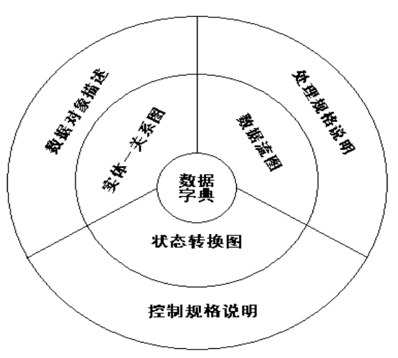

- ###### 结构化分析核心思想

  - 分解化简问题
  - 物理与逻辑表示分开
  - 进行数据与逻辑抽象

- ###### 结构化分析模型

  - **模型核心：数据字典**

    描述软件使用和产生的所有数据对象

  - **数据模型：实体-联系图**

    描绘数据对象及数据对象之间的关系，是用于建立数据模型的图形

    图中数据对象属性用“**数据对象描述**”表达

  - **功能模型：数据流图表达**

    描绘数据在软件中移动、变换及相应功能。
    图中功能用“**处理规格说明**”表达

  - **行为模型：状态转换图**

    描绘了系统的各种行为模式和在不同状态间转换的方式。
    图中软件控制附加信息用“**控制规格说明**”表达


- ###### 软件需求规格说明是需求分析阶段得出的最主要的文档，也是用户、软件设计人员和软件分析人员之间进行理解和沟通交流的工具

- ###### 需求验证包括**需求评审**和**需求测试**两个部分

- ###### 从哪些方面验证软件需求的正确性

  - 一致性
  - 完整性
  - 现实性
  - 有效性


#### 数据流图

---

> 描绘信息流和数据在软件中流动和被处理的逻辑过程, 是交流信息和分析与设计的工具
>
> 没有任何具体的物理部件
>
> 只需考虑系统必须完成的基本逻辑功能

- ###### 四种基本符号

  - 正方形(正方体): 表示数据的源点或终点
  - 圆角矩形(原型): 代表变换数据的处理
  - 开口矩形(两条平行横线): 代表数据存储
  - 箭头: 表示数据流，即特定数据的流动方向

  > 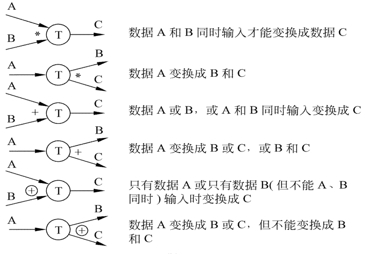


#### 数据字典

---

> 数据字典是关于数据的信息的集合，也就是对数据流图中包含的所有元素的定义的集合
>
> 四类构成元素:
>
> - 数据存储
> - 处理
> - 数据流
> - 数据元素


- ###### 数据存储: 

  - 数据存储名：
  - 简述：存放的是什么数据。
  - 输入数据:
  - 输出数据:
  - 数据文件组成:数据结构。
  - 存储方式:顺序，直接，关键码。
  - 存取频率:

- ###### 处理

  - 处理名:
  - 处理编号:反映该处理的层次
  - 简要描述:加工逻辑及功能简述
  - 输入数据流:
  - 输出数据流:
  - 加工逻辑： 简述加工程序、加工顺序
  - ... ... 

- ###### 数据流

  - 数据流名：
  - 说明：简要介绍作用即它产生的原因和结果。
  - 数据流来源：即该数据流来自何方。
  - 数据流去向：去向何处
  - 数据流组成：数据结构
  - 每个数据量流通量：数据量、流通量

- ###### 数据元素

  - 数据元素名:
  - 类型:数字（离散值、连续值），文字（编码类型）
  - 长度:
  - 取值范围:
  - 相关的数据元素及数据结构：


- ###### 数据字典的用途

  - 数据字典最重要的用途是作为分析阶段的工具；
  - 数据字典中包含的每个数据元素的控制信息是很有价值的；
  - 数据字典是开发数据库的第一步，而且是很有价值的一步。


- ###### 定义数据的方法

  - 顺序
  - 选择
  - 重复
  - 可选

  | 符号     | 含义            | 举例           |
  | -------- | --------------- | -------------- |
  | =        | 等价于 / 定义为 | x = a          |
  | +        | 与 / 连接       | x = a + b      |
  | [ \| ]   | 或 / 选择       | x = [ a \| b ] |
  | m {  } n | 重复 m .. n 次  | x = 1 { a } 5  |
  | (  )     | 可选            | x = a + ( b )  |
  | " "      | 基本数据元素    | x = “0”        |
  | ..       | 范围            | x = “1” .. “9” |

  


#### 状态转换图

---

> 状态转换图(简称为状态图)通过描绘系统的状态及引起系统状态转换的事件，来表示系统的行为。
>
> 状态是任何可以被观察到的系统行为模式，一个状态代表系统的一种行为模式。状态规定了系统对事件的响应方式。
> 状态图既可以表示系统循环运行过程，也可以表示系统单程生命期
>
> 建模步骤：
>
> 1. 列出产品/系统的所有状态；
> 2. 列出每个状态须执行的动作；
> 3. 确认并绘制出引起状态发生转换的事件；
> 4. 标注初态和终态，并细化状态转换图


- ###### 定义的状态

  - 初态(即初始状态) : 一张状态图中只能有**一个初态**, 用实心圆表示

  - 终态(即最终状态) : 终态则可以有0至多个, 用一对同心圆(内圆为实心圆)表示

  - 事件 : 引起系统做动作或(和)转换状态的控制信息, 箭头表示，箭头上标事件名

    > 事件表达式的语法: 
    >
    > 事件名(参数表) [守卫条件] / 动作表达式
    >
    > - 事件名: 用户与需求人员对事件的命名
    > - 参数表: 事件在触发或者运行时接收的参数
    > - 守卫条件: 事件被触发时必须满足的条件
    > - 动作表达式: 事件在运行过程中伴随的动作

  - 中间状态 : 用圆角矩形表示，可以用两条水平横线把它分成上、中、下3个部分

    - 上面部分为状态的名称，这部分是必须有的
    - 中间部分为状态变量的名字和值，这部分是可选的
    - 下面部分是活动表，这部分也是可选的

  > 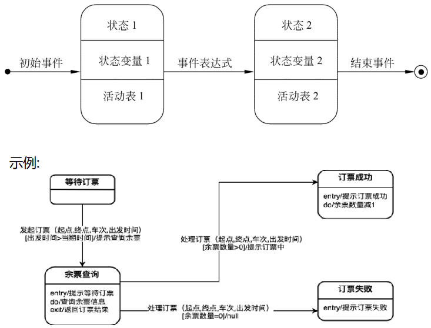


## 总体设计

> 将软件需求转化为数据结构和软件体系结构, 又称概要设计或初步设计
>
> 总体设计过程: 
>
> - 系统设计阶段
> - 结构设计阶段
>
> 总体设计与分析关系: 
>
> - 数据设计: 数据模型及核心数据字典转变为数据结构
> - 体系结构设计: 功能模型中数据流图转变成计算机模块框架
> - 接口设计: 功能模型中数据流图转变成软件内部、软件与协作系统间、软件与用户间通信方式
> - 过程设计: 行为模型及功能模型中的“处理规格说明”转换成软件构件过程描述


#### 设计过程

---

> 1. 设想供选择的方案
> 2. 选取合理的方案
> 3. 推荐最佳方案
> 4. 功能分解
> 5. 设计软件结构
> 6. 设计数据库
> 7. 指定测试计划
> 8. 书写文档
> 9. 审查和复查

- ###### 设想供选择的方案

  - 数据流图是总体设计的极好的出发点

- ###### 选取合理的方案

  - 选取若干个合理的方案，通常至少选取低成本、中等成本和高成本的3种方案

- ###### 推荐最佳方案

  - 审查分析员所推荐的最佳系统, 请使用部门负责人进一步审批

- ###### 功能分解

  - 首先进行结构设计，然后进行过程设计

- ###### 设计软件结构

  - 一个模块完成一个适当的子功能, 上层模块调用下层模块(用层次图或结构图来描绘)

- ###### 设计数据库

- ###### 指定测试计划

- ###### 书写文档

  - 系统说明
  - 用户手册
  - 测试计划：包括测试策略，测试方案，预期的测试结果，测试进度计划等
  - 详细的实现计划
  - 数据库设计结果

- ###### 审查和复查

  - 进行严格的技术审查，在技术审查通过之后再由客户从管理角度进行复审


#### 设计原理

---

> 模块是由边界元素限定的相邻程序元素, **模块是构成程序的基本构件**


- ###### 模块化: 

  - 模块化就是把程序划分成独立命名且可独立访问的模块，每个模块完成一个子功能，把这些模块集成起来构成一个整体，可以完成指定的功能满足用户的需求

  - 模块化是为了使一个复杂的大型程序能被人的智力所管理，是软件应该具备的唯一属性, 使软件结构清晰，不仅容易设计也容易阅读和理解

    > 设函数C(x)定义问题x的复杂程度，函数E(x)确定解决问题x需要的工作量(时间)。对于两个问题P1和P2，如果
    >
    > C(P1)>C(P2), 则有 E(P1)>E(P2)
    >
    > 通常 : C(P1+P2)>C(P1)+C(P2)
    >
    > 故: E(P1+P2)>E(P1)+E(P2), **各个击破**, 这就是模块化的根据。

  - 并不意味着无限地分割软件，最后为了开发软件而需要的工作量也就小得可以忽略了, 当模块数目增加时每个模块的规模将减小，开发单个模块需要的成本(工作量)确实减少了；但是，随着模块数目增加，设计模块间接口所需要的工作量也将增加

  - 每个程序都相应地有一个最适当的模块数目M，使得系统的开发成本最小

    > 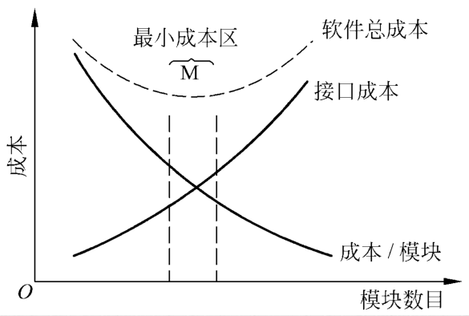


- ###### 信息隐藏和局部化

  - 信息隐藏原理: 应该这样设计和确定模块，使得一个模块内包含的信息(过程和数据)对于不需要这些信息的模块来说，是不能访问的
  - 局部化: 指把一些关系密切的软件元素物理地放得彼此靠近
  - 如果在测试期间和以后的软件维护期间需要修改软件，使用信息隐藏原理作为模块化系统设计的标准就会带来极大好处

  

- ###### 模块独立

  - 有效的模块化(即具有独立的模块)的软件比较容易开发出来
  - 独立的模块比较容易测试和维护。修改工作量较小，错误传播 范围小，扩充功能容易
  - 模块的独立程度可以由两个定性标准度量，这两个标准分别称为内聚和耦合

- ###### 耦合

  - 是软件结构内不同模块之间互连程度的度量

  - 耦合强弱取决于模块间接口的复杂程度，进入或访问一个模块的点，以及通过接口的数据

  - 模块耦合分为*数据耦合、控制耦合、特征耦合、公共环境耦合和内容耦合*

    - **非直接耦合**: 两个模块分别独立工作不需要另一模块存在。**耦合度最低**

    - **数据耦合**: 两个模块彼此间通过参数交换信息，而且交换的信息仅仅是数据

      数据耦合是**低耦合**。系统中至少必须存在这种耦合

      一个系统内部可以只包含数据耦合

    - **控制耦合**: 传递的信息中有控制信息(尽管有时这种控制信息以数据的形式出现), 是**中等程度的耦合**

      控制耦合往往是多余的，在把模块适当分解后通常可以用数据耦合代替它

    - **特征耦合**: 当把整个数据结构作为参数传递而被调用的模块只需要使用其中一部分数据元素时

    - **公共环境耦合**: 两个或多个模块通过一个公共数据环境相互作用时

      当耦合的模块个数增加时复杂程度显著增加

      > 只有两个模块有公共环境, 耦合有两种可能: 
      >
      > 1. 一个模块往公共环境送数据，另一个模块从公共环境取数据。这是数据耦合的一种形式，是比较松散的耦合
      > 2. 两个模块都既往公共环境送数据又从里面取数据，这种耦合比较紧密，介于数据耦合和控制耦合之间

    - **内容耦合** : **最高程度的耦合是内容耦合**, 坚决避免使用内容耦合

      > 出现以下情况中的一个就是内容耦合: 
      >
      > - 一个模块访问另一个模块的内部数据。
      > - 一个模块不通过正常入口而转到另一个模块的内部。
      > - 两个模块有一部分程序代码重叠(只可能出现在汇编程序中)。
      > - 一个模块有多个入口(这意味着一个模块有几种功能)。

  - 尽量使用数据耦合，少用控制耦合和特征耦合，限制公共环境耦合的范围，完全不用内容耦合

- ###### 内聚

  - 衡量**一个模块内部各个元素彼此结合的紧密程度**, 是信息隐藏和局部化概念的自然扩展。简单地说，理想内聚的模块只做一件事情

  - 内聚和耦合是密切相关的，模块内的高内聚往往意味着模块间的松耦合

  - 内聚分为三大类*低内聚、中内聚和高内聚*

    > 功能内聚 > 顺序内聚 > 通信内聚 > 过程内聚 > 时间内聚 > 逻辑内聚 > 偶然内聚

  - 高内聚: 

    - **功能内聚**: 模块内所有处理元素属于一个整体，完成一个单一的功能，即模块内部各个元素对于模块的单一功能而言是不可或缺的，则称为功能内聚。

      **功能内聚是最高程度的内聚**

    - **顺序内聚**:一个模块内的处理元素和同一个功能密切相关，而且这些处理必须顺序执行(通常一个处理元素的输出数据作为下一个处理元素的输入数据)

  - 中内聚: 

    - **通信内聚**: 模块中所有元素都使用同一个输入数据和(或)产生同一个输出数, 

      将多个需要相同输入的模块放到一起，或者将组成同一结果的多个功能封装在一起

    - **过程内聚**: 如果模块内的处理元素是顺序相关的，即使相邻元素之间没有数据传递也必须以特定次序执行

  - 低内聚: 

    - **时间内聚**: 一个模块内部包含的各个处理元素必须在同一段时间内执行，或者处理元素之间允许设置一定的时间限制
    - **逻辑内聚**: 一个模块完成的任务在逻辑上属于相同或相似的一类, 即某个模块将多个相关的功能组合在一起，且每个功能的执行由传入模块的参数来决定
    - **偶然内聚**: 一个模块完成一组任务，这些任务彼此间即使有关系，关系也是很松散的

  - 没有必要精确确定内聚的级别。重要的是设计时高内聚，并且能够辨认出低内聚的模块，有能力通过修改设计提高模块的内聚程度并且降低模块间的耦合程度，从而获得较高的模块独立性


#### 启发规则

---

> 通过模块分解或合并，力求降低耦合提高内聚
>
> 一个模块的规模过大，分解不充分，但进一步分解不应降低模块独立性。
>
> 一个模块的规模过小，开销大于有效操作，模块数目过多系统接口复杂。
>
> 最好能写在一页纸内(通常不超过60行语句)

- ###### 深度：软件结构中控制的层数

- ###### 宽度：软件结构内同一个层次上的模块总数的最大值

- ###### 扇出: 一个模块直接控制(调用)的模块数目

- ###### 扇入：有多少上级模块直接调用它

  > 设计得很好的软件结构通常：
  >
  > - 顶层扇出比较高
  > - 中间扇出比较少
  > - 底层扇入到公共的实用模块中去（底层模块有高扇入）
  >
  > 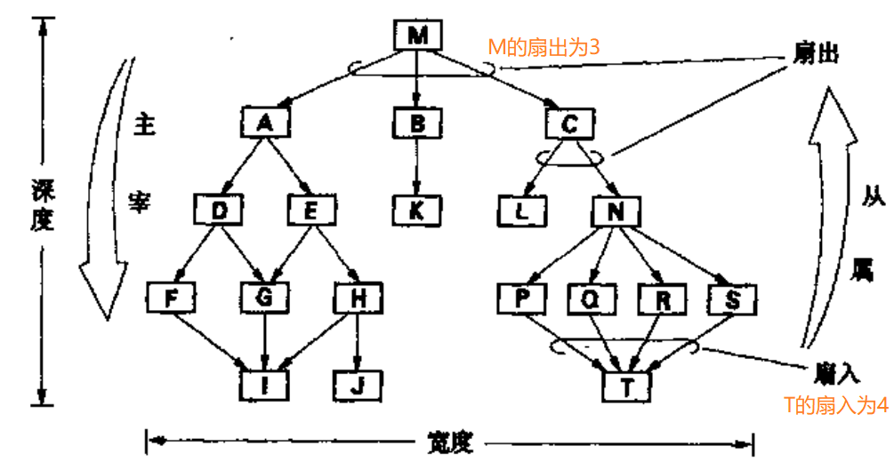

- ###### 模块的作用域应该在控制域之内

  - 作用域：受该模块内一个判定影响的所有模块的集合
  - 控制域：模块本身以及所有直接或间接从属于它的模块的集合

- ###### 力争降低模块接口的复杂程度

- ###### 设计单入口单出口的模块

  - 不要使模块间出现内容耦合

- ###### 模块功能应该可以预测

  - 只要输入的数据相同就产生同样的输出数据


#### 描绘软件结构

---

> 层次图用来描绘软件的层次结构， 形式和数据结构的层次方框图相同，但是表现的内容却完全不同。层次图很适于在自顶向下设计软件的过程中使用


#### 数据流设计方法

---

> 把信息流映射成软件结构，信息流的类型决定了映射的方法
>
> 有 变换流 和 事务流
>
> 变换流： 信息沿输入通路进入系统，由外部形式变换成内部形式，进入系统的信息通过变换中心，经加工处理以后再沿输出通路变换成外部形式离开软件系统
>
> 事务流： 数据沿输入通路到达一个处理T（T又称事务中心， 只要接收数据、确定类型、选取活动通路），这个处理根据输入数据的类型在若干个动作序列中选出一个来执行


## 详细设计

> 根本目标：确定应该怎样具体地实现所要求的系统， 不是具体地编写程序，而是要设计出程序的“蓝图”， 决定了最终的程序代码的质量


#### 人机界面设计

---

> 设计问题
>
> - 系统响应时间
> - 用户帮助设施
> - 出错信息处理
> - 命令交互

- ###### 系统响应时间

  - 系统响应时间指从用户完成某个控制动作，到软件给出预期的响应之间的这段时间， 两个重要属性，分别是**长度和易变性**

    - 长度：

      1-10 秒 ->鼠 标 显 示 成 为 沙 漏
      10 到18秒 ->由微帮助来显示处理进度
      18 秒以上 ->显示处理窗口，或显示进度条

    - 易变性: 

      指响应时间相对平均响应时间偏差，越低越好，否则会让用户误认为系统工作异常

- ###### 用户帮助设施

  - 手册和联机帮助（不离开用户界面）,提供部分功能的帮助信息和提供全部
    功能的帮助信息

  - 联机帮助两类：集成帮助和附加帮助, 帮助菜单，特殊功能键和HELP命令

  - 集成帮助设计在软件里面，附加帮助系统建成后加到软件中，前者可用性更强, 在独立的窗口中, 在屏幕固定位置显示简短提示

    返回: 屏幕上的返回按钮和功能键

    组织帮助信息: 平面结构（通过关键字访问），信息的层次结构（查更详细信息）和超文本结构

- ###### 出错信息处理

  - 交互式系统给出的出错信息或警告信息，具有下述属性:
    - 用用户可以理解的术语描述问题。
    - 提供清楚、易理解报错信息（出错位置、原因）；
    - 提供有助于从错误中恢复的建设性意见
  - 处理方法: 
    - 指出错误可能导致哪些负面后果(例如，破坏
      数据文件)，以便用户检查是否出现了这些问
      题，并在确实出现问题时及时解决。
    - 伴随着听觉上或视觉上的提示。
    - 不能带有指责色彩，不能责怪用户

- ###### 命令交互

  - 在提供命令交互方式时，必须考虑下列设计问题:
    - 是否每个菜单选项都有对应的命令?
    - 采用何种命令形式?有3种选择：控制序列(例如，Ctrl+P)，功能键和输入命令。
    - 学习和记忆命令的难度有多大?忘记了命令怎么办?
    - 用户是否可以定制或缩写命令?
  - 在理想的情况下，所有应用软件都有一致的命令使用方法


- ###### 设计过程

  - 建立起用户界面的原型，就必须对它进行评估, 评估可以是非正式的也可以使正式的

  - 用户界面的评估周期

    - 完成初步设计之后就创建第一级原型

    - 用户试用并评估该原型, 直接向设计者表述对界面的评价

    - 设计者根据用户意见修改设计并实现下一级原型

      


#### 过程设计

---

> 确定模块**算法**
>
> 确定模块使用**数据结构**
> 确定模块**接口**（系统外部接口、用户界面、内部模块间接口细节、输入数据和输出数据）

- ###### 结构化程序设计技术是过程设计一关键技术

  - 如果一个程序的代码块仅仅通过顺序、选择和循环这3种基本控制结构进行连
    接，并且每个代码块只有一个入口和一个出口，则称这个程序是结构化的

    从理论上说只用上述3种基本控制结构就可以实现任何单入口单出口的程序，但是为了实际使用方便起见，常常还允许使用DO-UNTIL和DO-CASE两种控制结构


#### 过程设计的工具

---

- ###### 程序流程图

  > 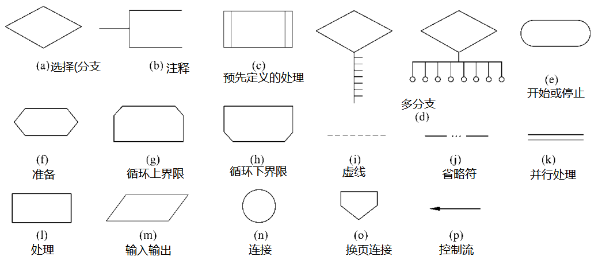

  - 顺序型：几个连续的加工依次序排列

  - 选择型：由某个判定的取值决定选择两个加工中一个

  - 当型循环型：当循环控制条件成立时，重复执行特定的加工

  - 直到型循环型：重复执行特定的加工，直到循环控制条件成立时

  - 多情况选择型：列出多种加工情况根据控制变量的取值，选择执行其一

  - 程序流程图优缺点: 

    - 优点：对控制流程描绘直观，便于初学者掌握。

    - 缺点：

      - 程序流程图本质上不是逐步求精的好工具，它诱使程序员过早地考虑程序的控制流程，而不去考虑程序的全局结构。

      - 程序流程图中用箭头代表控制流，因此程序员不受任何约束，可以完全不顾结构程序设计的精神，随意转移控制。

      - 程序流程图不易表示数据结构和调用关系。


- ###### 过程设计语言

  - 过程设计语言（PDL）又称伪码或程序描述语言。是一种用于描述功能模块的算法设计和加工细节的建模语言

    PDL规范涵盖全面的**结构化控制结构**、**数据说明**和**模块特征**，采用正文形式来表示模块的数据和数据处理过程


- ###### 判定表

  - 判定表能够清晰地表示复杂的条件组合与应做的动作之间的对应关系

  - 判定表由4部分组成：

    - 左上部列出所有条件
    - 左下部是所有可能做的动作
    - 右上部是表示各种条件组合的一个矩阵
    - 右下部是和每种条件组合相对应的动作。

  - 判定表右半部的每一列实质上是一条规则，规定了与特定的条件组合相对应的动作

    > 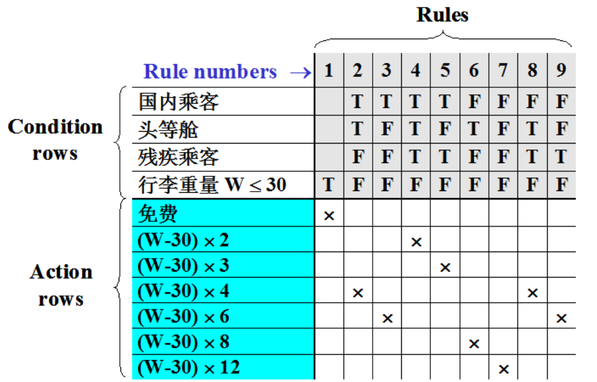


- ###### 判定树

  - 判定树是判定表的变种，它也能清晰地表示复杂的条件组合与应做的动作之间的对应关系。

  - 优缺点: 

    - 优点：形式简单，易看出含义，易于掌握和使用。
    - 缺点：简洁性不如判定表，相同数据元素重复写多遍，越接近叶端重复次数越多

    > 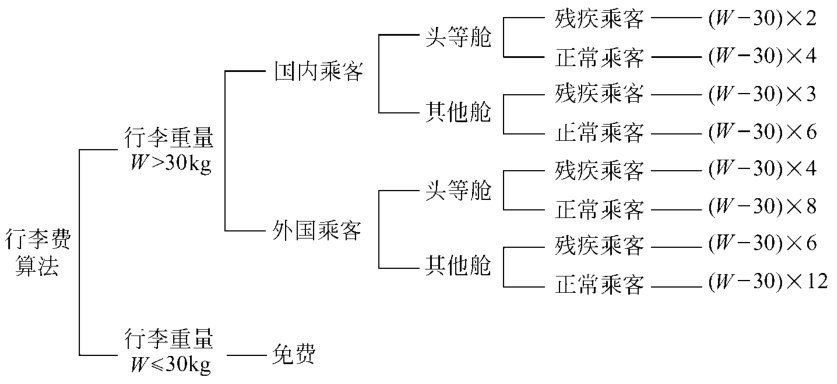


#### 面向数据结构设计

---

> 数据结构既影响程序的结构也影响程序的处理过程，可从数据结构导出程序的处理过程，适合详细设计
>
> 设计方法两种：
> Jackson和Warnier方法

- Jackson图

  - 顺序结构(A由B、C、D 3个元素顺序组成, 每个元素只出现一次，出现的次序依次是B、C和D)

    >B、C、D中任一个都不能是选择出现或重复出现的数据元素(即不能是右上角有小圆圈或星号标记的元素)

    ````mermaid
    graph TB
    A[方形]
    -->B[B]
    A-->C[C]
    A-->D[D]
    ```
    ````

  - 选择结构(右上角有小圆圈做标记)

    >```mermaid
    >graph TB
    >A[方形]
    >-->B["B°"]
    >A-->C["C°"]
    >A-->D["D°"]
    >```

  - 重复结构(A由B出现N次(N≥0)组成, 在B的右上角有星号标记)

    >```mermaid
    >graph TD
    >A[A]==>B["B*"]
    >```

  - > 示例: 
    >
    > 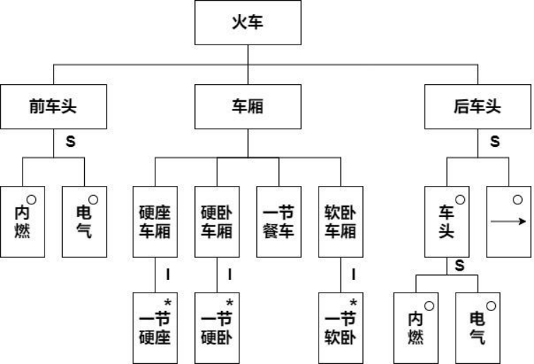


#### 复杂程度定度量

---

- ###### 定量度量程序复杂程度的方法很有价值：

  -  把程序的复杂程度乘以适当常数即可估算出软件中错误的数量以及软件开发需要用的工作量，
  -  定量度量的结果可以用来比较两个不同的设计或两个不同算法的优劣；
  -  程序的定量的复杂程度可以作为模块规模的精确限度

- ###### 衡量算法的好坏，一般是从时间和空间两个维度来衡量的

  - 时间复杂度：算法中的基本执行次数，衡量一个算法的运行快慢；
  - 空间复杂度：算法在运行过程中临时占用存储空间大小的量度。衡量一个算法运行所需要的额外空间


- ###### McCabe方法——流图

  - McCabe方法根据程序控制流的复杂程度定量度量程序的复杂程度，这样度量出的结果称为程序的**环形复杂度**

    实质上是“退化了的”程序流程图，描绘程序的控制流程，不表现对数据的具体操作以及分支或循环的具体条件

    *模块规模以V(G)≤10为宜*

    > 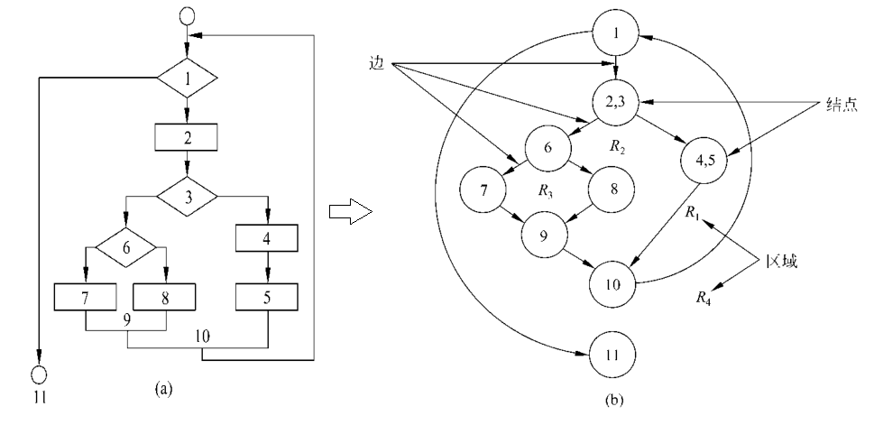

  - 计算环形复杂度: 

    - **流图中线性无关的区域数等于环形复杂度**

    - **V(G)=E-N+2,其中，E是流图中边的条数，N是结点数**

    - **V(G)=(n1 - 1) * m1 + (n2 - 2) * m2 + … + 1，**

      **m个扇出为n的判定节点**, 例如, 有 2 个扇出为 2 的节点, 一个扇出为 3 的节点

      则V(G) = (2 - 1) * 2 + (3 - 1) * 1 + 1 = 5

    > 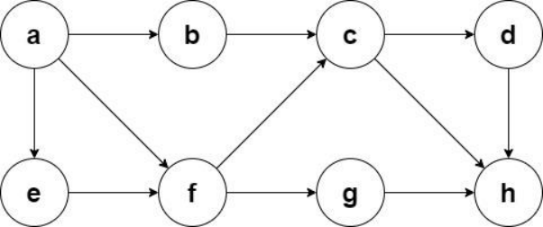
    >
    > 按线性无关区域数: 5
    >
    > V(G) = 11 - 8 + 2 = 5
    >
    > V(G) = (2 - 1) * 2 + (3 - 1) * 1 + 1 = 5


## 面向对象方法学

> ````mermaid
> graph LR
> A["需求分析"]-->B["面向对象分析"]
> C["总体设计"]-->E["面向对象设计"]
> D["详细设计"]-->E["面向对象设计"]
> ````


#### 面向对象概述

---

> 传统方法学的局限性: 
>
> 1. 结构化方法从计算机处理数据的角度来思考问题，以“动作”或“功能”划分为基础来构建软件，**与人类认识世界的方式和思维方式不符合**
> 2. 结构化方法以数据处理流程来映射软件系统结构，无法适应软件需求的快速变更
> 3. 结构化开发方法难以实现高效的软件复用

- ###### 面向对象的要点

  - 认为客观世界是由各种对象组成的；

  - 把所有对象都划分成各种对象类，每个对象类都定义了一组数据和一组方法；

  - 按照子类与父类的关系，把若干个对象类组成一个层次结构的系统；

  - 对象彼此之间仅能通过传递消息互相联系。

  - 面向对象方法学方程式：

    *面向对象＝对象＋类＋继承＋传递消息实现通信*

  - 面向对象的优点:

    - 与人类习惯的思维方法一致；
    - 稳定性好；
    - 可重用性好；
    - 可维护性好；
    - 较易开发大型软件产品


#### 面向对象的概念

---

- ###### 对象：

  - 定义: 具有相同状态的一组操作的集合，对状态和操作的封装。
  - 属性: 类中所定义数据，对客观世界实体具体性质的抽象
  - 方法: 对象执行的操作，即类中定义的服务，描述对象的行为
  - 对象的特点
    - 以数据为中心
    - 对象是主动的
    - 实现了数据封装
    - 本质上具有并行性
    - 模块独立性好

- ###### 类

  - 对具有相同状态和相同操作的一组相似对象的定义。
  - 类是一个抽象数据类型。
  - 类可以帮助我们方便地认识和定义世界中的对象
  - 类抽象地描述了属于该类的全部对象的属性和操作
  - 每个对象只是该类的一个实例
  - 实例是由某个特定类所描述的一个具体对象

- ###### 消息

  - 要求某对象执行某个操作的规格说明
  - 三部分：
    - 接收消息的对象
    - 消息名
    - 0或多个变元

- ###### 封装

  - 把相关的数据（属性）和对这些数据的操作结合在一起，组成一个独立对象
  - 信息隐藏

- ###### 继承

  - 子类自动共享基类中定义的属性和方法的机制

- ###### 多态

  - 多态描述子类在继承父类的属性和操作时，根据子类的特点，赋予子类的特殊性
  - 在类等级不同层次可共享一个方法名，不同层次每个类按各自需要实现这个方法
  - A是基类，B和C是A的派生类，多态函数Test参数是A的指针，Test函数可以引用A、B、C的对象
  - 多态性支持“**同一接口，多种方法**”的面向对象原则，使高层代码只写一次而在底层可以多次复用

- ###### 重载

  - 函数重载
    - 在同一作用域内，参数特征不同的函数可使用相同的名字
    - 优点：调用者不需记住功能雷同函数名，方便用户；程序易于阅读和理解
  - 运算符重载:同一运算符可施加于不同类型操作数上面


#### 统一建模语言

---

> Unified Modeling Language
>
> - 基于面向对象技术的标准建模语言
>
> - UML是图示化、说明、构造一个软件系统并生成其文档的标准语言
> - UML独立于开发过程，可与大多数面向对象开发过程配合使用
> - UML独立于程序设计语言，可用任一种面向对象程序设计语言实现

- ###### UML的应用范围

  - 分析与设计阶段：
    通过建立用例图等模型来描述系统的使用者对系统的功能要求。通过类和对象等主要概念及其关系建立静态模型，对类、用例等概念之间的协作进行动态建模，为开发工作提供详尽的规格说明
  - 开发阶段：
    将设计的模型转化为编程语言的实际代码，指导并减轻编码工作
  - 测试阶段：
    用UML图作为测试依据

- ###### UML模型图

  - **结构图**: 捕获事物与事物之间的静态关系，用来描述系统的静态结构模型
  - **行为图**: 捕获事物的交互过程如何产生系统的行为，用来描述系统的动态行为模型
  - UML 1.x与UML 2.x规范所包含的图的不同


## 面向对象分析设计


#### 用例图

---

> UML中的用例图是进行需求分析和建立功能模型的强有力工具
>
> 用例图从用户视角来描述和建模整个系统，分析系统的功能与行为
>
> 一个完整的用例模型应该不仅仅包括用例图部分，还要有完整的用例描述部分。
> 一般的用例描述主要包括以下几部分内容：
>
> - 用例名称
> - 参与者
> - 用例描述
> - 基本事件流

- ###### 用例图四种基本元素

  - 系统

    - 正在开发的网站、应用程序等软件系统, 

      用矩形框来表示，并将系统名称写在矩形框上部

  - 参与者

    - 在系统之外与系统交互的某人或某事物, 

      用火柴人来表示，并将参与者名称写在火柴人下方

    - 参与者在系统之外

    - 参与者一定与系统直接交互

    - 当参与者表示人时，其代表的是一个角色，而不是系统的单个用户

    - 参与者也可以是组织、其他软件系统或者外部设备

  - 用例

    - 是可以被参与者感受到的、系统的一个完整功能

      用例用椭圆形来表示，并将用例名称(动宾短语)写在椭圆形内

    - 每一个用例都必须有一个有别于其他用例的名字

    - 用例是**相对独立的一个完整功能，不是步骤**

  - 关系

    - **关联关系**：参与者与用例之间的交互

      关联关系表示：参与者启动该用例

    - **包含关系**：两个用例之间的关系，其中一个用例（称作基本用例）的行为包含了另一个用例（称作包含用例）的行为

      基本用例不能独立存在，依赖于包含用例。在执行基本用例时，一定会执行包含用例部分

      *用虚线箭头上写 <\<include\>> 表示, 箭头由基本用例指向包含用例*

    - **扩展关系**：两个用例之间的关系，基本用例的执行不会涉及扩展用例，只有在特定的条件发生时，扩展用例才被执行

      基本用例能独立存在，不依赖于它的扩展用例

      *用虚线箭头上写 <\<extend\>> 表示, 箭头由拓展用例指向基本用例*

    - **泛化关系**：表示一个对象对另一个对象的继承，可以用在用例与用例之间或者参与者与参与者之间

    >  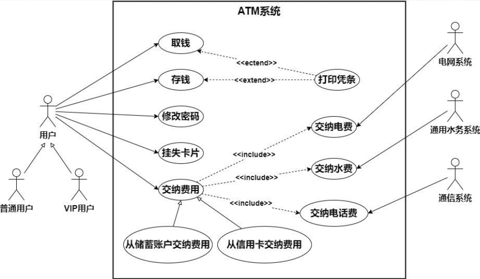
    >
    > 用例描述示例:
    >
    > | 用例名称   | 取钱                                                         |
    > | ---------- | ------------------------------------------------------------ |
    > | 参与者     | 用户                                                         |
    > | 用例描述   | 用户使用ATM系统提取现金                                      |
    > | 基本事件流 | 1.用户输入密码;<br/>2.用户选择取钱操作；<br/>3.用户输入取款金额<br/>4.若用户输入取款金额大于用户账户余额，<br/>则提示用户“余额不足<br/>若用户输入取款金额小于等于用户账户余额，<br/>系统自动提取现金，并从用户账户余额中扣除相应金额。 |


#### 类图和对象图

---

> 类（class）是一组拥有相同属性、操作、方法、关系和行为的对象描述符。
> 在UML中，可以根据实际情况来选择隐藏属性部分或操作部分，或者两者都隐藏。
>
> 类图和对象图是建立对象模型主要工具，用于各类系统：信息管理系统、数据库系统、Web应用系统、实时控制系统
>
> 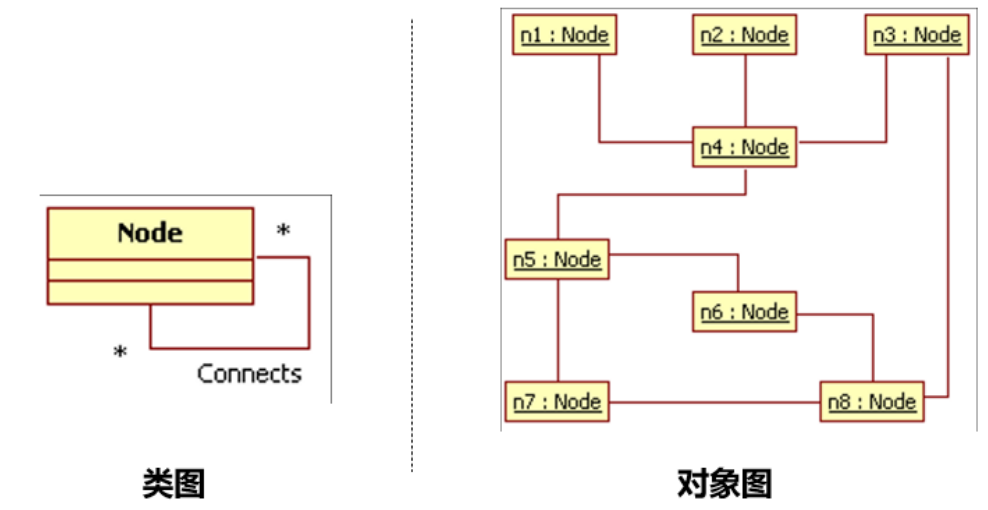

- ###### 类的属性

  - 类的属性描述了类的所有对象所共有的一些特性

  - 可以有任意数量的属性, 也可以没有属性

    - 类属性的语法：
      	**[可见性] 属性名 \[:类型]\[多重性]\[=初始值][{特性}]**

    可见性：公有（＋）、私有（－）、保护（#）

    - 公有：可被外部对象访问
    - 私有：不可为外部对象访问，只能为本类对象使用
    - 保护：可为本类对象和子类对象访问

    类型：可以是系统固有的类型，如整型、浮点型等，也可以是用户自定义的类型

    多重性：表示一个包含于方括号中的数字表达式，位于类型名称后，相当于编程语言中数组的概念

    特性：对属性性质的约束

    - 可变（changeable）：表示属性可以随便修改，没有约束。
    - 只增（addOnly）：表示该属性修改时可以增加附加值，但不允许对值进行消除或进行减的改变。
    - 冻结（frozen）：表示在初始化对象后，就不允许改变属性值

- ###### 类的操作

  - 类的操作用于操纵属性或执行其他动作

    可以有任意数量的操作，也可以没有操作

  - 类操作的语法：

    ​		**[可见性] 操作名 \[(参数列表)]\[: 返回类型][{特性}]**

    参数列表：按照顺序排列的属性，定义了操作的输入。可以有零到多个参数，多个参数之间用逗号隔开。参数的定义方式采用：
    				[方向]参数名：类型=[默认值]

    返回类型：回送调用对象消息的类型。无返回值时，一般的编程语言会添加void字表示无返回值

    特性：对操作性质的约束说明

- ###### 类之间的关系

  - 关联
  
    - 普通关联: 双向，用实线连接两个类
  
    - 单向关联: 关联是单向的，用实线箭头连接两个类
  
      > 关联名：用来描述关联的作用
      >
      > 关联的角色：关联的两端可以以某种角色参与关联, 如果不标注角色则隐含用类名作为角色名。如果在关联上没有标出角色名，则隐含地用类的名称作为角色名。角色还具有多重性，表示可以有多少个对象参与该关联
      >
      > 关联类: 关联本身也可以有特性，通过关联类可以进一步描述关联的属性、操作以及其他信息
      >
      > 关联的约束：有时两个类之间的关联后有一个规则，可以通过在关联线附近加一个约束来说明
  
    - 限定关联: 带有限定符的关联。限定符放在关联关系末端的矩形内
  
  - 聚合和组合
  
    > 聚合: 类与类间关系是"has-a"，整体与部分关系，较弱情况
    >
    > 聚合关系中代表部分事物对象与代表聚合事物对象生存期无关，删除聚合对象不一定删除代表部分事物对象
    >
    > 组合: 组合是“contains-a”关系，是整体与部分较强关系，部分类完全隶属于整体类
    >
    > 组合中删除组合对象，同时也就删除代表部分事物对象
  
  - 泛化:是指类间的“一般-特殊”关系
  
- ###### 抽象类

  - 抽象类（abstract class）是不能直接产生实例的类，因为抽象类中的操作往往只是一些声明，而没有具体的实现，因此不能对抽象类实例化

- ###### 接口

  - 接口（interface）是在没有给出对象的实现和状态的情况下对对象行为的描述。接口包含操作不包含属性，没有对外可见的关联。
  - 接口是一种类似于抽象类的机制，它是一个没有具体实现的类


- ###### 类图

  - 概念层类图: 描述应用领域的概念
  - 说明层类图: 描述软件的接口部分, 不是实现部分
  - 实现层类图: 考虑现实问题, 提供类的细节

  > 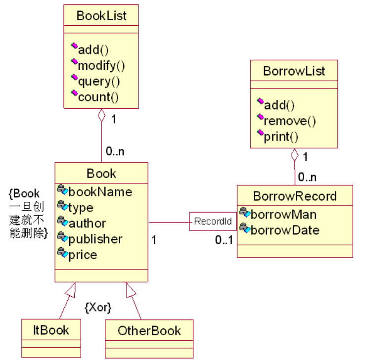


- ###### 对象图

  - 对象图是类图的一个实例。

    对象图表示一组对象及它们之间的关系. 是系统详细状态在某一时刻的快照, 表示复杂的类图的一个实例

    对象图在UML建模中使用有限, 用于表达数据结构的示例

    由于对象是一个类的实例，因此其名称的格式是“对象名：类名”，这两个部分是
    可选的，但如果是包含了类名，则必须加上“：”，另外为了和类名区分，还必须加上下划线: 

    <u>xChen : Account</u>	标准表示法

    <u> : Account</u>				匿名表示法

    <u>xChen</u>					  省略类名表示法

  - 属性：由于对象是一个具体的事物，因此所有的属性值都已经确定，因此通常会在属性的后面列出其值

- ###### 链

  - 链（link）表示的是对象与对象之间的关系。
  - 链是一个实例


#### 活动图

---

> 活动图（Activity diagram）描述为完成某一个用例需要做的活动以及这些活动的执行顺序。
> UML的活动图是用来表示完成一个操作所需要的活动，或者是一个用例实例（场景）的活动。
> 在客户**需求分析与系统分析**过程中，经常需要用活动图来进一步深入**描述用例图的具体功能实现流程**

- ###### 活动图

  - 开始节点：用一个实心圆表示初始节点

  - 终止节点：用一个圆圈内加一个实心圆来表示活动终点

  - 活动节点：是活动图中最主要的元素之一，它用来表示一个活动。所描述的活动可以是原子的动作（action），也可以是能进一步分解的一系列操作, 用胶囊形状表示

  - 控制流:  是活动图中用于标示控制路径的一种符号。它负责当一个动作或活动节点执行完毕后，将执行主体从当前已完毕的节点转移到过程的下一个动作或动作节点, 用箭头表示

  - 判断节点:  是用菱形表示的，它有一个进入控制流（箭头从外指向判断节点），至少二个导出控制流（箭头从分支符号指向外）

    每个离开转换上都会有一个控制条件，用来表示满足什么条件的时候执行该转移。
    条件行为用判断和合并表达

  - 分叉结合: 

    - 分叉: 用来描述并发线程，每个分叉可以有一个进入控制流和两个或多个离开控制流
    - 结合: 将多个并发控制流收束回同一流程的节点标记

  - 泳道:  是活动图中的区域划分, 每个泳道代表一个责任区, 有唯一的名称, 

    每个活动节点、判定节点必须只属于一个泳道, 

    控制流, 分叉与结合可以跨泳道


> 用例图 转 活动图	
>
> 


#### 顺序图

---

> 顺序图是按时间顺序显示对象交互的图
>
> 顺序图最适合用来在设计的早期分析阶段，因为他们是简单和容易理解的

- ###### 顺序图主要作用

  1. 细化用例的表达
  2. 有效地描述类职责的分配方式
  3. 丰富系统的使用语境的逻辑表达

- ###### 顺序图有两个维度

  - 纵向是代表时间维度，时间向下延伸，按时间依次列出各个对象所发出和接收的消息。
  - 水平方向是代表对象的维度，排列着参与交互的各个独立的对象。

- ###### 顺序图的四个元素

  - **对象**：顺序图中的对象与对象图中的概念一样，都是类的实例。顺序图中的对象可以是系统的参与者或者任何有效的系统对象

    生命线顶部使用显示对象名和类名的矩形框来标记, 

    参与者用火柴人加下方对象名表示

    对象名的三种命名方式: 

    <u>objectName: ClassName</u>

    <u>: ClassName</u>

    <u>objectName</u>

    如果一个对象出现在其它位置上（不在顶端），则说明这个对象是在交互执行到某些步骤的时候被创建出来的, 也可以销毁(打叉)

  - **生命线**:  代表了一次交互中的一个参与对象在一段时间内存在, 生命线所代表的时间内，对象一直是可以被访问的

  - **激活**: 又称为控制焦点，表示一个对象执行一个动作所经历的时间段, 可以是直接执行，也可以是安排下级过程执行

    激活也可以表示对应对象在这段时间内不是空闲的，它正在完成某个任务，或正被占用, 一个对象不在激活期时，该对象处于休眠状态

  - **消息**:是从一个对象（发送者）向另一个对象（接收者）发送信号，或由一个对象（发送者或调用者）调用另一个对象（接收者）的操作

    消息编号：整个消息的传递过程就形成了一个完整的序列，因此通过在每个消息的前面加上一个用冒号隔开的顺序号来表示其顺序。除了顺序编号之外，还可以采用嵌套方案

    在顺序图中，消息表示为从一个对象的生命线指向另一个对象的生命线的箭头

    - 简单消息: 实线箭头, 写消息(泛指任何交互，但不描述任何通信信息)
    - 调用消息: 实线箭头, 写消息(调用某个对象的一个操作)
    - 返回消息: 虚线箭头, 写消息(传递另一个消息的返回值)
    - 创建消息: 实线箭头, 写消息, 上面写<\<create>>  (传递另一个消息的返回值)
    - 销毁消息: 实线箭头, 写消息, 上面写<\<destory>>  (销毁一个对象, 允许对象销毁自身)
    - 同步消息: 实线箭头,线上打叉,  写消息(发出该消息的对象将不再继续进行后续工作，专心等待消息接收方返回消息)
    - 异步消息: 实线半箭头, 写消息(消息发出者在发出异步消息之后，不必等待接收者的返回消息便可以继续自己的活动和操作)

- ###### 可选片段

  - 可选片段：关键字为opt，表示一种单条件分支。
  - 条件片段：关键字为alt，表示一种多条件分支。
  - 并行片段：关键字为par，表示片段内有多个并行子片段的片段。
  - 循环片段：关键字为loop，表示一个循环。
  - 交互片段：关键字为ref，表示对一段交互的引用。


#### 通信图

---

> 通信图（协作图）包含一组对象和以消息交换为纽带的关联，用于描述系统的行为是如何由系统的成分合作实现的
>
> 通信图中的元素主要有**对象、消息和链**三种
>
> 对象和链分别作为通信图中的类元角色和关联角色出现，链上可以有消息在对象间传递

- ###### 对象

  - 通信图中的对象与顺序图中对象的概念相同，都是表示类的实例。
  - 由于通信图中不表示对象的创建与销毁，因此，对象在通信图中的位置没有限制。
  - 与顺序图中对象的表示法不同的是，通信图中的无法显示对象的生命线

- ###### 链

  - 通信图中的链与对象图中的链在语义以及表示法上都相同，都是两个（或多个）对象之间的独立连接，是关联的实例。链同时也是通信图中关联角色的实例，其生命受限于协作的生命

- ###### 消息

  - 通信图的消息需要附加在对象之间的链上，链用于传输或实现消息的传递
  - 通信图中的消息通过在链的上方或下方添加一个短箭头来表示，通常需要使用阿拉伯数字作为序号来表示通信图中发送消息的顺序

- 通信图与顺序图的不同

  - 通信图偏重于将对象的交互映射到连接它们的链上，这有助于验证类图中对应的类之间关联关系的正确性或建立新的关联关系的必要性。然而顺序图偏重描述交互中消息传递的逻辑顺序。因此通信图更适用于展示系统中的对象结构，而顺序图则擅长表现交互中消息的顺序
  - 顺序图可以显式地表现出对象创建与撤销的过程，而在通信图中，只能通过消息的描述隐式地表现这一点。
  - 顺序图还可以表示对象的激活情况，而对于通信图来说，由于缺少表示时间的信息，除了对消息进行解释，无法清晰地表示对象的激活情况

  > 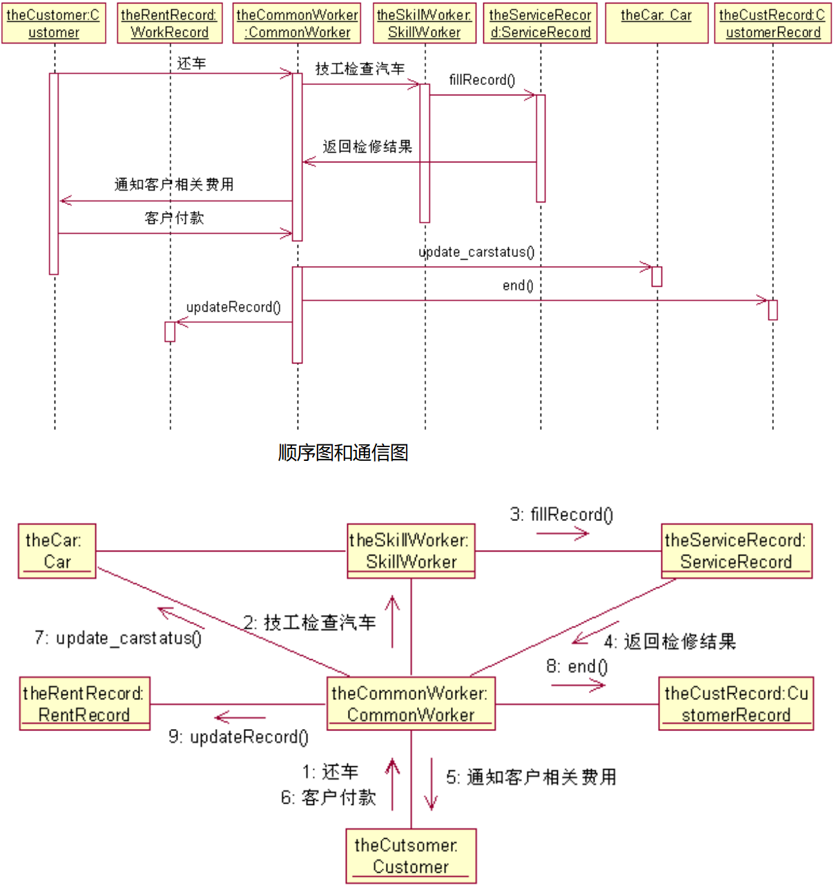


## 实现

> ```mermaid
> graph LR
> A["实现"]--> B["编码"]
> A-->C["测试"]
> ```
>
> **编码**就是把软件设计结果翻译成用某种程序设计语言书写的程序，是对设计的进一步具体化
>
> 软件**测试**是保证软件质量的关键步骤，是对软件规格说明、设计和编码的最后复审


#### 编码

---

- ###### 编程语言

  - 机器语言
    - 优点：计算机直接识别
    - 缺点：效率低，重用性差
  - 汇编语言
    - 优点：
      比机器语言易读写、易调试和修改; 执行速度快、占内存少; 针对硬件编制
    - 缺点：不能编写复杂程序; 依赖于机型、不通用、不可移植
  - 高级语言: 
    - 优点：编码效率高; 通用性强，兼容性好，便于移植
    - 缺点：运行效率低; 对硬件操作不如汇编
  - 高级语言对比汇编语言: 
    - 汇编语言编码需要把软件设计翻译成机器操作的序列，既困难又容易出差错；
    - 高级语言写程序比用汇编语言写程序生产率可以提高好几倍；
    - 用高级语言写的程序容易阅读、容易测试、容易调试、容易维护

- ###### 选择适宜的程序设计语言的原因：

  - 根据设计去完成编码时，困难最少；
  - 可以减少需要的程序测试量；
  - 可以得到更容易阅读和更容易维护的程序
  - 选择标准
    - **系统用户要求**：如果开发系统由用户维护，通常要求用熟悉的语言书写；
    - **可以使用的编译程序**：运行目标系统环境可提供编译程序限制可选用语言的范围；
    - **可以得到的软件工具**：有支持程序开发的软件工具可以利用
    - **逻辑简明清晰、易读易懂是重要标准**
    - 可遵循以下五方面规则：
      程序内部的文档：
      数据说明
      语句构造（简单）
      输入输出
      效率（和存储容量）

- ###### 编码风格

  - 标识符：含义鲜明的名字、缩写规则一致、为名字加注解；
  - 注解：正确性，简要描述模块的功能、主要算法、接口特点、重要数据以及开发简史或解释包含这段代码的必要性；
  - 视觉组织：适当的阶梯形式使程序的层次结构清晰明显。

- ###### 语句构造

  - 不要为了节省空间而把多个语句写在同一行
  - 尽量避免复杂条件测试
  - 尽量减少“非”条件测试
  - 避免大量使用循环嵌套和条件嵌套
  - 利用括号使表达式运算次序清晰直观
  - 避免为了片面追求效率而降低程序代码可读性
  - if、for、do、while、case、switch、default 等语句占一行，且if 、for 、do 、while等语句的执行语句部分无论多少都要加括号{}
  - 将BOOL值TRUE和FALSE对应1和0编程。
    多数编程语言：false定义为0，非0值是true

- ###### 输入输出

  - 对所有输入数据都进行检验；
  - 检查输入项重要组合的合法性；
  - 保持输入格式简单；
  - 使用数据结束标记，不要要求用户指定数据的数目；
  - 明确提示交互式输入的请求，详细说明可用的选择或边界数值；
  - 程序设计语言对格式有严格要求时，应保持输入格式一致；
  - 设计良好的输出报表；
  - 给所有输出数据加标志

- ###### 效率

  - 效率是性能要求，因此应该在需求分析阶段确定效率方面的要求；
  - 效率是靠好设计来提高的；
  - 程序的效率和程序的简单程度是一致的，不要牺牲程序的清晰性和可读性来不必要地提高效率
  - 写程序之前先简化算术的和逻辑的表达式；
  - 仔细研究嵌套的循环，以确定是否有语句可以从内层往外移；
  - 尽量避免使用多维数组；
  - 尽量避免使用指针和复杂的表；
  - 使用执行时间短的算术运算；
  - 不要混合使用不同的数据类型；
  - 尽量使用整数运算和布尔表达式
  - 在大型计算机中必须考虑操作系统页式调度的特点，一般说来，使用能保持功能域的结构化控制结构，是提高效率的好方法。
  - 在微处理机中如果要求使用最少的存储单元，则应选用有紧缩存储器特性的编译程序，在非常必要时可以使用汇编语言。
  - 提高执行效率的技术通常也能提高存储器效率。提高存储器效率的关键同样是“简单”
  - 所有输入输出都应该有缓冲，以减少用于通信的额外开销；
  - 对二级存储器(如磁盘)应选用最简单的访问方法；
  - 二级存储器的输入输出应该以信息组为单位进行；
  - 如果“超高效的”输入输出很难被人理解，则不应采用这种方法


#### 软件测试

---

> 为了发现程序中的错误而执行程序的过程
>
> 应该认识到测试决不能证明程序是正确的
>
> 规则如下：
>
> - 测试是为了发现程序中的错误而执行程序的过程
> - 好的测试方案是极可能发现迄今为止尚未发现的错误的测试方案
> - 成功的测试是发现了至今为止尚未发现的错误的测试

- ###### 黑盒测试

  - 又称功能测试, 完全不考虑程序的内部结构和处理过程, 只检查程序功能是否能按
    照规格说明书的规定正常使用

- ###### 白盒测试

  - 又称结构测试, 测试者完全知道程序的结构和处理算法。

    这种方法按照**程序内部的逻辑测试程序**，检测程序中的主要执行通路是否都能按预定要求正确工作

- ###### 软件测试准则

  - 所有测试应能追溯到用户需求，测试的目的是发现错误，其中最严重的是不能满足用户需求的错误
  - 应尽早地和不断地进行软件测试
  - 充分注意测试中群集现象
  - 测试应从小规模开始，逐步进行大规模测试
  - 不能做到穷举测试
  - 第三方测试原则

- ###### 单元测试

  - 把每个模块作为一个单独的实体来测试, 保证每个模块作为一个单元能正确运行

- ###### 子系统测试

  - 系统测试是把经过单元测试的模块放在一起形成一个子系统来测试。模块相互间的协调和通信是这个测试过程中的主要问题

- ###### 系统测试

  - 系统测试是把经过测试的子系统装配成一个完整的系统来测试

- ###### 确认测试

  - 把软件系统作为单一的实体进行测试, 在用户积极参与下进行, 可能主要使用实际数据进行测试
  - 目的是验证系统确实能够满足用户的需要, 确认测试也称为验收测试

- ###### 平行运行

  - 同时运行新开发出来的系统和将被它取代的旧系统
  - 目的有如下几点：
    - 可以在准生产环境中运行新系统而又不冒风险。
    - 用户能有一段熟悉新系统的时间。
    - 可以验证用户指南和使用手册之类的文档。
    - 能够以准生产模式对新系统进行全负荷测试，可以用测试结果验证性能指标


#### 单元测试

---

> 单元测试集中检测软件设计的最小单元——模块。
>
> 单元测试和编码属于软件过程的同一个阶段
>
> 可以应用人工测试和计算机测试
>
> 主要使用白盒测试技术
>
> 测试重点: 
>
> - 模块接口
> - 局部数据结构
> - 重要的执行通路
> - 出错处理通路
> - 边界条件(单元测试中最后的也可能是**最重要**的任务)
>
> 最终进行代码审查（人工）


#### 集成测试

---

- ###### 非渐增式测试: 

  - 把所有模块放在一起，作为一个整体来测试

- ###### 渐增式测试

  - 与“一步到位”的非渐增式测试相反，它把程序划分成小段来构造和测试, 比较容易定位和改正错误
  - 有自顶向下和自底向上两种集成策略
    - 自顶向下集成方法是从主控制模块开始，沿着程序的控制层次向下移动，逐渐把各个模块结合起来, 需要存根程序
    - 自底向上测试从“原子”模块(即在软件结构最低层的模块)开始组装和测试, 不需要存根程序
    - 纯粹自顶向下或纯粹自底向上的策略可能都不实用，人们在实践中创造出许多混合策略

- ###### 回归测试

  - 回归测试是指重新执行已经做过的测试的某个子集，以保证上述这些变化没有带来非预期的副作用
  - 回归测试就是用于保证由于调试或其他原因引起的变化，不会导致非预期的软件行为或额外错误的测试活动
  - 回归测试可以通过人工地进行，也可以使用自动化的捕获回放工具自动进行
  - 在集成测试过程中，回归测试用例的数量可能变得非常大


#### 系统测试

---

> 使软件和其它系统元素（硬件、数据库等）结合测试

- ###### 恢复测试

  - 自动恢复
  - 人工干预恢复

- ###### 安全性测试

  - 突破软件安全保护机构的安全保密措施，检验系统预防机制的漏洞

- ###### 强度测试

  - 检验系统能力最高达到实际限度

- ###### 性能测试

  - 软件运行性能与性能要求比较，检验是否达到性能要求规格

- ###### 时间测试


#### 确认测试

---

> **必须有用户积极参与**
>
> **通常使用黑盒测试法**
>
> Alpha测试由用户在开发者的场所进行，并且在开发者对用户的“指导”下进行测试
>
> 与Alpha测试不同，开发者通常不在Beta测试的现场


#### 白盒测试

---

> 通常把**测试数据**和**预期的输出结果**称为**测试用例**
>
> 做到尽可能完备的测试
>
> 基本目标是，确定一组最可能发现某个错误或某类错误的测试数据

- ###### 逻辑覆盖

  - 一系列测试过程的总称

- ###### 语句覆盖

  - 每个语句至少执行一次

- ###### 判定覆盖

  - 判定覆盖又叫分支覆盖, 每个判定的每个分支都至少执行一次
  - 判定覆盖比语句覆盖强，但是对程序逻辑的覆盖程度仍然不高

- ###### 条件覆盖

  - 判定表达式中的每个条件都取到各种可能的结果
  - 条件覆盖通常比判定覆盖强，但满足条件覆盖的测试数据不一定满足判定覆盖

- ###### 判定/条件覆盖

  - 能同时满足判定覆盖和条件覆盖的逻辑覆盖
  - 有时判定/条件覆盖也并不比条件覆盖更强

- ###### 条件组合覆盖

  - 使得每个判定表达式中条件的各种可能组合都至少出现一次
  - 满足条件组合覆盖标准的测试数据，也一定满足判定覆盖、条件覆盖和判定/条件覆
    盖标准


- ###### 基本路径测试

  1. 根据过程设计结果画出相应的流图

  2. 计算流图的环形复杂度

  3. 确定线性独立路径的基本集合

     环形复杂度 = 程序中独立路径的数量

  4. 设计可强制执行基本集合中每条路径的测试用例


#### 黑盒测试

---

> 黑盒测试着重测试软件功能。黑盒测试并不能取代白盒测试，它是与白盒测试互补的测试方法
>
> 黑盒测试力图发现下述类型的错误：
> (1) 功能不正确或遗漏了功能；
> (2) 界面错误；
> (3) 数据结构错误或外部数据库访问错误；
> (4) 性能错误；
> (5) 初始化和终止错误
>
> 白盒测试在测试过程的早期阶段进行，而黑盒测试主要用于测试过程的后期

- ######  常见黑盒测试技术：

  1. 等价类划分；
     - 把程序的输入域划分成若干个数据类，据此导出测试用例
     - 可以从每个等价类中只取一组数据作为测试数据
     - 有效等价类：合理，有意义输入数据构成集合。
     - 无效等价类：不合理，无意义输入数据构成的集合。
  2. 边界值分析；
     - 处理边界情况时程序最容易发生错误
     - 通常设计测试方案时总是联合使用等价划分和边界值分析两种技术
  3. 错误推测等
     - 列举出程序中可能有的错误和容易发生错误的特殊情况，并且根据它们选择
       测试方案


#### 调试

---

> 调试（也称为纠错）作为成功测试的后果出现，即调试是在测试发现错误之后排除错误的过程
>
> 调试不是测试

- ###### 调试过程

  1. 找到了问题的原因并把问题改正和排除掉了； 
  2. 没找出问题的原因。猜想一个原因，并设计测试用例来验证这个假设，重复此过程直至找到原因并改正了错误

- ###### 蛮干法

  - 可能是寻找软件错误原因的最低效的方法
  - 仅当所有其他方法都失败了的情况下，才应该使用这种方法

- ###### 回溯法

  - 回溯是一种相当常用的调试方法，当调试小程序时这种方法是有效的

- ###### 原因排错法

  - 对分查找法、归纳法和演绎法都属于原因排除法


#### 软件可靠性

---

> 软件可靠性是程序在给定的时间间隔内，按照规格说明书的规定成功地运行的概率
>
> 软件可用性是程序在给定的时间点，按照规格说明书的规定，成功地运行的概率


## 维护

> 是软件生命周期的最后一个阶段
>
> 软件维护需要的工作量很大, 高达开发成本的4倍左右
>
> 软件工程的主要目的就是要提高软件的可维护性


#### 维护定义

---

- ###### 改正性维护

  - 把诊断和改正错误的过程称为改正性维护

- ###### 完善性维护

  - 在使用软件的过程中用户往往提出增加新功能或修改已有功能的建议，还可能提出一般性的改进意见
  - 这项维护活动通常占软件维护工作的大部分
  - 一半以上是完善性维护

- ###### 预防性维护

  - 这项维护活动相对比较少


#### 维护特点

---

- ###### 非结构化维护

  - 非结构化维护需要付出很大代价
  - 如果软件配置的唯一成分是程序代码，那么维护活动从艰苦地评价程序代码开始
  - 如果有一个完整的软件配置存在，那么维护工作从评价设计文档开始

- ###### 结构化维护

- ###### 软件工程至少部分地解决了与维护有关的每一个问题


#### 软件可维护性

---

> 可理解性、可测试性、可修改性、可移植性、可重用性


#### 软件再工程过程

---

- ###### 库存目录分析

- ###### 文档重构

- ###### 逆向工程

- ###### 代码重构

- ###### 数据重构

- ###### 正向工程